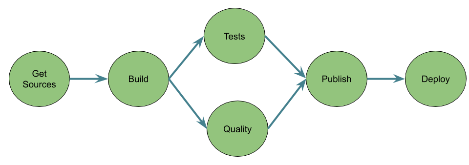

En rédigeant la [première partie de l'article](/2020-03-15-maveniser-sharedlib) sur comment faire des tests unitaires lors de développements de sharedlib pour les pipelines Jenkins, je me suis rendu compte que pour bien le comprendre il fallait tout d'abord expliquer rapidement ce que sont les dits pipelines et sharedlib ! :innocent:

On va donc reprendre depuis le début !

### CI / CD et automatisation 
En ces périodes de *DevOps* à outrance, il apparaît une chose commune à toutes celles et ceux qui s'y essaient: la nécessité d'automatiser et de fluidifier le processus de build, de livraison et de déploiement.

C'est là qu'interviennent la construction continue (Continuous Integration), la livraison continue (Continuous Delivery) et le déploiement continu (Continuous Deployment), en résumé ce que l'on appelle le **CI / CD**.

A cela s'ajoute le terme de *Pipelines* (comment concevoir et représenter les processus précédemment cités) qui ne sont au final qu'un enchaînement de tâches séquentielles ou parallèles permettant d'atteindre un but, à savoir la construction d'un livrable et son déploiement.

Par exemple un pipeline classique de construction d'une application (Java par exemple :wink:):


### Outillage
On se doute bien que l'on peut construire tout cela manuellement, en script bash par exemple, mais que cela risque de vite prendre du temps et ne pas être très simple à maintenir !

Il existe pléthore d'outils dédiés plus ou moins à cela: le plus ou moins venant du fait que certains outils, dont ce n'est pas le coeur de métier historique, finissent par le proposer afin de permettre aux utilisateurs de bénéficier d'une "suite" logicielle complète pour la fabrication de leur application (entre nous cela permet aussi de garder l’utilisateur bien au chaud dans son giron sans qu'il aille voir ailleurs :wink:).

Citons quelques uns de ces outils:
- [Jenkins](https://jenkins.io/) (1 & 2)
- [Travis CI](https://travis-ci.org/)
- [Circle CI](https://circleci.com)
- [GitLab CI](https://docs.gitlab.com/ee/ci/)
- [GitHub Actions](https://github.com/features/actions)
- ...

Il y en a pleins d'autres, mais l'idée est juste d'illustrer que ce n'est pas le choix qui manque !

Les deux derniers (GitLab et GitHub) sont un peu particuliers car ce ne sont pas *que* des outils de CI/CD mais bien plus: je vous laisse aller voir cela par vos propres moyens (peut être que cela fera l'objet de prochains articles :wink:).

Intéressons-nous à Jenkins, sujet de cet article.

### Jenkins
Deux versions existent, même si la version 1 n'est plus beaucoup utilisée (à part dans du legacy) c'est avec elle que beaucoup ont commencé (dont moi). Je ne vais pas m’appesantir dessus car ce n'est pas avec cette version que je vais illustrer mes articles.

La version 2 de Jenkins est celle qui nous intéresse et celle qui sera utilisée pour mes articles, non pas que les autres soient mauvais (j'utilise à titre personnel d'autres outils gratuits) mais je ne les utilise pas au quotidien dans mon travail.

Dans sa première mouture Jenkins permettait de définir un *job* qui était un ensemble de *stages*: tâche maven, appel sonar, bash, ...
Toute la configuration se faisait par le biais de l'interface graphique, pratique mais pas très industrialisable ni facile à généraliser: une modification transverse et c'était sur l'ensemble des jobs qu'il fallait repasser.

Jenkins 2, qui a vu le jour en 2016, a apporté une grosse nouveauté: la généralisation du pipeline as code pour définir ses jobs.

L'autre grosse nouveauté c'est que l'on peut désormais "embarquer" le pipeline directement dans l'arborescence projet sans devoir créer le job dans l'interface de Jenkins: le pipeline se définit par du code dynamiquement chargé et exécuté par le moteur de Jenkins.

### Pipeline as code
Jenkins est écrit en Java et permet d'exécuter des pipelines écris en Groovy (je pense qu'il serait possible de le faire en Java aussi mais ce n'est clairement pas comme cela que ça a été pensé).

Pour développer son [pipeline](https://jenkins.io/doc/book/pipeline/) il y a deux possibilités: *[Scripted Pipeline](https://jenkins.io/doc/book/pipeline/syntax/#scripted-pipeline)* ou *[Declarative Pipeline](https://jenkins.io/doc/book/pipeline/syntax/#declarative-pipeline)*. Les deux sont basées sur Groovy et le DSL (Domain Specific Language) proposé par Jenkins. Le *Scripted Pipeline* est la première façon qui a vu le jour pour développer ses pipelines, le *Declarative Pipeline* est plus récent et permet, principalement, de simplifier le développement des pipelines en n'utilisant que du DSL qui fait plus penser à de la config as code (mais où les espaces ne sont pas représentatifs ... :smiling_imp:).

Au final nous allons essentiellement conserver la philosophie des *Declaratives Pipelines*: ne pas mettre de code Groovy dans nos Jenkinsfiles, réserver cela à des classes utilitaires ou la définition de nos propres steps.

### Jenkinsfile
Bon, on a les notions de base, maintenant il faut nous lancer et pour cela il va falloir que l'on code notre premier pipeline: par convention on code le pipeline dans un fichier se nommant *Jenkinsfile* mais au final peut importe le nom tant que c'est un script groovy !

Un *Jenkinsfile* en mode *Declarative pipeline*:
```groovy
pipeline {
    agent any

    stages {
        stage('Build') {
            steps {
                echo 'Building..'
                sh 'mvn clean package'
            }
        }
        stage('Test') {
            steps {
                echo 'Testing..'
            }
        }
        stage('Deploy') {
            steps {
                echo 'Deploying....'
            }
        }
    }
}
``` 

L'idée n'est pas d'expliquer dans le détail comment développer un pipeline (cela viendra ensuite et dans d'autres articles :wink:) mais simplement d'illustrer comment cela se déroule. 
Un pipeline est une suite d'étape (*stages*) qui comportent plus au moins de sous-étapes (*steps*), elles-mêmes pouvant regrouper plusieurs commandes (par exemple *echo*).

Jenkins fournit donc pas mal de [steps](https://jenkins.io/doc/pipeline/steps/). Les différents plugins que l'on rajoute dans Jenkins mettent aussi souvent des steps à disposition mais malgré tout, il est possible que dans le contexte d'une entreprise, il soit nécessaire de faire une action particulière ou d'utiliser un outil qui ne possède pas de plugin Jenkins. De manière assez naturelle on a tendance à utiliser le step *sh* qui permet d'exécuter n'importe quelle commande bash (y comprit d'appeler un script) comme on l'aurait fait avec Jenkins 1. Cela fonctionne mais je trouve que l'on tombe dans le travers boîte noire, car une fois que l'on passe la main à un script, il est plus compliqué d’interagir avec les éléments qui le composent et surtout cela fait deux référentiels de code à maintenir pour notre pipeline (le jenkinsfile et le script bash).

C'est pourquoi on va devoir, pour sortir du pipeline *hello world*, faire nos propres "steps" (au final ce ne sont pas des vrais steps mais ils s'utilisent de la même façon) en codant du début à la fin notre pipeline dans une lib afin de n'avoir à coder que le minimum dans le Jenkinsfile. Le gain est double:
1. on factorise du code et donc les modifications sont plus simples,
2. on contextualise à notre société ce qui doit l’être.

Cette lib s'appelle dans Jenkins une *SharedLib*.

### Les sharedlib
Comme je l'ai déjà indiqué, une fois que l'on a commencé à coder des pipelines dans nos *Jenkinsfile* on a fait un grand pas par rapport à l'approche *click to config* de Jenkins 1. Mais on se retrouve avec le même problème: toutes les actions identiques entre les projets sont dupliquées et lors d'un changement, par exemple de plugin que l'on utilise, on se retrouve à faire une maintenance sur tous les *Jenkinsfiles*.
Il faut donc pouvoir factoriser le code pour pouvoir le réutiliser, c'est là qu’interviennent les [sharedlib](https://jenkins.io/doc/book/pipeline/shared-libraries/): une lib qui regroupe des classes / scripts réutilisables dans les *Jenkinsfile*. 

Imaginons que nous voulions reprendre l'exemple précédent sans utiliser le step *sh* mais un développement maison permettant d'appeler du maven.
Pour cela il va falloir développer une classe utilitaire se chargeant d'appeler des commandes maven.

Le code de la classe *Utilities*:
```groovy
package fr.ourson.utils

/**
* Utility class example for a pipeline
*/
class Utilities implements Serializable{
    Script steps

    Utilities(Script steps) {
        this.steps = steps
    }

    /**
    * Simple method to execute maven commands
    * @param args Maven arguments.
    */
    void mvn(String args) {
        steps.sh "mvn ${ args}"
    }
}
```
[source](https://github.com/philippart-s/jenkins-examples/blob/master/src/fr/ourson/utils/Utilities.groovy)

En dehors de l'utilité même de cette classe utilitaire ce qu'il faut retenir:
1. la classe implémente *Serializable*: c'est une obligation pour une classe utilisée dans un pipeline Jenkins car celui-ci doit pouvoir "sauvegarder" à tous moments l'état du pipeline. C'est notamment induit par le fait que Jenkins utilise le CPS (Continuation Passing Style). Il s'agit d'un principe assez complexe et obscure mais il faut être au courant que ça existe car il n'est pas rare d'avoir une exception du genre *Caused: java.io.NotSerializableException:* :wink: et dans ce cas la doc de Jenkins a une [section dédiée](https://wiki.jenkins.io/display/JENKINS/Pipeline+CPS+method+mismatches) au fonctionnement du CPS et comment s'en sortir dans le code.
2. la classe possède un constructeur avec un paramètre (habituellement appelé *steps*) permettant de passer le contexte Jenkins et notamment permettant l'utilisation des steps déjà présents dans Jenkins
3. c'est donc grâce à cela que l'on peut utiliser le steps *sh* proposé par Jenkins dans notre code

⚠️Spoiler alerte: ⚠️ un jour il faudra être capable de tester tout ça sans lancer un Jenkins :wink:.

Il ne reste plus qu'à mettre à disposition la classe pour n'importe quel pipeline défini dans Jenkins. Cela se fait simplement en mettant le source dans un repo git avec la [bonne arborescence](https://jenkins.io/doc/book/pipeline/shared-libraries/#directory-structure) (la classe doit se trouver dans un répertoire *src*). Ensuite il faut la [déclarer](https://jenkins.io/doc/book/pipeline/shared-libraries/#using-libraries) dans Jenkins en indiquant l'endroit où elle se trouve:


Enfin il ne reste plus qu'à la référencer grâce à l'instruction *@Library* dans le code du JenkinsFile.

Le code de notre pipeline devient donc:
```groovy
@Library('ourson-lib') _

import fr.ourson.utils.Utilities
def utils = new Utilities(this)
pipeline {
    agent any

    stages {
        stage('Build') {
            steps {
                echo 'Building..'
                script {
                utils.mvn 'clean package'
                }
            }
        }
        stage('Test') {
            steps {
                echo 'Testing..'
            }
        }
        stage('Deploy') {
            steps {
                echo 'Deploying....'
            }
        }
    }
}
```
Quelques explications:
1. la sharedlib se charge grâce à *@Library('ourson-lib') _*, le nom étant celui donné lors de la déclaration dans Jenkins
2. il est nécessaire dans notre exemple d'utiliser le steps *script* car nous essayons d'exécuter du script (en fait du code groovy) dans un pipeline de type *Declarative Pipeline*. Pour éviter cela, il faut utiliser un step prédéfini ou en faire un nous même (on va voir que l'on arrive à quelque chose de similaire un peu plus loin :wink:)

Comment simplifier l'utilisation de notre shared lib ? :thinking:

#### Passer en mode Scripted Pipeline
C'est moins joli mais c'est plus simple d'appeler directement du code exposé par une sharedlib:
```groovy
@Library('ourson-lib') _

import fr.ourson.utils.Utilities
def utils = new Utilities(this)

node {
    stage('Build') {
        echo 'Building..'
            utils.mvn 'clean package'
        }
    stage('Test') {
        echo 'Testing..'
    }
    stage('Deploy') {
        echo 'Deploying....'
    }
}
```

#### Passer par la définition de steps custom
L'idée d'un *[custom step](https://jenkins.io/doc/book/pipeline/shared-libraries/#defining-custom-steps)* est d'avoir la facilité d'écriture d'un *Declarative Pipeline* sans le *boilerplate code* qui est nécessaire pour appeler du code groovy.

Pour cela il va falloir rajouter un script (et non une classe) dans le répertoire *vars* de notre projet sharedlib. Les scripts dans ce répertoire ne contiennent qu'une seule méthode (*call*) et accessible [comme un step](https://jenkins.io/doc/book/pipeline/shared-libraries/#defining-custom-steps).

Le code de notre script (*myMaven.groovy*):
```groovy
import fr.ourson.utils.Utilities

/**
* Custom step example.
* @param args The maven args
*/
def call(String args) {
    Utilities util = new Utilities(this)

    util.mvn(args)
}
```
[source](https://github.com/philippart-s/jenkins-examples/blob/master/vars/myMaven.groovy)


Et enfin le code de notre pipeline:
```groovy
@Library('ourson-lib') _

pipeline {
    agent any

    stages {
        stage('Build') {
            steps {
                echo 'Building..'
                myMaven 'compile'
            }
        }
        stage('Test') {
            steps {
                echo 'Testing..'
            }
        }
        stage('Deploy') {
            steps {
                echo 'Deploying....'
            }
        }
    }
}
```

Simple non ? :tada:

### ~~One~~ Two more thing 
#### Branches
Ce qui est bien en déportant la sharedlib dans un repo git, c'est que l'on va pouvoir utiliser le mécanisme de branches pour tester une fonctionnalité sans impacter l'ensemble des pipelines qui dépendent de la sharedlib:
```groovy
@Library('ourson-lib@feature/test') _

pipeline {
    agent any

    stages {
        stage('Build') {
            steps {
                echo 'Building..'
                myMaven 'compile'
            }
        }
        stage('Test') {
            steps {
                echo 'Testing..'
            }
        }
        stage('Deploy') {
            steps {
                echo 'Deploying....'
            }
        }
    }
}
```
Notez le *@feature/test* qui permet de cibler une branche qui s'appelle *feature/test* dans mon repo git.

#### Tout le pipeline as code
Jusqu'à présent, les différents exemples de code montrent qu'il faut tout de même définir une partie du pipeline dans le Jenkinsfile: pas grand chose mais tout de même assez pour que cela apporte quelques problèmes:
- un changement de paradigme d'entreprise sur les pipelines (par exemple ajout systématique d'un stage dédié à la performance) implique la modification de tous les Jenkinsfiles,
- il est simple pour un projet d'alléger son pipeline voir de le rendre instable en le modifiant de manière erronée.

Pour pallier à cela, il est possible de pousser encore plus le principe de la factorisation de code: concevoir l'ensemble du pipeline dans la sharedlib et ne l'exposer que sous forme de step dans un Jenkinsfile.
C'est une sorte de merge de tout ce qui a été présenté jusqu'ici:
- on reprend la classe utilitaire
- on reprend le principe de step maison ... mais amélioré :wink:

Le code du step (*myMavenStep.groovy*) devient:
```groovy
import fr.ourson.utils.Utilities

/**
* Custom full step example.
* @param config Step parameters
*/
def call(Map config) {

    Utilities util = new Utilities(this)

    node() {
        stage('Build') {
            echo 'Building..'
            util.mvn config.mvnArgs
        }
        stage('Test') {
            echo 'Testing..'
        }
        stage('Deploy') {
            echo 'Deploying....'
        }
    }
}
```
[source](https://github.com/philippart-s/jenkins-examples/blob/master/vars/myMavenStep.groovy)

Quelques explications:
- la map en paramètre permet de passer n'importe quel paramètre nommé à notre step,
- on voit ici qu'en fait on code un *Scripted Pipeline*,
- le paramètre passé dans le jenkinsfile est récupéré dans la map

Enfin l'utilisation dans notre Jenkinsfile:
```groovy
@Library('ourson-lib') _

myMavenStep mvnArgs: 'clean compile'
```
Plutôt concis non ? :sunglasses:

Et comme indiqué, le paramètre *mvnArgs* est celui que l'on récupère dans la map de notre script.

A ce stade je pense que l'on a plutôt réussi ce que l'on voulait non ?
1. Avoir du pipeline as code
1. Avoir du code centralisé pour aider la maintenance
1. Pouvoir coder des steps maison pour adapter nos pipelines à nos outils

Voilà, c'est la fin de cet article de présentation de la notion de pipeline as code avec Jenkins 2. Le mode développement n'a pas été abordé dans cet article, mais le fait de devoir mettre à disposition le code dans le repo git et ensuite lancer dans Jenkins ne permet pas une bonne industrialisation de développement: ce sera l'objet des articles dédiés au tests des shared lib Jenkins ([part 1](/2020-03-15-maveniser-sharedlib) & part 2 - coming soon !)

Le projet dans sa globalité est disponible sur mon [repo](https://github.com/philippart-s/jenkins-examples) github.