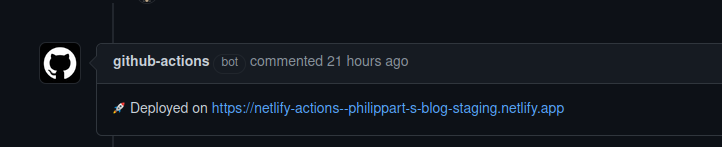

Cela fait quelque temps que je cherche un moyen d'avoir un environnement de staging pour mes sites [Jekyll](https://jekyllrb.com/) qui sont déployés sur *GitHub Pages*.
En effet, lorsque l'on est plusieurs à contribuer c'est plutôt pratique de pouvoir voir ce que cela donne pour relire avant de le faire sur la prod !

La version *prod* est déployée sur [GitHub Pages](https://pages.github.com/), mais comme cela ne permet pas d'avoir un aperçu de ce que donne une PR / branche (visiblement cela va bientôt arriver mais je ne suis pas patient :wink:) je me suis mis à la recherche d'une solution automatisée pour faire ça !

Ma première version d'environnement de staging reposait sur un [bucket S3](https://docs.aws.amazon.com/AmazonS3/latest/dev/UsingBucket.html) à travers l'offre [cellar](https://www.clever-cloud.com/doc/deploy/addon/cellar/) de [Clever Cloud](https://www.clever-cloud.com/) : voir l'article [Déployer un site statique sur un bucket S3 avec GitHub Actions]({{ site.baseurl }}).
Si cela fonctionne, il manque un élément important : la possibilité d'activer la fonctionnalité *[website](https://docs.aws.amazon.com/AmazonS3/latest/userguide/EnableWebsiteHosting.html)* qui permet une navigation plus fluide comme si c'était déployé sur un serveur HTTP.

Par exemple, si on n'active pas cette fonctionnalité, il faut spécifier une page html à chaque requête (ce qui n'est pas le cas avec le template de site Jekyll que j'utilise) sinon on obtient une erreur du genre :
```xml
<Error>
  <Code>NoSuchKey</Code>
  <BucketName>aws-clever</BucketName>
  <RequestId>tx00000000000000fb77132-00603f52e4-a4bc63c-default</RequestId>
  <HostId>a4bc63c-default-default</HostId>
</Error>
```
Après avoir contacté le support de Clever cette fonctionnalité n'est pas encore disponible avec l'addon *cellar* (cela devrait arriver dans les semaines qui viennent) mais, comme pour GitHub pages, je ne suis pas patient et cela me fait une excuse pour tester un nouveau truc !

## Ce que je veux faire 💡
Pour mémoire mon workflow est assez simple:
1. Si une PR est créée je veux créer un nouveau site de staging avec la version statique du site Jekyll de la branche de la PR déployée
1. A chaque push le site est à jour
1. Sur la fermeture de la PR la branche est détruite et à la destruction de la branche le site est supprimé

## Ce que je vais utiliser :factory:
Pour la création du site statique : [Jekyll](https://jekyllrb.com/).

Pour l'hébergement de la prod : [GitHub Pages](https://pages.github.com/).

Pour l’hébergement des environnements de staging : [Netlify](https://www.netlify.com/).

Enfin, pour l'automatisation : [GitHub Actions](https://github.com/features/actions).

Plutôt sympa comme stack :sunglasses: !

## Création de l'environnement de staging dans Netlify ⚙️

J'ai délibérément choisi d'utiliser les appels d'API REST via curl pour faire mes actions sur le site Netlify.
J'avais aussi le choix de faire une action mais je n'avais pas envie de faire du javascript et je trouvais trop lourds de faire une image Docker pour ça.
J'aurai bien l'occasion de créer ma propre action un de ces jours !

Du coup le job de création est le suivant:
```yaml
name: Jekyll site CI

on:
  # Dès qu'une activité sur la PR ciblant la master est détectée on déclenche le workflow
  pull_request:
    branches: [ master ]

jobs:
  create_env:
    # Ce job doit créer le site si il n'existe pas
    name: Site creation on netlify
    runs-on: ubuntu-latest
    outputs:
      # Cet output servira au job de déploiement du site sur Netlify
      site-id: ${{ steps.create-site.outputs.site-id }}    
    steps:
      - id: create-site
        # Step permettant la création d'un site Netlify avec comme nom le nom de la branche ciblée par la PR
        # Il permet aussi de récupérer le site_id pour le futur déploiement.
        name: Create Site
        run: |
          SITE_ID=$(curl -X GET -H "Content-Type: application/json" -H "Authorization: Bearer ${{ secrets.NETLIFY_AUTH_TOKEN }}" https://api.netlify.com/api/v1/sites?name=${{ github.head_ref}} | jq --raw-output '.[0].id')
          if [ $SITE_ID == 'null' ];
          then
            echo "Site inexistant"
            SITE_ID=$(curl -X POST -H "Content-Type: application/json" -H "Authorization: Bearer ${{ secrets.NETLIFY_AUTH_TOKEN }}" -d '{"name": "${{ github.head_ref}}"}' https://api.netlify.com/api/v1/sites | jq --raw-output '.id')
          fi
          if [ $SITE_ID == 'null' ];
          then
            return -1
          fi
          echo "::set-output name=site-id::$SITE_ID"

#...
```

L'élément important dans le retour de l'appel est le **SITE_ID** mais il est possible de le retrouver dans la console de gestion de Netlify, il sera utilisé plus tard pour le déploiement.

## Mise à jour de l'environnement de staging à la création / modification de la PR 🚀
### Build du site Jekyll
On utilise deux actions : 
1. une action pour builder le site : `lemonarc/jekyll-action@1.0.0`
1. une action pour avoir un cache des dépendances ruby pour accélérer les builds futurs : `actions/cache@v2`


```yaml
### ... 
  jekyll:
    needs: create_env
    # Ce job permet de construire et déployer le site Jekyll
    name: Build and deploy Jekyll site
    runs-on: ubuntu-latest

    steps:
      # Récupération des sources
    - name: Checkout
      uses: actions/checkout@v2

      # Mise en cache des dépendances Ruby
    - uses: actions/cache@v2
      with:
        path: vendor/bundle
        key: ${{ runner.os }}-gems-${{ hashFiles('**/Gemfile.lock') }}
        restore-keys: |
          ${{ runner.os }}-gems-

      # Build du site Jekyll    
    - name: Build
      uses: lemonarc/jekyll-action@1.0.0
# ...      
```


### Déploiement du site généré sur Netlify
Pour cela on utilise l"action `nwtgck/actions-netlify@v1.1.13` qui permet :
- d'utiliser le nom de la branch comme début du nom de l'URL du site déployé
- d'ajouter un message à la PR avec l'URL du site déployé


```yaml
#...
      # Déploiement sur Netlify
    - name: Deploy to Netlify
      uses: nwtgck/actions-netlify@v1.1.13
      with:
        publish-dir: './_site'
        github-token: ${{ secrets.GITHUB_TOKEN }}
        deploy-message: "Deploy from GitHub Actions : ${{ github.event.pull_request.title }}"
        enable-pull-request-comment: true
        enable-commit-comment: true
        overwrites-pull-request-comment: true
        alias: ${{ github.head_ref }}
      env:
        NETLIFY_AUTH_TOKEN: ${{ secrets.NETLIFY_AUTH_TOKEN }}
        # Réutilisation de l'identifiant du site précédemment créé
        NETLIFY_SITE_ID: ${{ needs.create_env.outputs.site-id }}
      timeout-minutes: 1
```


⚠️ c'est ici que l'on réutilise le *site_id* positionné dans un *output* du job précédent. ⚠️

A chaque modification de ma PR un build puis un déploiement dans Netlify de la branche est déclenché, plutôt cool :sunglasses:.
Et un joli message apparaît dans la PR avec le lien de la version staging:



### Suppression de la version staging du site 🗑️
Netlify ne permet pas de supprimer les déploiements de type preview, il sont stockés et accessibles tant que le site est créé dans Netlify.
Il y a un [thread](https://answers.netlify.com/t/does-each-deploy-preview-stay-available-forever/12601) dans le forum de support qui indique que la fonctionnalité de pouvoir supprimer des déploiements en *preview* a été demandée et qu'elle sera disponible un jour :wink:.

Il est donc nécessaire d'avoir un workflow qui se charge de cette suppression:

```yaml
name: Delete env for branch

on:
    # Dès qu'une pull request est fermée on déclenche le workflow
    pull_request:
        types: [closed]
    
jobs:
  delete_env:
    name: Delete site in Netlify for the branch
    runs-on: ubuntu-latest
    steps:
      # Suppression du site correspondant au nom de la branche ciblée par la PR
      - name: Delete site for branch
        run: |
          SITE_ID=$(curl -X GET -H "Content-Type: application/json" -H "Authorization: Bearer ${{ secrets.NETLIFY_AUTH_TOKEN }}" https://api.netlify.com/api/v1/sites?name=${{ github.head_ref}} | jq --raw-output '.[0].id')
          curl -X DELETE -H "Content-Type: application/json" -H "Authorization: Bearer ${{ secrets.NETLIFY_AUTH_TOKEN }}" https://api.netlify.com/api/v1/sites/$SITE_ID
```


## En conclusion :dart:
Au final j'ai ce que je voulais : un site de staging attaché à une PR qui a dure le temps de la PR.
Ce n'est pas parfait et il y a des améliorations à faire (comme tester que le nom de la branche ne comporte pas des caractères non compatibles par exemple). En tout cas cela permet d'attendre que GitHub ajoute cette fonctionnalité de preview pour GitHub pages :wink:.

L'ensemble des sources des workflows sont disponible [ici](https://github.com/philippart-s/blog/tree/master/.github/workflows).