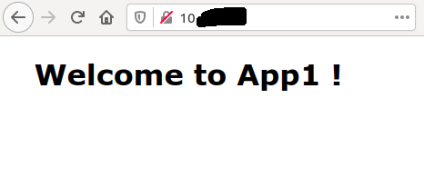
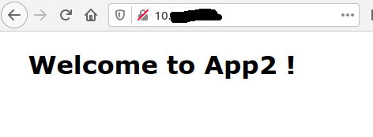
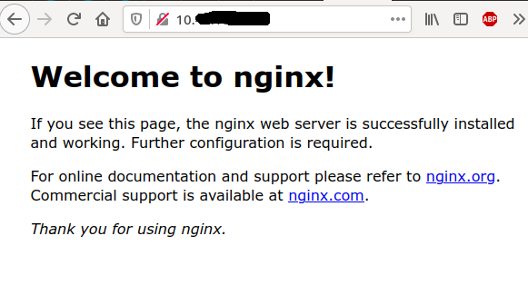

En ce moment ma principale occupation est de mettre en place Openshift avec notamment une adaptation de toute la delivery.
Je me suis dit, du coup, que j'allais partager mes différentes petites trouvailles qui pourront servir pour des personnes voulant se lancer ou des dev désireux de toucher un peu la partie Kube / Helm.
Je sais qu'il existe de nombreux posts sur Internet sur le même sujet mais celui-ci sera en Français et restera volontairement simple pour être le plus accessible possible.

# Installation de K3s
On a dit simple, donc pour faire du Kube sans se prendre la tête j'ai choisi [K3s](https://rancher.com/products/k3s/) de Rancher.
Et pour le coup quand je dis simple c'est simple, une commande et 30s plus tard on a un cluster Kube pour jouer :
```bash
curl -sfL https://get.k3s.io | sh -
```
Un petit copy de la config pour éviter le *sudo* :
```bash
sudo cp /etc/rancher/k3s/k3s.yaml ~/.kube/config
export KUBECONFIG=~/.kube/config
```
Et hop :sunglasses: :
```bash
kubectl get pods --all-namespaces
NAMESPACE     NAME                                      READY   STATUS      RESTARTS   AGE
kube-system   helm-install-traefik-hcxlv                0/1     Completed   0          68m
kube-system   coredns-854c77959c-rnt8m                  1/1     Running     1          68m
kube-system   svclb-traefik-bjh7f                       2/2     Running     2          67m
kube-system   metrics-server-86cbb8457f-spjjd           1/1     Running     1          68m
kube-system   traefik-6f9cbd9bd4-4vx6r                  1/1     Running     1          67m
kube-system   local-path-provisioner-5ff76fc89d-7tbsg   1/1     Running     2          68m
```
# Un petit Hello world 

Pour illustrer ça on va déjà déployer une version *statique* de notre exemple, dans mon cas un POD contenant un conteneur NGinx.
Après quelques `kubectl apply -f ...` des fichiers suivants on a un hello world qui fonctionne.

## Namespace
```yaml
apiVersion: v1
kind: Namespace
metadata:
  name: helm-for-dev
```

## Deployment.yaml
```yaml
apiVersion: apps/v1
kind: Deployment
metadata:
  name: nginx-deployment
  namespace: helm-for-dev
  labels:
    app: nginx
spec:
  replicas: 1
  selector:
    matchLabels:
      app: nginx
  template:
    metadata:
      labels:
        app: nginx
    spec:
      containers:
      - name: nginx
        image: wilda/app1
        ports:
        - containerPort: 80
```

## Service
```yaml
apiVersion: v1
kind: Service
metadata:
  name: nginx-service
  namespace: helm-for-dev
spec:
  selector:
    app: nginx
  ports:
    - protocol: TCP
      port: 80
      targetPort: 80
```

## Ingress
```yaml
apiVersion: networking.k8s.io/v1
kind: Ingress
metadata:
  name: nginx-ingress
  namespace: helm-for-dev
spec:
  defaultBackend:
    service:
      name: nginx-service
      port:
        number: 80
```
## Résultat du déploiement manuel
```bash
kubectl get all -n helm-for-dev

NAME                                    READY   STATUS    RESTARTS   AGE
pod/nginx-deployment-5c7c9d84f9-psswn   1/1     Running   0          101s

NAME                    TYPE        CLUSTER-IP   EXTERNAL-IP   PORT(S)   AGE
service/nginx-service   ClusterIP   10.X.X.X   <none>        80/TCP    5m52s

NAME                               READY   UP-TO-DATE   AVAILABLE   AGE
deployment.apps/nginx-deployment   1/1     1            1           5m58s

NAME                                          DESIRED   CURRENT   READY   AGE
replicaset.apps/nginx-deployment-5c7c9d84f9   1         1         1       101s
```


Bon c'est pas mal tout ça mais du coup je fais autant de fichiers que de modifications que je souhaite faire (par exemple un changement de port ou de config de déploiement) ? :thinking:

# Plusieurs Hello World !
On l'a vu, ce n'est pas très compliqué de déployer rapidement dans notre cluster un POD Ngnix mais si je veux changer plusieurs paramètres ou encore déployer des POD légèrement différents il va falloir que je duplique mes fichiers et que je repasse du *kubectl* partout ...
C'est là que [Helm](https://helm.sh/) va nous aider.

## Création du projet
Bien entendu Helm vient avec avec son CLI pour nous faciliter les choses.
On va donc tout d'abord créer le projet Helm : 
```bash
helm create helm-for-dev-chart
```
Cela crée tout l'arborescence avec les fichiers nécessaires à faire un chart Helm : 
```bash
.
└── helm-for-dev-chart
    ├── charts
    ├── Chart.yaml
    ├── templates
    │   ├── deployment.yaml
    │   ├── _helpers.tpl
    │   ├── hpa.yaml
    │   ├── ingress.yaml
    │   ├── NOTES.txt
    │   ├── serviceaccount.yaml
    │   ├── service.yaml
    │   └── tests
    │       └── test-connection.yaml
    └── values.yaml
```
A ce stade tout est prêt, on retrouve :
 - *Chart.yaml* : les différentes infos décrivant notre chart
 - *templates* : répertoire qui contient les templates (:sweat_smile:), ce ne sont que les fichiers décrivant les ressources Kubernetes (on y retrouve le deployment, service, ...)
 - *charts* : permet de définir des charts enfants
 - *tests* : répertoire contenant ... les tests 
 - *values.yaml* : fichier qui va permettre de rendre les templates dynamiques en stockant les différentes valeurs à injecter aux templates

 Pour notre exemple on ne va conserver que le répertoire *templates* et les fichiers *Chart.yaml* et *values.yaml*.
 ```bash
 .
└── helm-for-dev-chart
    ├── Chart.yaml
    ├── templates
    │   ├── deployment.yaml
    │   ├── ingress.yaml
    │   ├── namespace.yaml
    │   ├── service.yaml
    └── values.yaml
 ```

## Vérification que tout va bien
La commande `helm template` permet de vérifier comment sont résolus nos templates une fois passés dans la moulinette Helm :wink:.
Avec simplement nos fichiers statiques cela donne:
```bash
helm template .
---
# Source: helm-for-dev-chart/templates/namespace.yaml
apiVersion: v1
kind: Namespace
metadata:
  name: helm-for-dev
---
# Source: helm-for-dev-chart/templates/service.yaml
apiVersion: v1
kind: Service
metadata:
  name: nginx-service
  namespace: helm-for-dev
spec:
  selector:
    app: nginx
  ports:
    - protocol: TCP
      port: 80
      targetPort: 80
---
# Source: helm-for-dev-chart/templates/deployment.yaml
apiVersion: apps/v1
kind: Deployment
metadata:
  name: nginx-deployment
  namespace: helm-for-dev
  labels:
    app: nginx
spec:
  replicas: 1
  selector:
    matchLabels:
      app: nginx
  template:
    metadata:
      labels:
        app: nginx
    spec:
      containers:
      - name: nginx
        image: wilda/app1
        ports:
        - containerPort: 80
---
# Source: helm-for-dev-chart/templates/ingress.yaml
apiVersion: networking.k8s.io/v1
kind: Ingress
metadata:
  name: nginx-ingress
  namespace: helm-for-dev
spec:
  defaultBackend:
    service:
      name: nginx-service
      port:
        number: 80
```
Pas de surprise ici puisque nos fichiers n'ont pas été modifiés mais au moins ils ne sont pas altérés !

## Go, en route dans Kubernetes !
Allez, on va créer tout ça dans notre cluster en une seule commande !
`helm install helm-for-dev` et ça y est tout est créé comme avant et la suppression est aussi simple : `helm delete helm-for-dev`.
Ca commence à être sympa : une commande on crée et un commande on supprime, on verra que c'est la même chose pour mettre à jour : pour cela on utilise *upgrade* à la place d'*install*.

### One ring to rule them all :ring:
Maintenant que l'on a les bases et les grandes lignes de notre template on va regarder comment l'utiliser pour déployer le même type d'application tout en apportant des modifications sans dupliquer tous nos fichiers de configuration !

La base pour identifier ce qui va pouvoir varier est le fichier *values.xml*.
C'est assez simple : ce fichier va lister des variables que l'on va pouvoir *injecter* dans les différents fichiers qui composent le template.
Il est possible d'y déclarer des listes (tableau et map), des structures, du YAML, ...
On ne fait pas que déclarer des variables on peut aussi donner des valeurs par défaut (qui sont surchargeables).

Prenons un cas simple de customisation, je veux pouvoir :
 - choisir le nom du namespace
 - le nom de l'application
 - le nom de l'image à utiliser
 - positionner par défaut les quotas
 - positionner par défaut une variable d'environnement LOG_LEVEL à debug et la surcharger dans l'une des applications

Le *values.yaml* qui va nous permettre de lister les éléments variables ressemble à ça :
```yaml
# Nom du namespace
namespace: ""

# Nom de l'image à déployer
image: 

# Variable d'environnement à déclarer
env:
 - name: LOG_LEVEL
   value: debug

# Quotas pour le conteneur
resources:
  requests:
    cpu: "500m"
    memory: "256Mi"
  limits:
    cpu: "1"
    memory: "512Mi"
```
Nous verrons plus loin comment l'utiliser.

### Le nom de l'application
Pour positionner le nom de l'application j'utilise un objet prédéfinit d'Helm : `Release.Name`.
Je ne l'ai pas encore dit, mais les templates Helm utilisent le moteur de templating de Go et donc sa syntaxe qui est loin d'être intuitive, enfin selon moi :wink:.
La [documentation](https://golang.org/pkg/text/template/) complète est sur le site de Go.
Voici ce que cela donne dans notre *deployment.yaml* :

```yaml
apiVersion: apps/v1
kind: Deployment
metadata:
  name: {{ .Release.Name }}-deployment
  namespace: helm-for-dev
  labels:
    app: {{ .Release.Name }}
spec:
  replicas: 1
  selector:
    matchLabels:
      app: {{ .Release.Name }}
  template:
    metadata:
      labels:
        app: {{ .Release.Name }}
    spec:
      containers:
      - name: nginx
        image: wilda/app1
        ports:
        - containerPort: 80
``` 


Voyez l'utilisation des `{{ ... }}` qui permet d'accéder à la syntaxe, et donc aux objets, de templating.
Les autres fichiers suivent le même principe dès que l'on a besoin de positionner le nom de l'application.

### Le namespace
Passons à positionner quelque chose qui n'est pas fourni par Helm et qui est donc listé dans le *values.yaml*.
L'accès fonctionne de la même façon, je ne rentrerai pas dans le détail de la syntaxe du templating Go car il me faudrait 10 fois la taille de ce post !

```yaml
apiVersion: v1
kind: Namespace
metadata:
  name: {{ .Values.namespace }}
```

Là encore c'est le même principe dans les autres fichiers qui ont besoin de positionner le namespace.
Si vous avez bien suivi la variable *namespace* ne contient pas de valeur dans le fichier *values.yaml* il va donc falloir la positionner au déploiement du chart, encore une fois utilisons d'abord la commande *template* pour tester.
`helm template nginx ./helm-for-dev-chart --set-string namespace=helm-for-dev -s templates/namespace.yaml`

Au passage on voit que l'on peut demander à exécuter le moteur de templating sur un seul fichier avec l'option `-s`, ce qui est pratique pour tester un template :wink:.
L'autre option est le positionnement de la valeur de la variable *namespace* de notre fichier *values.yaml* avec l'option *--set-string* suivi de la variable avec sa valeur (ici *namespace=helm-for-dev*).
Au final le template, une fois passé dans le moteur donne :
```yaml
---
# Source: helm-for-dev-chart/templates/namespace.yaml
apiVersion: v1
kind: Namespace
metadata:
  name: helm-for-dev
```
Donc c'est plutôt cool on a ce que l'on veut !

### Le choix de l'image
Pour l'instant le nom de l'image est statique (*wilda/app1*). On sait que nous allons vouloir changer d'image à un moment donné, rendons donc le nom d'image dynamique.
Pour cela rien de plus simple, cela fonctionne comme pour le namespace:

```yaml
apiVersion: apps/v1
kind: Deployment
metadata:
  name: {{ .Release.Name }}-deployment
  namespace: {{ .Values.namespace }}
  labels:
    app: {{ .Release.Name }}
spec:
  replicas: 1
  selector:
    matchLabels:
      app: {{ .Release.Name }}
  template:
    metadata:
      labels:
        app: {{ .Release.Name }}
    spec:
      containers:
      - name: nginx
        image: {{ .Values.image }}
        ports:
        - containerPort: 80
```

Il faut donc ajouter le paramètre représentant l'image lors de notre commande helm : `helm template nginx ./helm-for-dev-chart --set-string namespace=helm-for-dev --set image=wilda/app1 -s templates/deployment.yaml`
Vérifions que tout va bien:
```yaml
# Source: helm-for-dev-chart/templates/deployment.yaml
apiVersion: apps/v1
kind: Deployment
metadata:
  name: nginx-deployment
  namespace: helm-for-dev
  labels:
    app: nginx
spec:
  replicas: 1
  selector:
    matchLabels:
      app: nginx
  template:
    metadata:
      labels:
        app: nginx
    spec:
      containers:
      - name: nginx
        image: wilda/app1
        ports:
        - containerPort: 80
```

### Positionnement des quotas

Là, ce qui va nous intéresser, est d'inclure un bloc YAML dans notre fichier *deployment.yaml* à chaque fois qu'un POD est déployé.
On ne va pas surcharger ce qui est positionné dans le *values.yaml* mais juste l'insérer tel quel dans notre fichier *deployment.yaml*.

```yaml
apiVersion: apps/v1
kind: Deployment
metadata:
  name: {{ .Release.Name }}-deployment
  namespace: {{ .Values.namespace }}
  labels:
    app: {{ .Release.Name }}
spec:
  replicas: 1
  selector:
    matchLabels:
      app: {{ .Release.Name }}
  template:
    metadata:
      labels:
        app: {{ .Release.Name }}
    spec:
      containers:
      - name: nginx
        image: {{ .Values.image }}
        ports:
        - containerPort: 80
        resources:
{{ toYaml .Values.resources | indent 10 }}
```

La petite nouveauté ici est l'utilisation de fonctions permettant d'insérer correctement du YAML à la bonne position (ah le yaml ...).
On indique que l'on insère un bloc YAML à partir de la dixième colonne dans notre fichier.
Un petit coup de commande Helm : `helm template nginx ./helm-for-dev-chart --set-string namespace=helm-for-dev --set image=wilda/app1 -s templates/deployment.yaml`.
Au final cela donne : 
```yaml
---
# Source: helm-for-dev-chart/templates/deployment.yaml
apiVersion: apps/v1
kind: Deployment
metadata:
  name: nginx-deployment
  namespace: helm-for-dev
  labels:
    app: nginx
spec:
  replicas: 1
  selector:
    matchLabels:
      app: nginx
  template:
    metadata:
      labels:
        app: nginx
    spec:
      containers:
      - name: nginx
        image: wilda/app1
        ports:
        - containerPort: 80
        resources:
          limits:
            cpu: "1"
            memory: 512Mi
          requests:
            cpu: 500m
            memory: 256Mi
```

### Variable d'environnement
On ajoute la gestion de la variable d'environnement, cela fonctionne comme toutes les autres variables à la différence qu'elle possède une valeur par défaut et qu'il n'est donc pas obligatoire de la positionner (mais c'est possible).
Et comme on est des fous fous on va tester qu'il y a quelque chose de positionné avant de l'utiliser :wink:.

```yaml
apiVersion: apps/v1
kind: Deployment
metadata:
  name: {{ .Release.Name }}-deployment
  namespace: {{ .Values.namespace }}
  labels:
    app: {{ .Release.Name }}
spec:
  replicas: 1
  selector:
    matchLabels:
      app: {{ .Release.Name }}
  template:
    metadata:
      labels:
        app: {{ .Release.Name }}
    spec:
      containers:
      - name: nginx
        image: {{ .Values.image }}
        ports:
        - containerPort: 80
        resources:
{{ toYaml .Values.resources | indent 10 }}
        env:
        {{- if .Values.env }}
{{ toYaml .Values.env | indent 10}}
        {{- end }}
```

On reprend le même principe pour ajouter un bloc YAML pour insérer les valeurs et on voit ici la possibilité avec le templating Go de faire une condition de type *if then else*.
Un peu de magie Helm : `helm template nginx ./helm-for-dev-chart --set-string namespace=helm-for-dev --set image=wilda/app1 -s templates/deployment.yaml`.
Et voilà le résultat : 
```yaml
---
# Source: helm-for-dev-chart/templates/deployment.yaml
apiVersion: apps/v1
kind: Deployment
metadata:
  name: nginx-deployment
  namespace: helm-for-dev
  labels:
    app: nginx
spec:
  replicas: 1
  selector:
    matchLabels:
      app: nginx
  template:
    metadata:
      labels:
        app: nginx
    spec:
      containers:
      - name: nginx
        image: wilda/app1
        ports:
        - containerPort: 80
        resources:
          limits:
            cpu: "1"
            memory: 512Mi
          requests:
            cpu: 500m
            memory: 256Mi
        env:
          - name: LOG_LEVEL
            value: debug
```
Une petite subtilité, on peut aussi surcharger une variable qui a déjà une valeur : 
`helm template nginx ./helm-for-dev-chart --set-string namespace=helm-for-dev --set image=wilda/app1 --set env[0].name=LOG_LEVEL,env[0].value=info -s templates/deployment.yaml`
Ce qui nous donne : 
```yaml
---
# Source: helm-for-dev-chart/templates/deployment.yaml
apiVersion: apps/v1
kind: Deployment
metadata:
  name: nginx-deployment
  namespace: helm-for-dev
  labels:
    app: nginx
spec:
  replicas: 1
  selector:
    matchLabels:
      app: nginx
  template:
    metadata:
      labels:
        app: nginx
    spec:
      containers:
      - name: nginx
        image: wilda/app1
        ports:
        - containerPort: 80
        resources:
          limits:
            cpu: "1"
            memory: 512Mi
          requests:
            cpu: 500m
            memory: 256Mi
        env:
          - name: LOG_LEVEL
            value: INFO
```

### Déploiement
Ca y est on a tout positionné et tout testé, maintenant il faut envoyer tout ça sur Kubernetes.
Déploiement de notre première application : `helm install helm-for-dev-1 ./helm-for-dev-chart --set-string namespace=helm-for-dev-1-ns --set image=wilda/app1`
```bash
kubectl get all -n helm-for-dev-1-ns
NAME                                             READY   STATUS    RESTARTS   AGE
pod/helm-for-dev-1-deployment-646bb7f7c5-6jjmm   1/1     Running   0          110s

NAME                             TYPE        CLUSTER-IP      EXTERNAL-IP   PORT(S)   AGE
service/helm-for-dev-1-service   ClusterIP   10.X.X.X   <none>        80/TCP    110s

NAME                                        READY   UP-TO-DATE   AVAILABLE   AGE
deployment.apps/helm-for-dev-1-deployment   1/1     1            1           110s

NAME                                                   DESIRED   CURRENT   READY   AGE
replicaset.apps/helm-for-dev-1-deployment-646bb7f7c5   1         1         1       110s
```
Tada ! :tada:




Un petit deuxième :
`helm install helm-for-dev-2 ./helm-for-dev-chart --set-string namespace=helm-for-dev-2-ns --set image=wilda/app2`
```bash
kubectl get all -n helm-for-dev-2-ns

NAME                                             READY   STATUS    RESTARTS   AGE
pod/helm-for-dev-2-deployment-79f94f754b-dztr2   1/1     Running   0          31s

NAME                             TYPE        CLUSTER-IP     EXTERNAL-IP   PORT(S)   AGE
service/helm-for-dev-2-service   ClusterIP   10.X.X.X   <none>        80/TCP    32s

NAME                                        READY   UP-TO-DATE   AVAILABLE   AGE
deployment.apps/helm-for-dev-2-deployment   1/1     1            1           32s

NAME                                                   DESIRED   CURRENT   READY   AGE
replicaset.apps/helm-for-dev-2-deployment-79f94f754b   1         1         1       32s

```


L'exemple est simple car on ne change pas tout mais on voit tout de suite qu'en une seule commande sans dupliquer les fichiers de ressources on a déployé une nouvelle application *du même type* (qui se déploie de la même façon) dans le cluster. A noter que pour bien faire il aurait fallu rendre aussi le port de l'ingress paramétrable pour ne pas se marcher dessus, mais ça vous savez faire maintenant :wink:.

Et enfin une modification :
`helm upgrade helm-for-dev-2 ./helm-for-dev-chart --set-string namespace=helm-for-dev-2-ns --set image=wilda/app2 --set env[0].name=LOG_LEVEL,env[0].value=info`
```bash
kubectl exec helm-for-dev-2-deployment-cc58b4cf9-2q4ft env -n helm-for-dev-2-ns
LOG_LEVEL=info
```
Puis suppression de tout ça !
`helm delete helm-for-dev-1` et `helm delete helm-for-dev-2`
```bash
kubectl get all -n helm-for-dev-1-ns

No resources found in helm-for-dev-1-ns namespace.

kubectl get all -n helm-for-dev-1-ns

No resources found in helm-for-dev-1-ns namespace.
```
## Conclusion
L'objectif de cet article n'était pas de devenir un expert en Helm et d'avoir une industrialisation aux petits oignons.
L'idée était de présenter comment Helm pouvait aider simplement en local pour s'éviter de gérer de nombreuses versions de fichiers YAML et accélérer le déploiement et la configuration de plusieurs types d'applications qui partageraient une base commune de paramétrage pour Kubernetes.
Je n'ai pas abordé la partie release du chart et partage dans une registry mais il faut savoir que c'est possible.

Comme d'habitude l'ensemble des sources de cet article sont disponibles dans le repository [helm-for-dev](https://github.com/philippart-s/helm-for-dev).

Et pour conclure :
> Happy Helming !

## One more thing
J'ai directement pris l'option de créer un chart *maison*.
Il faut savoir qu'une grosse force de Helm est l'écosystème de celui-ci, qui propose déjà beaucoup de charts prêts à l'emploi :wink:.
> C'est maintenant que tu nous dis ça !

Oui mais c'est mon côté j'aime bien voir comment ça marche quand j'utilise un truc.

Pour déployer un Nginx depuis un chart existant c'est très simple, si on prend le chart de Bitnami cela donne:
```bash
helm repo add bitnami https://charts.bitnami.com/bitnami
helm install my-release bitnami/nginx
```
Et voilà :

