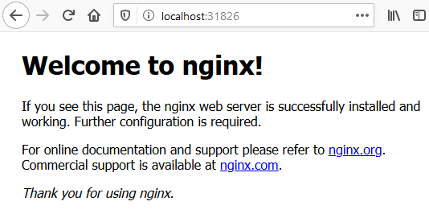

> 💡 Mise à jour : suite à la release 2.x du SDK j'ai mis à jour l'article et le code 😉 


Lors d'un précédent [article](/2021-11-09-java-k8s-operator) j'ai jeté les bases de comment développer un opérateur Kubernetes en Java.
Après la réalisation d'un merveilleux _Hello World !_ il me semblait utile d'illustrer un cas d'utilisation plus réel et de commencer à faire des actions utiles pour un Ops dans sa vie de tous les jours.

Je ne m'étendrai donc pas sur le comment démarrer un projet Java pour écrire un opérateur et comment le packager, pour cela je vous laisse vous replonger dans l'article précédent abordant ces sujets.

## Un Ops dans mon cluster 👷‍♂️ ?

Lors de mon précédent article j'indiquais qu'il était possible de faire faire plus ou moins de choses à notre opérateur, le fameux _modèle de maturité_ des opérateurs.
C'est un niveau (de 1 à 5) qui indique si l'opérateur est capable de faire plus ou moins d'actions automatiques (de l'installation à bien plus).

Dans cet article je vais vous montrer deux aspects intéressants pour un tel opérateur : 

 - installer et désinstaller de manière simple / automatique un serveur HTTP Nginx,
 - ajouter une surveillance _ops_ qui permet de redéployer le serveur si on a supprimé (par erreur) le déploiement et donc le serveur Nginx.

Deux fonctionnalités très simples mais qui vont nous permettre de plus se projeter vers un cas concret d'un opérateur (mieux qu'avec un _Hello World !_ 😅).

## Gérer l'installation d'un serveur HTTP Nginx 🛠️

### La custom resource definition (CRD) 📝

On est habitué maintenant, avant toute chose, pour débuter notre opérateur on crée la [_custom resource definition_](https://kubernetes.io/docs/tasks/extend-kubernetes/custom-resources/custom-resource-definitions/) (CRD) associée.

C'est maintenant une habitude, mais j'utilise le SDK [java-operator-sdk](https://github.com/java-operator-sdk/java-operator-sdk) pour me faciliter la vie pour initier / coder mon opérateur.

Commençons donc par les classes nécessaires pour générer le YAML de la CRD.

Notre CRD doit permettre la création d'une _custom resource_ avec comme champ utile le nombre de replicas que l'on souhaite.
Pour cela on définit la partie _spec_ de la CRD:

```java
public class NginxInstallerSpec {

    private Integer replicas;

    public Integer getReplicas() {
        return replicas;
    }

    public void setReplicas(Integer replicas) {
        this.replicas = replicas;
    }
}
```

Il ne reste plus qu'à définir la CRD en elle même : 
```java
@Group("fr.wilda")
@Version("v1")
@ShortNames("ngi")
public class NginxInstallerResource extends CustomResource<NginxInstallerSpec, Void> implements Namespaced {
    
}
```

Un petit `mvn clean compile` et la magie du projet [fabric8](https://github.com/fabric8io/kubernetes-client/) fait le reste :

```yaml
apiVersion: apiextensions.k8s.io/v1
kind: CustomResourceDefinition
metadata:
  name: nginxinstallerresources.fr.wilda
spec:
  group: fr.wilda
  names:
    kind: NginxInstallerResource
    plural: nginxinstallerresources
    shortNames:
    - ngi
    singular: nginxinstallerresource
  scope: Namespaced
  versions:
  - name: v1
    schema:
      openAPIV3Schema:
        properties:
          spec:
            properties:
              replicas:
                type: integer
            type: object
          status:
            type: object
        type: object
    served: true
    storage: true
```

### Le contrôleur, l'âme de notre opérateur 🤖

Rentrons dans le vif du sujet et donnons de l'intelligence à notre opérateur.
Cela se passe dans la classe définissant le contrôleur.

La structure du contrôleur reste simple :
```java
@ControllerConfiguration
public class NginxInstallerReconciler implements Reconciler<NginxInstallerResource> {
  
    // K8S API utility
    private KubernetesClient k8sClient;
    // Watcher to do some actions when events occurs
    private Watch watch = null;
    
    public NginxInstallerReconciler(KubernetesClient k8sClient) {
        this.k8sClient = k8sClient;
    }

    @Override
    public UpdateControl<NginxInstallerResource> reconcile(NginxInstallerResource resource, Context context) {
        System.out.println("🛠️  Create / update Nginx resource operator ! 🛠️");

        // ...

        return UpdateControl.updateResource(resource);
    }

    @Override
    public DeleteControl cleanup(NginxInstallerResource resource, Context context) {
        System.out.println("💀 Delete Nginx resource operator ! 💀");

        // ...

        return DeleteControl.defaultDelete();
    }

}
```

Pour mémoire, ce contrôleur réagit sur la création / modification / suppression d'une _custom resource_ (basée sur la CRD définie précédemment).
A titre d'exemple voici ce que cela donne pour la création d'une instance Nginx avec deux replicas dans le namespace _test-nginx-operator_:
```yaml
apiVersion: "fr.wilda/v1"
kind: NginxInstallerResource
metadata:
  name: nginx-installer
  namespace: test-nginx-operator
spec:
  replicas: 2
```

Avant de développer la partie gérant le déploiement, et pour se simplifier la vie, nous allons utiliser un _deployment.yml_ pour le déploiement de Nginx.
Il aurait été possible de tout faire en Java mais il y a peu d'intérêt ici.

Le _deployment.yml_ pour notre Nginx :
```yaml
apiVersion: apps/v1
kind: Deployment
metadata:
  name: nginx-deployment
  labels:
    app: nginx
spec:
  replicas: 1
  selector:
    matchLabels:
      app: nginx
  template:
    metadata:
      labels:
        app: nginx
    spec:
      containers:
      - name: nginx
        image: nginx:stable-alpine
        ports:
        - containerPort: 80
```

Passons au code qui va gérer _l'installation_ (en fait la création de la ressource de déploiement):
```java
    @Override
    public UpdateControl<NginxInstallerResource> reconcile(NginxInstallerResource resource, Context context) {
        System.out.println("🛠️  Create / update Nginx resource operator ! 🛠️");

        String namespace = resource.getMetadata().getNamespace();

        // Load the Nginx deployment
        Deployment deployment = loadYaml(Deployment.class, "/k8s/nginx-deployment.yml");

        // Apply the number of replicas
        deployment.getSpec().setReplicas(resource.getSpec().getReplicas());
        deployment.getMetadata().setNamespace(namespace);
        // Create or update the modifications
        k8sClient.apps().deployments().inNamespace(namespace).createOrReplace(deployment);

        return UpdateControl.updateResource(resource);
    }
```
Et enfin celui qui aura la charge de supprimer notre serveur HTTP :
```java
    @Override
    public DeleteControl cleanup(NginxInstallerResource resource, Context context) {
        System.out.println("💀 Delete Nginx resource operator ! 💀");

        // Delete deployment and its PODs
        k8sClient.apps().deployments().inNamespace(resource.getMetadata().getNamespace()).delete();

        return DeleteControl.defaultDelete();
    }
```

Simple non ?
Comme indiqué, j'ai choisi de partir d'un YAML plutôt que de tout renseigner à la main mais il est possible de tout faire via l'API, on a un exemple avec le positionnement du replica `deployment.getSpec().setReplicas(resource.getSpec().getReplicas());`.

Passons au déploiement de notre opérateur et à son test.

Pour simplifier le test nous allons utiliser le mode ligne de commande : cela correspond à lancer notre opérateur directement depuis l'IDE ou un bash sur notre machine et non déployé comme POD dans Kubernetes.
J'ai déjà abordé le déploiement d'un opérateur dans Kubernetes dans mon article précédent. 
J'y reviendrai tout de même en fin d'article car il y a quelques spécificités à prendre en compte.

Lançons notre opérateur et commençons à tester tout ça !

```bash
mvn exec:java -Dexec.mainClass=fr.wilda.NginxInstallerRunner

🚀 Starting NginxInstaller operator !!! 🚀
```
Pour tester son bon fonctionnement nous allons commencer par créer la CRD : `kubectl apply -f ./target/classes/META-INF/fabric8/nginxinstallerresources.fr.wilda-v1.yml`.
Enfin il suffit ensuite de créer la CR basée sur la CRD : `kubectl apply -f ./src/test/resources/test_nginx.yml -n test-nginx-operator`.

Vérifions ce qu'il se passe sur notre opérateur et dans notre cluster Kubernetes :
```bash
🚀 Starting NginxInstaller operator !!! 🚀
🛠️   Create / update Nginx resource operator ! 🛠️
```
```bash
kubectl get pods -n test-nginx-operator

NAME                                READY   STATUS    RESTARTS   AGE
nginx-deployment-69c78cd8c6-bbhjj   1/1     Running   0          107s
nginx-deployment-69c78cd8c6-rz6xs   1/1     Running   0          11s
```
Plutôt cool non ?
Nos deux PODs contenant un serveur Nginx ont bien été déployés comme demandé !

Et la suppression n'est pas plus compliquée : `kubectl delete ngi/nginx-installer  -n test-nginx-operator`

```bash
🚀 Starting NginxInstaller operator !!! 🚀
🛠️   Create / update Nginx resource operator ! 🛠️
💀 Delete Nginx resource operator ! 💀
```
```bash
kubectl get pods -n test-nginx-operator

No resources found in test-nginx-operator namespace.
```

A ce stade de notre développement résumons ce que l'on a : 
 - une _custom resource définition_ (CRD) définissant un ressource permettant la création d'une _custom resource_ (CR) qui définit les informations minimums (dans notre cas le nombre de réplicas) pour créer un POD ou des PODs avec un serveur HTTP Nginx
 - un opérateur ayant un contrôleur se basant sur la CR créée afin de créer ou supprimer les éléments voulus (les PODs).

C'est bien mais ça demande un peu plus d'intelligence, c'est ce que nous allons voir dans le paragraphe suivant !

## Plus d'intelligence !!! 🧠

Nous allons donc aller un peu plus loin : 
 - permettre d'utiliser le serveur Nginx déployé (c'est la moindre des choses 😅) en ajoutant un service (en mode _node port_),
 - ajouter une _supervision_ de notre _deployment_ : si il est supprimé autrement que via la CR, on le recrée.


### Un Ops dans le code 👷

Nous commençons par ce dernier point : recréer le _deployment_ si il est supprimé par inadvertence.
Pour cela on va utiliser une deuxième notion des opérateurs : la notion de _watch_.
C'est assez simple : on va abonner notre opérateur à certains évènements et il réagira en fonction.
Dans notre exemple cela va donner quelque chose du genre : 
> envoie moi tous les évènements en rapport aux déploiements d'un certain namespace.

Voyons comment faire cela en adaptant notre code précédent et, comme vous vous en doutez peut être, tout va se faire dans le contrôleur.
Il suffit d'ajouter dans la méthode _createOrUpdateResource_ la gestion des évènements sur le deployment créé :

```java
    @Override
    public UpdateControl<NginxInstallerResource> reconcile(NginxInstallerResource resource, Context context) {
        System.out.println("🛠️  Create / update Nginx resource operator ! 🛠️");

        String namespace = resource.getMetadata().getNamespace();

        // Load the Nginx deployment
        Deployment deployment = loadYaml(Deployment.class, "/k8s/nginx-deployment.yml");

        // Apply the number of replicas
        deployment.getSpec().setReplicas(resource.getSpec().getReplicas());
        deployment.getMetadata().setNamespace(namespace);
        // Create or update the modifications
        k8sClient.apps().deployments().inNamespace(namespace).createOrReplace(deployment);

        // Watch events on the Nginx deployment
        watch = k8sClient.apps().deployments().withName(deployment.getMetadata().getName())
                .watch(new Watcher<Deployment>() {
                    @Override
                    public void eventReceived(Action action, Deployment resource) {
                        System.out.println("⚡ Event receive on watcher ! ⚡ ➡️ " + action.name());

                        if (action == Action.DELETED) {
                            System.out.println("🗑️  Deployment deleted, recreate it ! 🗑️");
                            k8sClient.apps().deployments().inNamespace(resource.getMetadata().getNamespace())
                                    .createOrReplace(deployment);
                        }
                    }

                    @Override
                    public void onClose(WatcherException cause) {
                        System.out.println("☠️ Watcher closed due to unexpected error : " + cause);
                    }
                });

        return UpdateControl.updateResource(resource);
    }

```
Ce qui nous intéresse se trouve dans la méthode _watch_ : on récupère l'évènement pour tester si il est de type _DELETE_ afin de recréer le _deployment_ que l'on vient de supprimer.

Cela donne en exécutant l'opérateur : 
```bash
mvn exec:java -Dexec.mainClass=fr.wilda.NginxInstallerRunner

🚀 Starting NginxInstaller operator !!! 🚀
🛠️   Create / update Nginx resource operator ! 🛠️
⚡ Event receive on watcher ! ⚡ ➡️ ADDED
⚡ Event receive on watcher ! ⚡ ➡️ MODIFIED
⚡ Event receive on watcher ! ⚡ ➡️ MODIFIED
⚡ Event receive on watcher ! ⚡ ➡️ MODIFIED
```
```bash
 kubectl get pods -n test-nginx-operator
NAME                                READY   STATUS    RESTARTS   AGE
nginx-deployment-69c78cd8c6-5g5kq   1/1     Running   0          3s
nginx-deployment-69c78cd8c6-6t7dx   1/1     Running   0          3s
```

On supprime le deployment sans passer par la suppression de la CR : `kubectl delete deployment/nginx-deployment -n test-nginx-operator`

Vérifions ce que ça a provoqué côté opérateur:
```bash
⚡ Event receive on watcher ! ⚡ ➡️ DELETED
🗑️  Deployment deleted, recreate it ! 🗑️
⚡ Event receive on watcher ! ⚡ ➡️ ADDED
⚡ Event receive on watcher ! ⚡ ➡️ MODIFIED
⚡ Event receive on watcher ! ⚡ ➡️ MODIFIED
⚡ Event receive on watcher ! ⚡ ➡️ MODIFIED
⚡ Event receive on watcher ! ⚡ ➡️ MODIFIED
⚡ Event receive on watcher ! ⚡ ➡️ MODIFIED
⚡ Event receive on watcher ! ⚡ ➡️ MODIFIED
```
Et enfin dans notre cluster:
```bash
 kubectl get pods -n test-nginx-operator
NAME                                READY   STATUS    RESTARTS   AGE
nginx-deployment-64d8d4556f-nrhdw   1/1     Running   0          115s
nginx-deployment-64d8d4556f-zftlf   1/1     Running   0          115s
```

On a bien notre Ops qui veille au grain et recrée notre _deployment_ en cas de disparition de celui-ci !

Si vous avez bien suivi il nous reste un dernière adaptation à faire.
En effet, notre ops est un peu trop zélé car même si on supprime la ressource il va recréer le _deployment_ !
Pour cela, il faut lui dire d'arrêter de surveiller notre _deployment_ en cas de suppression de la CR:
```java
    @Override
    public DeleteControl cleanup(NginxInstallerResource resource, Context context) {
        System.out.println("💀 Delete Nginx resource operator ! 💀");

        // Avoid the automatic recreation
        if (watch != null) watch.close();
        // Delete deployment and its PODs
        k8sClient.apps().deployments().inNamespace(resource.getMetadata().getNamespace()).delete();

        return DeleteControl.defaultDelete();
    }
```
C'est _close_ sur le _watch_ qui nous permet de dire à notre ops de se rendormir tranquillement 😉.

### Terminer la configuration 🛠️

Nous venons de fournir à notre opérateur un ops virtuel mais son premier travail, à savoir l'installation, n'est pas complet.
Notre serveur Nginx n'est pas accessible de l'extérieur.
Pour cela, je rajoute un _service_  en mode _node port_ pour se simplifie la vie (à ne pas reproduire chez vous !).
Comme pour le _deployment_ je passe par un fichier _yaml_ mais il est possible de tout faire en version code.

Le _service_ : 
```yaml
apiVersion: v1
kind: Service
metadata:
  name: "nginx-service"
spec:
  selector:
    app: "nginx"
  ports:
  - protocol: TCP
    port: 80
    targetPort: 80
  type: NodePort
```

Enfin l'adaptation de notre contrôleur pour créer ces deux ressources :
```java
    @Override
    public UpdateControl<NginxInstallerResource> reconcile(NginxInstallerResource resource, Context context) {
        System.out.println("🛠️  Create / update Nginx resource operator ! 🛠️");
    
        String namespace = resource.getMetadata().getNamespace();

        String namespace = resource.getMetadata().getNamespace();

        // Load the Nginx deployment
        Deployment deployment = loadYaml(Deployment.class, "/k8s/nginx-deployment.yml");

        // Apply the number of replicas
        deployment.getSpec().setReplicas(resource.getSpec().getReplicas());
        deployment.getMetadata().setNamespace(namespace);
        // Create or update the modifications
        k8sClient.apps().deployments().inNamespace(namespace).createOrReplace(deployment);

        // Watch events on the Nginx deployment
        watch = k8sClient.apps().deployments().withName(deployment.getMetadata().getName())
                .watch(new Watcher<Deployment>() {
                    @Override
                    public void eventReceived(Action action, Deployment resource) {
                        System.out.println("⚡ Event receive on watcher ! ⚡ ➡️ " + action.name());

                        if (action == Action.DELETED) {
                            System.out.println("🗑️  Deployment deleted, recreate it ! 🗑️");
                            k8sClient.apps().deployments().inNamespace(resource.getMetadata().getNamespace())
                                    .createOrReplace(deployment);
                        }
                    }

                    @Override
                    public void onClose(WatcherException cause) {
                        System.out.println("☠️ Watcher closed due to unexpected error : " + cause);
                    }
                });

        // Create service
        Service service = loadYaml(Service.class, "/k8s/nginx-service.yml");
        k8sClient.services().inNamespace(namespace).createOrReplace(service);

        return UpdateControl.updateResource(resource);
    }

```
Comme on peut le constater cela reprend exactement le même principe que pour le _deployment_ mais ici on crée notre service.

Testons tout ça : 



## Déploiement dans Kubernetes 🐳

On a un opérateur qui a plus d'intelligence que notre simple _Hello World_ du dernier article.
Bien sûr ce n'est pas les fonctionnalités les plus impressionnantes du monde mais maintenant que le principe est là on peut faire un peut tout type d'action.

Il nous reste une dernière chose, le déployer de manière autonome sur notre cluster Kubernetes.
Et là, j'ai eu une mauvaise surprise qui m'a occupée quelques jours, je vais vous la partager afin de vous faire gagner du temps !

### Le _deployment_ de l'opérateur 📝

Avant de passer à la création de l'image (et ses déboires) il faut créer le _deployment_ pour notre opérateur, rien de bien extraordinaire : 
```yaml
apiVersion: v1
kind: Namespace
metadata:
  name: nginx-operator
---

apiVersion: apps/v1
kind: Deployment
metadata:
  name: nginx-operator
  namespace: nginx-operator
spec:
  selector:
    matchLabels:
      app: nginx-operator
  replicas: 1 
  strategy:
    type: Recreate 
  template:
    metadata:
      labels:
        app: nginx-operator
    spec:
      containers:
      - name: operator
        image: localhost:5000/nginx-operator
        imagePullPolicy: Always
```

### A l'uber jar au revoir tu diras 🍱

Pour packager et déployer mon opérateur j'étais parti sur la même chose que pour mon _Hello World_ : Dockerfile et _uber jar_ (ou _fat jar_).
Mais voilà rien n'est simple dans la vie et une fois mon image déployée dans un POD, mon opérateur refusait systématiquement de passer les commandes _fabric8_ pour créer le _deployment_ avec l'erreur : 
```bash
🚀 Starting NginxInstaller operator !!! 🚀
🛠️  Create / update Nginx resource operator ! 🛠️
07:45:58.215 ERROR io.javaoperatorsdk.operator.processing.EventDispatcher.handleExecution(EventDispatcher.java:55) - Error during event processing ExecutionScope{ events=[CustomResourceEvent{ action=MODIFIED, resource=[ name=nginx-installer, kind=NginxInstallerResource, apiVersion=fr.wilda/v1 ,resourceVersion=274608, markedForDeletion: false ]}], customResource uid: 00ebe0d1-5f22-4982-89bf-fb029b9349d0, version: 274608} failed.
java.lang.IllegalStateException: No adapter available for type:class io.fabric8.kubernetes.client.AppsAPIGroupClient
    at io.fabric8.kubernetes.client.BaseClient.adapt(BaseClient.java:134) ~[operator.jar:?]
    at io.fabric8.kubernetes.client.BaseKubernetesClient.apps(BaseKubernetesClient.java:523) ~[operator.jar:?]
    at fr.wilda.controller.NginxInstallerController.createOrUpdateResource(NginxInstallerController.java:46) ~[operator.jar:?]
    at fr.wilda.controller.NginxInstallerController.createOrUpdateResource(NginxInstallerController.java:20) ~[operator.jar:?]
    at io.javaoperatorsdk.operator.processing.ConfiguredController$2.execute(ConfiguredController.java:101) ~[operator.jar:?]
    at io.javaoperatorsdk.operator.processing.ConfiguredController$2.execute(ConfiguredController.java:76) ~[operator.jar:?]
    at io.javaoperatorsdk.operator.Metrics.timeControllerExecution(Metrics.java:23) ~[operator.jar:?]
    at io.javaoperatorsdk.operator.processing.ConfiguredController.createOrUpdateResource(ConfiguredController.java:75) ~[operator.jar:?]
    at io.javaoperatorsdk.operator.processing.EventDispatcher.handleCreateOrUpdate(EventDispatcher.java:127) ~[operator.jar:?]
    at io.javaoperatorsdk.operator.processing.EventDispatcher.handleDispatch(EventDispatcher.java:87) ~[operator.jar:?]
    at io.javaoperatorsdk.operator.processing.EventDispatcher.handleExecution(EventDispatcher.java:46) [operator.jar:?]
    at io.javaoperatorsdk.operator.processing.DefaultEventHandler$ControllerExecution.run(DefaultEventHandler.java:360) [operator.jar:?]
    at java.util.concurrent.ThreadPoolExecutor.runWorker(Unknown Source) [?:?]
    at java.util.concurrent.ThreadPoolExecutor$Worker.run(Unknown Source) [?:?]
    at java.lang.Thread.run(Unknown Source) [?:?]
```

Après quelques heures / jours de recherches j'ai mis en doute mon image elle-même (il m'en a fallu du temps me direz vous ! 😅), j'ai donc décidé d'utiliser la même technique que dans les exemples de l'opérateur, à savoir le plugin maven [jib](https://github.com/GoogleContainerTools/jib/tree/master/jib-maven-plugin) pour fabriquer l'image.

```xml
    <plugins>
      <plugin>
        <groupId>com.google.cloud.tools</groupId>
        <artifactId>jib-maven-plugin</artifactId>
        <version>3.2.0</version>
        <configuration>
          <from>
            <image>adoptopenjdk:11-jre</image>
          </from>
          <to>
            <image>localhost:5000/nginx-operator</image>
          </to>
        </configuration>
      </plugin>
```

Un petit coup de maven : `mvn clean compile jib:dockerBuild`

Et là magie cela fonctionne du premier coup !

Si une personne a une explication j'avoue que je suis preneur car à ce stade je ne vois pas l'explication.
Ca sent un problème de précédence dans le _classpath_ mais je n'arrive pas à mettre le doigt dessus !

## Conclusion 🧐

Avec cet exemple un peu plus poussé j'espère que vous avez pu entrevoir toutes les possibilités d'un opérateur et sa facilité de l'écrire en Java.

L'ensemble des sources est disponible dans le projet GitHub [java-k8s-nginx-operator](https://github.com/philippart-s/java-k8s-nginx-operator).

Merci de m'avoir lu et si vous avez vu des coquilles n'hésitez pas à me l'indiquer sur le repository des [sources](https://github.com/philippart-s/java-k8s-nginx-operator) ou de l'[article](https://github.com/philippart-s/blog).