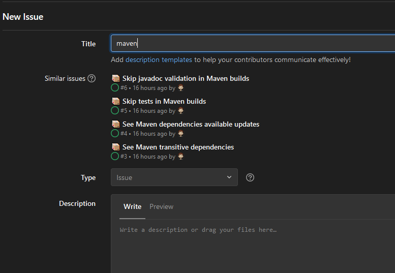

A force de trainer avec des gens inspirants, on finit par faire des trucs que l'on n'aurait pas forcément imaginés.
C'est mon cas avec [Philippe Charrière](https://k33g_org.gitlab.io/), à force de le voir utiliser GitLab autrement qu'un portail Git ça a déteint sur moi ! 
Je me suis mis dans la tête de gérer des _cheat sheets_ avec GitLab ou GitHub (je reviendrai plus tard sur le pourquoi j'ai choisi plus l'un que l'autre).

## Mais c'est quoi cette histoire de cheat sheet ? :nerd_face:
En dehors du fait que c'est imprononçable (en bon français antisèche) le besoin est assez simple.
De part mon métier et mon grand âge je suis en quelque sorte un _full stack_ mais un peu particulier puisque j'interviens aussi bien sur des problématiques de développement (angular, java, groovy, ...) mais aussi ops (kubernetes, docker, ...).
Au final beaucoup de commandes, de petits trucs et astuces à mémoriser et connaître.
En plus, comme je suis un fashion victime geek, je ne peux pas m'empêcher d'utiliser des CLI, voir de me rajouter des petits outils à droite à gauche ([oh my zsh](https://ohmyz.sh/) par exemple).

De plus, entre le pro et le perso, noter tout ça ou le bookmarker fait que j'ai plusieurs référentiels (one note, evernote, bookmark de navigateur, pocket, ...) et que cela devient compliqué de s'y retrouver :sweat_smile:.
Sans parler que certains de ces outils sont loin de m'avoir convaincu sur leur facilité ou rapidité d'utilisation.

Ma première idée a été de faire des cheat sheets au format [Markdown](https://fr.wikipedia.org/wiki/Markdown) ou [Asciidoctor](https://asciidoctor.org/).
Ca marche mais je trouvais que ce n'était pas assez pratique pour la recherche, le classement, l'accès ...

## Et les issues alors ? 💡

Et c'est là que le fait de côtoyer Philippe m'a influencé :laughing:.
Dernièrement il a eu l'idée de gérer une liste de recettes (culinaires) sous forme d'issues dans GitLab et du coup je me suis dit : mais au final c'est ce que je veux !

 1. Un titre où on peut mettre des emojis (primordial !)
 2. Une saisie markdown ou asciidoctor pour sa simplicité de saisie et le fait de pouvoir insérer facilement du code
 3. Une classification aisée avec une notion de tags (en fait des labels dans les issues)
 4. Une recherche full text
 5. Une discussion où je peux rajouter des éléments périphériques
 6. Accessible rapidement de n'importe où
 7. Potentiellement partageables à plusieurs en lecture ou lecture / écriture

Par la suite on verra que le choix entre GitLab et GitHub m'a permis de rajouter une ou deux fonctionnalités fort pratiques !

## Implémentation :memo:

Passons à la mise en place, au final assez simple.
J'ai deux regroupements possibles : 
 - par labels pour les regroupements par technos : Docker, Maven, Kubernetes, ...
 - un emoji pour le type : commande terminal (:computer:), packagers (:package:), ...

Voici ce que cela donne pour la vue liste : 

Voici un exemple d'un tip d'une commande linux utilisée dans un conteneur :

## Mais pourquoi GitLab au final ? :mag_right:

Honnêtement, à l'origine, je suis parti sur GitHub.
Par habitude, car je ne suis pas un utilisateur GitLab mais l'utilisation récente des issues GitLab (souvenez-vous les recettes) m'a fait me souvenir qu'une fonctionnalité que j'ai découverte sur les issues serait très pratique dans mon cas pour éviter les doublons : la suggestion des issues déjà existantes lorsque l'on saisit une nouvelle issue.

Du coup c'est ce qui m'a fait choisir GitLab plutôt que GitHub, en dehors du fait aussi de vouloir un peu découvrir ce que l'on peut faire sur cette petite partie du produit :wink:.

En utilisant GitLab j'ai pu, du coup, découvrir aussi que je pouvais trier mes issues par titre.
Comme les titres commencent par une liste finie d'emojis cela me donne un regroupement par types en plus de celui par catégories :wink:.

>:information_source: A noter :information_source:
>
>A noter que lors de la rédaction de l'article je me suis rendu compte qu'il y a un bug / fonctionnalité en cours car au final les emojis au format markdown (`:wink:` par exemple) sont rendus dans l'issue mais pas dans la liste d'issues.
Du coup pour que le tri fonctionne il faut accepter que la vue liste affiche les emojis au format texte : 

>
>Comme cela ne plaît pas j'ai choisi de me passer du tri par emojis en attendant la correction / implémentation de l'issue et d'utiliser pour le titre de mes issues directement l'image de l'emoji (par exemple en provenance de [emojipedia](https://emojipedia.org/)).
>
>L'issue dont je vous parle est dans la liste des issues GitLab ([14572](https://gitlab.com/gitlab-org/gitlab/-/issues/14572)).

## Conclusion 🧐

Je verrai si à l'utilisation mon idée est viable et pratique.
Il me reste encore quelques idées comme : partager le repository avec d'autres, utiliser les templates, utiliser les boards pour avoir un autre regroupement, pourquoi pas un peu d'automatisation sur la création, ...

Merci de m'avoir lu et si vous avez vu des coquilles n'hésitez pas à me l'indiquer sur l'[article](https://github.com/philippart-s/blog).