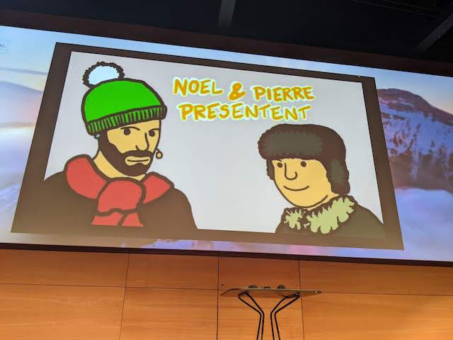
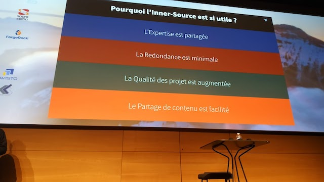
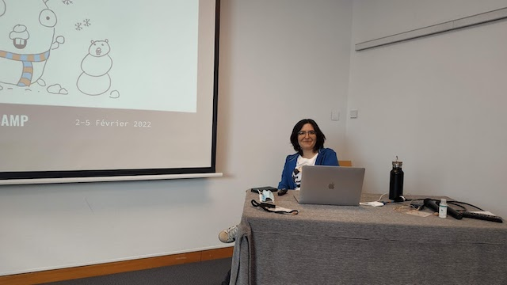
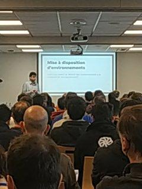
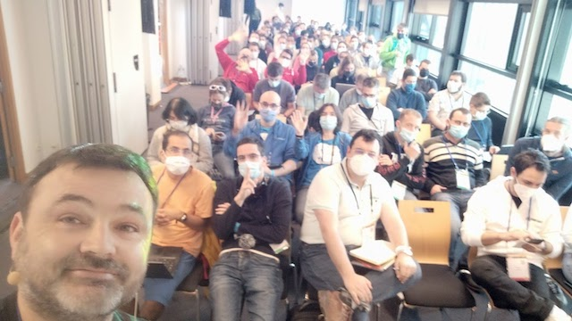

Mon [Snowcamp](https://snowcamp.io/fr/) 2022 a été particulier pour bien des raisons.

Déjà, c’est la première fois que je viens à cette conférence.
C’est une très belle conférence dans une superbe région et revoir ces montagnes que j’aime tant m’a fait un bien fou !

Ensuite, c’est la première fois que je donne un talk dans une conférence de cette taille sur un format de 45 minutes !

Et pour finir, c’est mon troisième jour en tant que DevRel à OVHcloud, changement non négligeable dans ma vie professionnelle mais aussi de la façon dont j’ai abordé cette conférence :wink:.

Comme souvent dans ce genre de conférence les organisateurs ont géré comme des malades.
Alors oui le repas était compartimenté, le café assis, … Mais au final le plus important ce n’est pas que tout cela ait pu avoir lieu ?

## Les conférences 💬

### [Il était une fois ... les navigateurs :sailboat:](https://snowcamp2022.sched.com/event/qa5F/il-etait-une-fois-les-navigateurs-nulb) - Noël Macé / Pierre Tibulle

Très bon choix de Keynote.

J’avais déjà eu la chance de voir ce talk lors du dernier JUG Summer Camp et c’est toujours aussi efficace.
La dextérité de Pierre dans l’art du sketch noting n’est plus à prouver et les talents de conteur de Noël non plus.
Et en plus, pour ne rien gâcher, on a appris plein de choses !

Plus de détails dans mon [article]({{ site.baseurl }}) sur leur conférence au JUG Summer Camp.

### [Mais à quoi ça sert un DevRel ? :unicorn:](https://snowcamp2022.sched.com/event/qHPo/mais-a-quoi-ca-sert-un-devrel) - Aurélie Vache / Horacio Gonzalez

:page_facing_up: [les slides](https://t.co/g9ZsVy6PQ0)

Ah celle là je l’attendais avec impatience car elle était donnée par deux membres éminents de ma nouvelle équipe : Aurélie et Horacio, DevRel chez OVHcloud.

Alors oui, j’avais déjà une (mon) idée du métier, mais j’ai vraiment aimé le côté honnêteté de ce qu’est ce métier : ce n’est pas que de la communication ou des paillettes il y a aussi les à côtés moins sympas comme les voyages et autres sollicitations.

Il est important aussi de garder à l’esprit qu’un DevRel se doit de rester technique (ouf :wink:) mais doit savoir partager et communiquer avec les développeurs.
Bien entendu comme de nombreux métiers qui sont faits par passion l’équilibre vie personnelle et professionnelle est toujours fragile et attention à ne pas se faire happer par ce métier passionnant.

Je crois que la phrase qui résume le mieux ce métier est : “rendre les développeurs heureux”, on entend souvent de grands DevRel la citer (comme Sébastien Blanc) mais je crois que ce n’est pas galvaudé et que c’est vraiment ce qui nous (j’ai le droit maintenant de dire “nous”) caractérise le plus en tant que DevRel.
N’ayant pas eu de captation vidéo vous ne pourrez pas admirer les beaux costumes de licornes qu’avaient nos speakers.

### [Qu'est-ce que l'InnerSource ? Comment ça se met en place et pourquoi ça va améliorer votre IT ... mais pas que ? :handshake:](https://snowcamp2022.sched.com/event/qHQm/quest-ce-que-linnersource-comment-ca-se-met-en-place-et-pourquoi-ca-va-ameliorer-votre-it-mais-pas-que) - Philippe Charrière / Matthieu V

:page_facing_up: [les slides](https://t.co/VE6MLwBdm6)

Ce talk m’a particulièrement parlé car il faisait énormément écho à [celui](https://snowcamp2022.sched.com/event/qHR4/lopen-source-au-secours-du-developpeur-et-de-larchitecte) que j’ai donné à ce même Snowcamp sur le monde open source et pourquoi il faut y participer.
Ce qui me rassure c’est que je suis en phase avec Philippe et Matthieu sur ce qui peut être transposé du monde open source au monde inner source.

Ce qu’il faut en retenir, je pense, que ce soit pour l’inner source ou l’open source : la transparence, le partage et l’envie d’apprendre.
En fait tout est question d’état d’esprit, est-on prêt à faire les “efforts” pour partager et faire grandir sa communauté de développeurs au sein de l’entreprise ou se satisfait-on de l’étanchéité des silos pour “vivre heureux en vivant cachés” ?
Spoiler alert : cela ne marche pas de _siloter_, ou du moins pas sans efforts voir souffrances des personnes qui sont au coeur d’un tel système.
Alors oui cela demande de l’énergie de mettre tout ça en place et le travail effectué par l’équipe de Matthieu est impressionnant (que ce soit le portail ou la documentation mise en place) mais il en vaut le coup pour l’entreprise mais aussi pour le bien être des développeurs.

### [Common tips & mistakes" en Go - et comment les résoudre :eyes:](https://snowcamp2022.sched.com/event/vE3y/common-tips-mistakes-en-go-et-comment-les-resoudre) - Aurélie Vache

:page_facing_up: [les slides](https://t.co/2Hboctdx73)

Une conférence d’Aurélie est toujours un bon moment et celle-ci m’a permis de continuer ma découverte de Go.
Je ne suis pas un développeur Go mais il semble quasiment impossible dans les années qui viennent de passer à côté.

Et là, Aurélie nous donne une liste déjà bien fournie (mais qui va certainement encore s’allonger) d’erreurs communes à ne pas reproduire car elle s’est cassées les dents dessus pour nous avant !

En prime, une option cachée (surtout non documentée !) sur la commande _go get_ permettant de se sortir des mauvaises situations.
Je me suis noté dans un ma TODO list des choses à faire en Go de revoir les slides d’Aurélie avant de me lancer dans les développements de mes futurs projets.

### [Checklist pour concevoir une application dans le cloud : 10 conseils à l'attention des concepteurs et architectes :cloud:](https://snowcamp2022.sched.com/event/qHP8/checklist-pour-concevoir-une-application-dans-le-cloud-10-conseils-a-lattention-des-concepteurs-et-architectes) - Alexandre Touret

:page_facing_up: [les slides](https://t.co/35pPCRtF3w)

Vous reprendrez bien un peu d’architecture ?

Alexandre, avec qui j’ai travaillé dans une vie antérieure, nous livre une liste de conseils ou de questions qu’il est bon de se poser avant de ce lancer dans le cloud et son éco système.

Le premier est, je trouve, le plus important : **si vous n’avez pas besoin d’infra dans le cloud, n’y allez pas.**

C’est une évidence mais tellement peu suivie car souvent victime du hype driven development.
Alors oui cela ne fait pas toujours plaisir de s’entendre dire qu’un développeur doit déjà bien savoir développer avant de commencer à tous prix de mettre les mains dans Docker ou Kubernetes, mais n’est-ce pas vrai une fois que l’on a mis un peu son égo de côté ?

Plein de bons conseils que je vous laisserai aller voir dans ses slides mais gardez à l’esprit certains d’entre eux : le temps de démarrage des applications, la gestion des patchs management, le logging / trace, …

### L'instant auto promo, ma propre conférence 🐻‍❄️

Comme je l'ai indiqué, j'ai eu la chance de donner une conférence lors de ce Snowcamp.

Le sujet était de présenter pourquoi et comment je me suis lancé dans le monde open source.
Je vous laisse aller voir le [pitch](https://snowcamp2022.sched.com/event/qHR4/lopen-source-au-secours-du-developpeur-et-de-larchitecte) ainsi que les [feedbacks](https://roti.express/share-survey/7J4677bqJ4NMkiDfG) des personnes ayant participé.

Je ne suis pas un speaker confirmé et j'avoue que j'appréhendais un peu de savoir comment j'allais me comporter.
La prise de parole en public n'est pas quelque chose qui m'effraie particulièrement mais il y a toujours ce petit moment de stress où l'on se met à douter.
Pour ma part c'était surtout sur l'intérêt même du sujet : n'étant pas un sujet technique j'ai eu le doute quant à la plus value de passer 45 mins face à un public plutôt technique de leur parler d'open source d'un point de vue humain et non technique.

Comme souvent lors des conférences le public est plutôt bienveillant et cela s'est bien passé avec un auditoire qui m'a semblé attentif jusqu'au bout.
Petit bonus j'ai pu recroiser du monde ensuite pour prendre le temps de discuter plus en profondeur et me rendre compte que certain.e.s avaient vraiment apprécié et voulaient se lancer dans l'aventure open source.
Honnêtement ça a suffit à mon bonheur !

Pour ceux qui veulent les liens dans la présentation, celle-ci est accessible [ici](https://noti.st/philippart-s/8XjcQg/opensource-au-secours-du-developpeur-et-de-larchitecte).

Et j'ai la chance d'avoir eu la version sketchnote de Pierre Tibulle : 

## Conclusion 🧐
On a le plaisir de pouvoir reprendre tranquillement les conférences en présentiel et ça ce n’est que du bonheur !

C’est la première fois que je participais au Snowcamp et j’ai beaucoup aimé la diversité des sujets, la gentillesses des orgas.
Le lieu est magnifique entouré de ces belles montagnes que j’aime tant … et que dire des restaurants tous plus bons les uns que les autres !
Juste un petit bémol : le fait que la conférence ne soit pas filmée : c’est dommage pour les conférences loupées et j’aurai bien ramené un petit souvenir de ma conférence ;).

Bref, continuez comme ça et à l’année prochaine !

Merci de m'avoir lu et si vous avez vu des coquilles n'hésitez pas à me l'indiquer sur l'[article](https://github.com/philippart-s/blog).