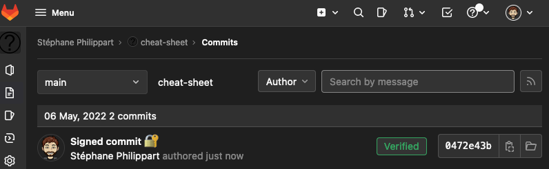

Pour beaucoup, c'est peut être une évidence, mais jusqu'à présent je ne signais pas mes commits Git.
Je n'en n'avais pas forcément le besoin et la connaissance.

Alors pourquoi le faire maintenant ?  
Tout simplement parce que je suis dans une société qui préconise de le faire 😉.

L'autre avantage est de _sécuriser_ mes commits pour ne pas avoir d'usurpation d’identité.
C'est peut être pas grand chose mais je me dis qu'il serait dommage que cela m'arrive alors qu'il est possible de s'en prémunir _simplement_.
Et avoir la double authentification (_2FA_ pour les intimes) c'est bien, mais cela n'empêche pas les gens d'usurper votre identité et de mettre dans leur méta data vos noms et emails, les commits signés oui.

## Simplement, vraiment ? 🙄

Alors, ce n'est pas que c'est compliqué, c'est que, pour moi, cela utilise des notions que je connais pas forcément.  
Pour le faire je vous conseille fortement les tutoriels de [GitLab](https://docs.gitlab.com/ee/user/project/repository/gpg_signed_commits/) et [GitHub](https://docs.github.com/en/authentication/managing-commit-signature-verification).  
Ces deux tutoriels vous expliquent comment créer votre clef et la configurer dans Git et votre hébergeur Git.

## Les pré-requis ⚙️

La première chose est d'avoir un client permettant la manipulation des clefs GPG, dans mon cas, sur Mac Os, je l'installe avec [brew](https://brew.sh/):
```bash
$ brew install gnupg
```

Une fois que c'est fait il suffit de suivre un des deux tutos pour créer sa clef:
```bash
$ gpg --generate-key 

gpg (GnuPG) 2.3.6; Copyright (C) 2021 Free Software Foundation, Inc.
This is free software: you are free to change and redistribute it.
There is NO WARRANTY, to the extent permitted by law.

Note: Use "gpg --full-generate-key" for a full featured key generation dialog.

GnuPG needs to construct a user ID to identify your key.

Real name: Foo Bar
Email address: foo@gmail.com
You selected this USER-ID:
    "Foo Bar <foo@gmail.com>"

Change (N)ame, (E)mail, or (O)kay/(Q)uit? 
```

Une fois la clef créée, il est possible d'avoir ses clefs publiques et privée:
```bash
$ gpg --list-secret-keys --keyid-format=long

/Users/sphilipp/.gnupg/pubring.kbx
----------------------------------
sec   ed25519/ABCDEFGHIJKLMNOP 2022-05-05 [SC] [expires: 2024-05-04]
      SSSSSSSSSSSSSSSSSSSSSSSSSABCDEFGHIJKLMNOP
uid                 [ultimate] Foo Bar <foo@gmail.com>
ssb   cv25519/ZZZZZZZZZZZZZZZZ 2022-05-05 [E] [expires: 2024-05-04]
```
Ce qui est utile pour ensuite manipuler la clef est la clef publique, `ABCDEFGHIJKLMNOP` dans mon exemple.

Une fois la clef générée vous pouvez lui ajouter un autre email, si par exemple vous avez plusieurs emails (par ex pro et perso) derrière le même compte.  
Cela se passe de nouveau avec le client gpg:
```bash
& gpg --edit-key ABCDEFGHIJKLMNOP
gpg (GnuPG) 2.3.6; Copyright (C) 2021 Free Software Foundation, Inc.
This is free software: you are free to change and redistribute it.
There is NO WARRANTY, to the extent permitted by law.

Secret key is available.

gpg: checking the trustdb
gpg: marginals needed: 3  completes needed: 1  trust model: pgp
gpg: depth: 0  valid:   1  signed:   0  trust: 0-, 0q, 0n, 0m, 0f, 1u
gpg: next trustdb check due at 2024-05-04
sec  ed25519/ABCDEFGHIJKLMNOP
     created: 2022-05-05  expires: 2024-05-04  usage: SC  
     trust: ultimate      validity: ultimate
ssb  cv25519/ABCDEFGHIJKLMNOP
     created: 2022-05-05  expires: 2024-05-04  usage: E   
[ultimate] (1). Foo Bar <foo@gmail.com>

gpg> adduid
Real name: Foo Foo
Email address: bar@gmail.com
Comment: 
You selected this USER-ID:
    "Foo Foo <bar@gmail.com>"

Change (N)ame, (C)omment, (E)mail or (O)kay/(Q)uit?
```

Pour ne pas avoir à saisir sa passphrase à chaque signature de commit il faut installer `pinentry-mac` (ou pinentry pour les autres os).
Cela permet de faciliter l'enregistrement de cette passphrase dans le _Keychain_ de Mac Os.  
Ensuite, il suffit de configurer gpg pour l'utiliser.

```bash
$ brew install pinentry-mac

$ echo "pinentry-program $(which pinentry-mac)" >> ~/.gnupg/gpg-agent.conf
```

A ce stade tout est en place pour signer ses commits.

## Signer ses commits 🔒

Là c'est plus simple !

Pour le faire en _one shot_ : `git commit -S -m "my cool signed commit 🔒"`  
Mais bon, on va le configurer pour le faire à chaque commit.

```bash
$ git config --global commit.gpgsign true
$ git config --global gpg.program gpg
$ git config --global user.signingkey ABCDEFGHIJKLMNOP
$ killall gpg-agent
```

Et voilà vos commits sont signés 😎.

## Où il est question de ceinture et de bretelles 🔐

Vous signez vos commits, et c'est très bien mais comment savoir que, ce qui est sur GitHub et GitLab, vient bien de vous ?
Rien de plus simple, les deux portails vous proposent de rentrer votre clef publique afin de pouvoir identifier vos commits.  
Pour cela il faut exporter votre clef:

```bash
$ gpg --armor --export ABCDEFGHIJKLMNOP

-----BEGIN PGP PUBLIC KEY BLOCK-----

TG9yZW0gaXBzdW0gZG9sb3Igc2l0IGFtZXQsIGNvbnNlY3RldHVyIGFkaXBpc2NpbmcgZWxpdC4g
SW4gYmliZW5kdW0gaGVuZHJlcml0IG5pYmggaWQgZ3JhdmlkYS4gUGhhc2VsbHVzIG5lYyBhbGlx
dWFtIG1hc3NhLCBmcmluZ2lsbGEgc29sbGljaXR1ZGluIG1ldHVzLiBQaGFzZWxsdXMgc2l0IGFt
ZXQgdGluY2lkdW50IG9yY2kuIERvbmVjIHF1aXMgdml2ZXJyYSBsaWd1bGEuIE5hbSBwaGFyZXRy
YSBlbGl0IGV4LCBzaXQgYW1ldCB0aW5jaWR1bnQgbmliaCB0ZW1wb3IgdmVsLiBOdWxsYSBzZW1w
ZXIgcGxhY2VyYXQgZGlhbSBzaXQgYW1ldCB2YXJpdXMuIFN1c3BlbmRpc3NlIHRyaXN0aXF1ZSBl
Z2V0IGxvcmVtIGV1IHBsYWNlcmF0LiBOdW5jIGlhY3VsaXMgbnVuYyBldCBuZXF1ZSBlZmZpY2l0
dXIgZnJpbmdpbGxhLiBWZXN0aWJ1bHVtIG1vbGxpcyBldWlzbW9kIG1hZ25hIHNpdCBhbWV0IGlu
dGVyZHVtLiBQZWxsZW50ZXNxdWUgaW1wZXJkaWV0IGxvcmVtIG51bGxhbS4g

-----END PGP PUBLIC KEY BLOCK-----
```

Et vous copiez cette sortie dans votre configuration GPG [GitHub](https://docs.github.com/en/authentication/managing-commit-signature-verification/adding-a-new-gpg-key-to-your-github-account) ou [GitLab](https://docs.gitlab.com/ee/user/project/repository/gpg_signed_commits/#add-a-gpg-key-to-your-account) pour renseigner votre clef GPG.

Et du coup vos commits apparaissent comme _verified_



## Et avec plusieurs ordinateurs ? 💻

Vous vous en doutez bien, si on a plusieurs ordinateurs on ne va pas générer des clefs différentes ...
Pour cela il suffit d'exporter la clef du premier ordinateur.
Puis de l'importer sur le deuxième.

L'export se fait simplement avec deux commandes:

```bash
$ gpg --export-secret-keys -a ABCDEFGHIJKLMNOP > my_private_key.asc
$ gpg --export -a ABCDEFGHIJKLMNOP > my_public_key.asc
```

Et du coup il ne reste plus qu'à importer les deux clefs sur le nouvel ordinateur:
```bash
$ gpg --import my_private_key.asc
$ gpg --import my_public_key.asc
```

Comme vous venez d'importer une clef il vous faut indiquer le degrés de confiance que vous lui accordez (`trust`), dans votre cas comme c'est votre clef autant mettre le plus haut (`ultimate`).

```bash

$ gpg --edit-key ABCDEFGHIJKLMNOP

gpg> trust

Please decide how far you trust this user to correctly verify other users\' keys
(by looking at passports, checking fingerprints from different sources, etc.)

  1 = I don't know or won't say
  2 = I do NOT trust
  3 = I trust marginally
  4 = I trust fully
  5 = I trust ultimately
  m = back to the main menu
```

`Go to paragraphe Signer ses commits 🔒` pour que les commits sur le nouvel ordinateur soit signés.

## 🗓️ Mise à jour de la date d'expiration

Petite mise à jour de cet article en ce 4 mai 2024 ... car cela ne fonctionne plus 😅.
Avec un message qui n'est pas plus explicite que ça:
```bash
error: gpg failed to sign the data
fatal: failed to write commit object
```

En regardant de plus près avec la commande `gpg --list-keys`, je me rends compte que mes clefs ne sont plus valides (`expired`).
Si cela vous arrive il est possible d'étendre la date d'expiration de votre clef.

```bash
$ gpg --edit-key ABCDEFGHIJKLMNOP

gpg> expire
Changing expiration time for the primary key.
gpg: WARNING: no user ID has been marked as primary.  This command may
              cause a different user ID to become the assumed primary.
Please specify how long the key should be valid.
         0 = key does not expire
      <n>  = key expires in n days
      <n>w = key expires in n weeks
      <n>m = key expires in n months
      <n>y = key expires in n years
Key is valid for? (0)
```

Choisissez la durée à partir de laquelle la clef ne sera plus valide puis quittez le mode édition avec `save`.

Et voilà, votre clef est de nouveau valide 😉.

## Conclusion 🧐

Et voilà, fin de cet article.  
J'espère qu'il aura éclairé certain.e.s sur l'utilité (ou non) de signer ses commits et de comment faire pour la CLI git ainsi que votre portail préféré.

Merci de m'avoir lu, et si vous avez vu des coquilles n'hésitez pas à me l'indiquer sur l'[article](https://github.com/philippart-s/blog).