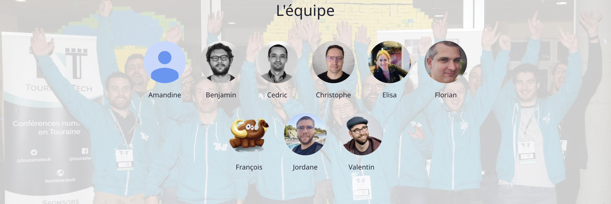
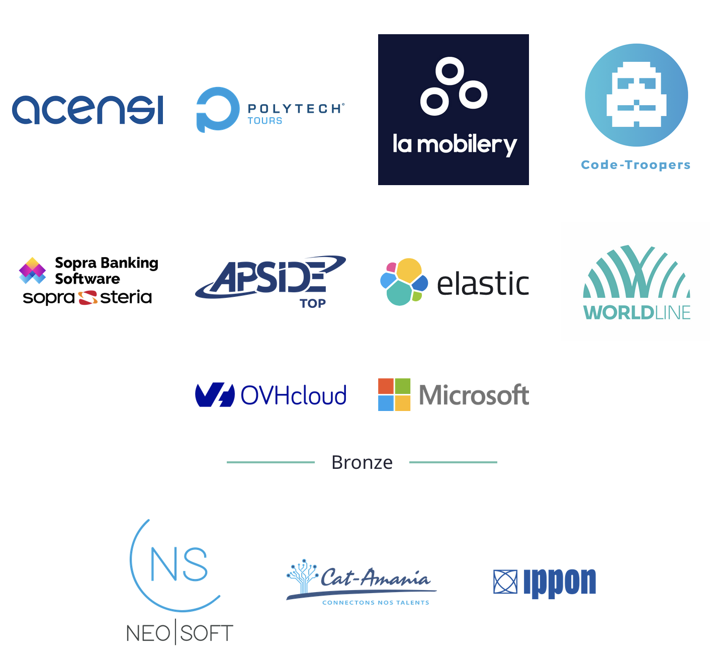

Ca y est, enfin, [Touraine Tech](https://touraine.tech/) édition 2023 est là et moi je viens de vivre deux jours intenses en émotions 🤩.  
C'est déjà la première chose différente par rapport aux années précédentes, les orgas ont eu la bonne idée de doubler le plaisir en ajoutant un jour de conférence !

## L'organisation 💪

Quelle équipe !
Alors commençons par les remercier : merci Amandine, Elisa, Benjamin, Cédric, Christophe, Florian, François, Jordan et Valentin ❤️.  
Vous avez réussi un truc de fous et toujours dans la bonne humeur en prenant soin de vos spectatrices, spectateurs, oratrices, orateurs et sponsors.  
Une mention spéciale aussi à tous les étudiantes et étudiants qui vous ont aidé durant ces deux jours, ils ont été au top 👏.

## La conférence 🗣

[Jeremy Thomas](https://unsplash.com/photos/4dpAqfTbvKA?utm_source=unsplash&utm_medium=referral&utm_content=creditShareLink)

Il m'arrive, en parlant de cette conférence, de ne pas être toujours objectif peut être 😉.  
Touraine Tech c'est, maintenant, 2 jours de conférences autour de la tech et plus particulièrement du développement.
Le programme réserve aussi de belles surprises autour de thèmes plus vastes comme la place de la femme / homme dans la tech, l'agilité, des retours d'expériences personnelles afin de nous aider à mieux apprendre ou s'organiser, ...

Vous l'aurez compris, ne pas trouver chaussure à son pied durant ces deux jours est impossible.
Durant ces deux jours il est possible de choisir parmi : 
 - 4 keynotes
 - 3 workshops
 - 35 conférences
 - 18 quickies

Plus de détails sur le programme : [https://touraine.tech/#schedule](https://touraine.tech/#schedule).

C'est aussi l’occasion pour 400 personnes de venir non seulement assister à des conférences de qualité mais aussi de rencontrer de gentils sponsors sur les stands.
Cette année ils étaient au nombre de 10 en physique et 3 en virtuel.

Je me dois aussi de parler d'une chose qui fait la renommée de cette conférence : [les fouées](https://www.my-loire-valley.com/2022/07/fouees-tourangelles/).
Qu'elles soient garnies de rillettes (de Tours bien évidemment), de chèvre (de Touraine bien évidemment) ou tout autre chose, c'est délicieux 🤤. 

# Ma conférence à moi 🔍

[Joshua Colman](https://unsplash.com/photos/_yVRLC75Ma8?utm_source=unsplash&utm_medium=referral&utm_content=creditShareLink)

Cette année, je cumulais pas mal de casquettes : 
 - sponsor avec ma société [OVHcloud](https://www.ovhcloud.com/fr/), et donc tenue du stand,
 - speaker avec un [talk](https://touraine.tech/talk/SltiD9i2aW0hxWmNWWop) en compagnie d'[Elea Petton](https://twitter.com/EleaPetton),
 - accompagnateur pour soutenir Matthieu dans sa découverte du monde des conférences de l'autre côté de la barrière,
 - spectateur de quelques talks et bien sûr local de l'étape 😉

# Sponsor à Touraine Tech 💬

C'est un des aspects de mon métier de [DevRel](/2022-03-06-c-est-quoi-un-devrel) : participer à la vie du stand lors de la conférence.
Là encore, l'équipe d'organisation de Touraine Tech fait bien les choses en organisant avant la conférence une soirée dédiée aux sponsors.
L'occasion de s'organiser une dernière fois avec eux mais aussi de découvrir et discuter avec les autres sponsors présents lors de l'évènement.

La tenue de ce stand était un peu particulière car, forcément, je connaissais beaucoup plus de monde que d'habitude.
Donc, beaucoup de discussions, mais aussi de _"ah t'es chez OVHcloud maintenant mais du coup tu fais quoi ?"_.  
En gros, mêler l'utile à l'agréable 😉.

Comme toute conférence en tant que sponsor la journée commence tôt : 6h 😱 !
Mais là aucun besoin de motivation pour démarrer la journée je n'attendais que ça.
Place au montage du stand avant l'arrivée des participantes et participants.

Ensuite, comme je l'ai dit, la journée classique de conférence derrière un stand avec des discussions passionnantes et essayer de présenter ce que fait ma société tout en restant dans une approche détendue entre devs ☺️.

# Les conférences 🗣

[Kane Reinholdtsen](https://unsplash.com/photos/LETdkk7wHQk?utm_source=unsplash&utm_medium=referral&utm_content=creditShareLink)

Comme souvent, lorsque je suis sponsor, je ne peux pas participer à de nombreuses conférences, cela n'a pas dérogé à la règle cette année.
Je me rattraperai sur les replays car cette année les trois salles étaient captées 🎥.

## Edge AI : allez viens, on embarque notre intelligence artificielle ! - Eléa Petton

Programme : [https://touraine.tech/talk/07vraokDo3cMoivHt8SD](https://touraine.tech/talk/07vraokDo3cMoivHt8SD)

Comment ne pas aller à cette conférence !
J'ai eu le privilège d'assister à la genèse de cette conférence, de ses doutes, de ses problèmes pour enfin qu'elle voit le jour.
Et je peux vous dire que le résultat est totalement bluffant, allez voir le replay vous verrez que je ne mens pas 😉.
Lors de ce talk vous apprendrez comment construire un modèle de reconnaissance d'objets dans une image ou en temps réel grâce à [YOLO](https://github.com/WongKinYiu/yolov7).
Mais comme Eléa trouvait ça trop simple, elle vous embarque avec elle pour vous expliquer comment mettre ça au plus proche de la machine l'utilisant, dans son cas un Raspberry Pi 4.  
Et comme d'habitude avec Eléa, en restant pédagogue et simple.

## Lego Flow Game : le Waterfall, le Scrum et le Kanban tu différencieras ! - Fanny Klauk

Programme : [https://touraine.tech/talk/Y3UvX1gfVgRQtncTbfSa](https://touraine.tech/talk/Y3UvX1gfVgRQtncTbfSa)

Cette année, Touraine Tech, a de nouveau positionné des workshops.
Exercice périlleux si il en est et long puisqu'il dure 2h.
Je n'ai pas eu la chance d'assister à ce workshop mais je suis allé donné un coup de main avant et après afin d'encourager ma chérie, même si je n'avais aucun doute sur sa capacité à mener à bien cet atelier 💪.  
Pour avoir eu la chance de la voir le préparer, le bichonner jours après jours je vous assure que c'est un boulot titanesque de préparer tout ça et de le donner le jour J.

Au vu de la réaction des nombreuses participantes et participants à la sortie j'en déduis que ce fut un franc succès.
Oui Fanny, comme tout les speakers, vous dira que tout ne s'est pas déroulé comme prévu mais au final avec une capacité de résilience et d'adaptation tout s'est bien fini et tout le monde a beaucoup appris.

Bravo à toi 💪 😘.

## Keynote d'ouverture du vendredi - Stéphane Bortzmeyer

Comme toujours lorsque cela touche des sujets d'éthique ou de neutralité on ne peut pas rester indifférent.
L'exposé de Stéphane était passionnant et, même si il avait son parti pris, vous oblige à vous poser des questions sur votre propre consommation et production des applications et services numériques.
Toujours avec le sourire sans avoir une posture de donneur de leçon, ce qui aide grandement à se poser les bonnes questions lorsque l'on écoute son talk.
Bravo, un talk qui remue le cerveau 😉.

## (Et si on apprenait à) Apprendre et partager autrement - Aurélie Vache

Programme : [https://touraine.tech/talk/RSFB4Oq1k0AafqRJeZ4z](https://touraine.tech/talk/RSFB4Oq1k0AafqRJeZ4z)

A travers un témoignage de ses propres expériences passées et actuelles, Aurélie nous livre sa vision de comment partager autrement.
Au delà de donner des astuces ou des outils, ce témoignage nous permet aussi de se dire que partager fait du bien aux autres mais aussi à soi même.  
Et chose importante, ne pas s'arrêter à un système qui, souvent, cherche à vous mettre dans des cases ou tout simplement vous exclut de toute forme d'expression.
Non, ce ne sont pas les autres qui doivent décider comment vous allez vous exprimer et partager vos idées mais bien vous en osant faire le premier pas.  
Si vous souhaitez voir ce talk il faudra attendre une autre conférence d'Aurélie car la captation a eu un petit problème (mais c'est ça aussi l'avantage de venir en vrai aux conférences 😉).

## Web dans le cloud, piloter ses décisions par les coûts - Matthieu Werner

Programme : [https://touraine.tech/talk/TvfUGgFtJJ5z8zp5KcLB](https://touraine.tech/talk/TvfUGgFtJJ5z8zp5KcLB)

Ce talk était un peu particulier pour moi.
Matthieu donnait son premier talk et il a accepté que je l'accompagne dans cette aventure de devenir speaker (voir mon [article](/2023-01-01-accompagnement-speaker) sur le sujet).  
J'ai essayé au mieux de l'accompagner, de gommer ses doutes, de l'encourager lorsque le stress et le doute commençaient à prendre trop de place.
Il n'y avait pas grand chose à améliorer juste l'aider à oser se lancer.  
Le talk en lui-même était, vous vous en doutez, très intéressant.
Il vous permet, à travers une étude de cas concret, de voir qu'il est possible de réduire ses coûts lorsque l'on conçoit une architecture dans le cloud.
L'idée n'est pas de diminuer les performances ou la qualité de l'application finale mais de ne pas faire n'importe quoi pour, ensuite, avoir de désagréables surprises lorsque la facture arrive !

## Si on aidait le capitaine Némo à classifier les monstres marins ? - Eléa Petton / Stéphane Philippart

Programme : [https://touraine.tech/talk/SltiD9i2aW0hxWmNWWop/](https://touraine.tech/talk/SltiD9i2aW0hxWmNWWop/)

Celle-là, j'étais un peu obligé d'être présent puisque j'étais co-speaker avec Eléa 😅.
C'est la troisième fois que l'on donne ce talk et j'avoue que je prends toujours autant de plaisir à le donner.
Là, le petit plaisir en plus était de le donner devant beaucoup de visages connus et dans l'amphi dans lequel moi-même, 24 ans plus tôt, je suivais des cours.

## Keynote de cloture du vendredi - Olivier Beautier

Quoi de mieux pour finir une conférence qu'une Keynote qui explique comment raconter une histoire !
Olivier, à travers sa passion pour le théâtre d’improvisation nous raconte comment, de nombreuses histoires sont construites sur le même schéma.  
A la fin de sa présentation vous allez vous rendre compte que Dirty Dancing et Star Wars ont de nombreux points communs !

## En conclusion

Que dire comme conclusion ?  
Tout simplement que je suis heureux d'avoir participé à cette nouvelle édition de Touraine Tech.
Que plus tard je pourrais dire que j'ai connu l'époque où c'était sur 1 jour puis la première sur 2 jours 😉.  
Que je suis fier de ma région, de cette équipe de bénévoles qui fait de merveilleuses choses.
Que je suis fier de ma co-speakeuse, de Matthieu que j'ai pu découvrir et accompagner du mieux que je pouvais.  
Et que dire de ma chérie, fier qu'elle se lance dans les conférences, les keynotes et maintenant les workshops de 2h en plus de tout ce qu'elle accomplit professionnellement et personnellement.

Bref j'ai tellement hâte d'être à l'année prochaine !

Si vous êtes arrivés jusque là merci de m'avoir lu et si il y a des coquilles n'hésitez pas à me faire une [issue ou PR](https://github.com/philippart-s/blog) 😊.

Merci à ma relectrice, Fanny, qui vous permet de lire cet article sans avoir trop les yeux qui saignent 😘.