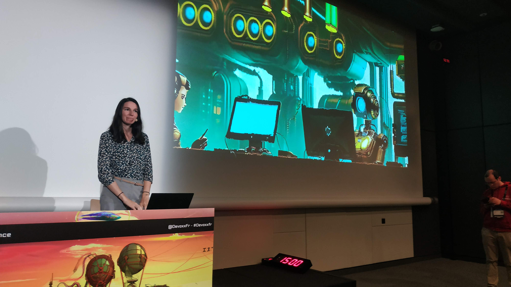
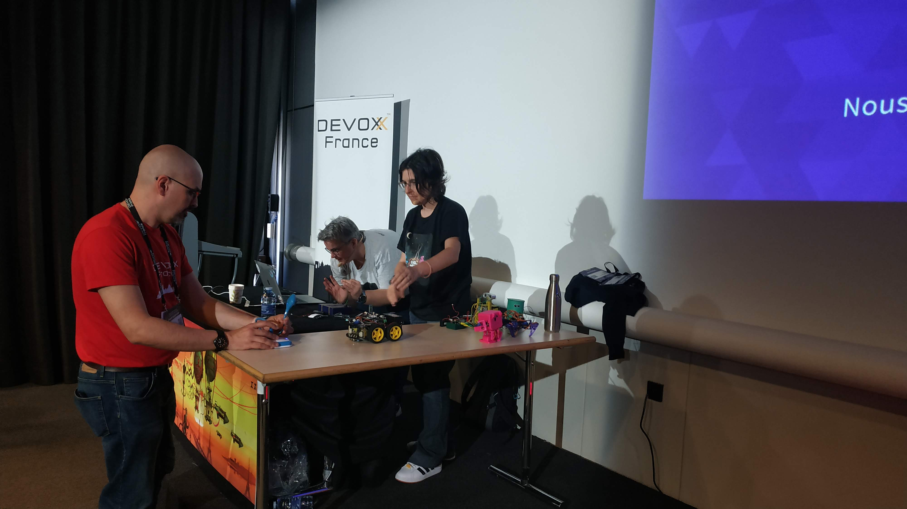
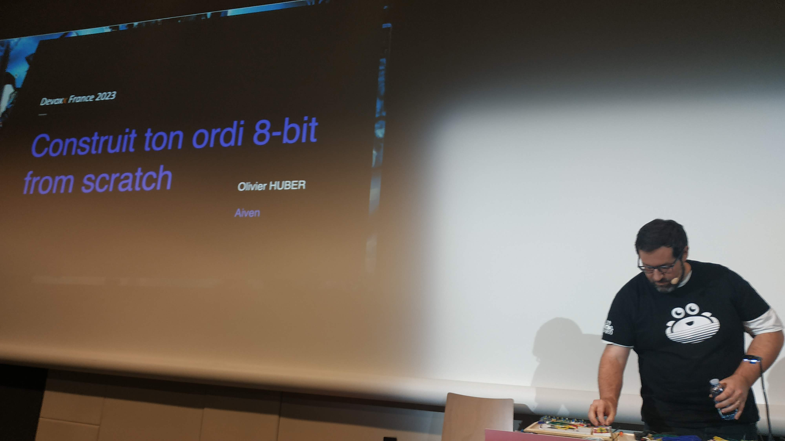
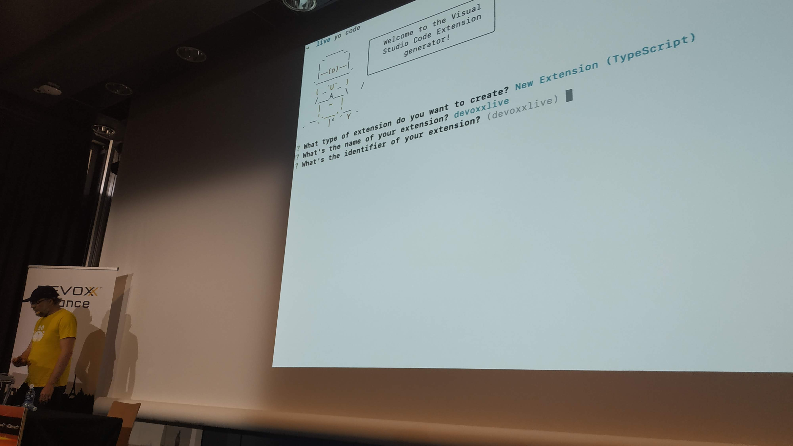

Tout juste rentré de ce 11ème Devoxx France, plongeons ensemble dans ces 3 jours toujours aussi intenses et enrichissants 🤩.  
Une fois de plus, j'ai eu la chance de faire ce [Devoxx](https://www.devoxx.fr) avec ma chérie ❤️, mais j'y reviendrai plus tard car elle donnait un workshop auquel j'ai pu participer !

## 🏗️ Le jour d'avant, ... les coulisses

Cette année, comme l'année dernière, j'ai la chance de participer à Devoxx en tant que sponsor (heureusement l'ensemble de mes soumissions n'ayant pas été retenu 😅).
Qui dit sponsor, dit installation du stand la veille.
C'est l'occasion de voir le Devoxx en mode back stage et j'aime bien l'ambiance qui y règne.
On sent un début d’excitation, mais mesurée.  
Et c'est déjà l'occasion de croiser des copines et copains ici et là qui sont aussi en pleins préparatifs de montage de stand.
De notre côté, pour le stand d'[OVHcloud](https://www.ovhcloud.com), direction le fond de la salle à côté de la salle Maillot, plutôt bien comme emplacement on va avoir pas mal de passage.
L'habillage du stand est en cours d'installation par les standistes (bravo à elles / eux pour le boulot titanesque de montage et démontage des stands 💪).
C'est l'occasion pour nous de voir IRL les illustrations créées par [Horacio](https://twitter.com/LostInBrittany), comme d'habitude un super boulot de fou de sa part et de longues heures parfois très tard pour arriver au résultat final, mais en un mot : ouhaou 🤩.

[@wildagsx](https://twitter.com/wildagsx)

Pour le coup pas grand chose à faire car les standistes ont fait le plus gros, on vérifie avec [Anissa](https://twitter.com/AnissaBenkh) et [Aurélie](https://twitter.com/aurelievache) que tout est là, on range les goodies et livres et on installe les portraits grandeur réelle que nous avait fait [commit strip](https://www.commitstrip.com/fr/) pour VTT, ça rend super bien !  
J'en profite pour faire une petite parenthèse.  
Lors de ce type d'évènement, ne croyez pas que l'on se mette à préparer ça deux ou trois jours avant.
C'est souvent un travail de longue haleine et surtout mené par des équipes dont c'est le métier. J'en profite donc pour féliciter encore spécialement notre équipe _events_ et particulièrement Anissa qui a su faire que l'on soit présents le jour J et ce, malgré un contexte pas toujours simple 😉.

## 🎉 Le jour J, ça y est ça commence !

Comme tout Devoxx, cela commence tôt, surtout lorsque l'on est sponsor !
Réveil à 6h ... 🥱  
Mais on est là, fidèles au poste et super heureuses et heureux de commencer notre Devoxx.

[@wildagsx](https://twitter.com/wildagsx)

Le calme avant la tempête, c'est un peu ce que l'on ressent en arrivant 15 mins avant l'ouverture des portes au public, le badge en main, direction le stand.

Et c'est donc parti !
Cela commence doucement, comme une mise en jambes, mais déjà les discussions passionnantes et enrichissantes commencent.
C'est toujours amusant de voir la connaissance ou non des personnes de ma société.
D'expliquer réellement ce que l'on fait, juste écouter les projets, les ressentis ou les interrogations des personnes.
De prendre le temps de discuter avec des personnes que l'on n'avait pas vu depuis longtemps.  
Je l'avais déjà dit dans un REX passé mais, pour moi, Devoxx reste une conférence à part.
Pas forcément pour les sujets même si, il faut le reconnaître, avec le choix possible c'est toujours aussi incroyable 🤩.  
Non, c'est surtout qu'il y a tellement de monde que c'est comme retrouver les amis, les copains, les connaissances, voir pour certains la famille que l'on n'avait pas vu depuis longtemps et que l'on prend tellement plaisir à revoir 🥰.

Cette année, contrairement aux autres années, j'ai pu alterner présence sur le stand et participation aux conférences 😊.
La plupart du temps des conférences des ami.e.s mais pas que.  
J'ai donc, dès le premier jour, participé à quelques conférences.

### 🧩 Lego Flow Game : le Waterfall, le Scrum et le Kanban tu différencieras !
🎙️ [Fanny Klauk](https://www.linkedin.com/in/fanny-klauk) et [Aude Devanneaux](https://www.linkedin.com/in/audedevalbray)  
📝 [Abstract](https://cfp.devoxx.fr/2023/talk/QAG-3613/Lego_Flow_Game_:_le_Waterfall,_le_Scrum_et_le_Kanban_tu_differencieras_!) / 
🏞️ [Slides]() / 
📽️ [Replay]()

En 11 participations c'est la première fois que j'arrive à faire un workshop à Devoxx !
Mais celui-là, vous vous en doutez bien je ne voulais pas le louper.
A noter que, pour assurer une place, il était possible de venir chercher un ticket 30 minutes avant le début.
Les dernières fois que j'avais essayé de participer à un workshop c'était premier arrivé, premier servi.
Là, j'avoue que c'est cool, car cela évite de faire la queue une heure avant 😅.

Ce workshop je l'ai vu se préparer, se modifier.
J'ai vu les doutes sur le fait de faire un atelier de type _serious game_.
J'ai vu les heures innombrables à préparer minutieusement tous les éléments.  
J'attendais donc avec impatience de pouvoir le voir jouer en live et surtout y participer !

Une fois la salle installée avec ses 6 îlots de participants, c'est parti pour 3 heures de découvertes autour du Waterfall, du Kanban et de Scrum.

[@wildagsx](https://twitter.com/wildagsx)

Résumer un workshop de 3h est impossible.
Mais la première chose à constater est de voir avec quelle maîtrise les deux speakeuses arrivent à tenir la salle.  
En effet, qui dit workshop, dit débats et discussions mais à chaque fois elles arrivent à nous recentrer et nous évitent de nous éparpiller, bravo 👏.  
Petite astuce que je leur repiquerai certainement lors d'un workshop : pour attirer l'attention et pour revenir au silence elles lèvent le bras et dès que l'on voit cela nous aussi.
Avec ça, en quelques secondes le calme se propage car on s'auto entraîne à se taire et à lever le bras.

Je suis un convaincu de l'agilité, cet atelier m'a confirmé qu'il y a tellement de bonnes choses à faire.
Le mode lego peut surprendre si on ne regarde que cet aspect de l'extérieur mais, très vite, une fois dedans, on se rend compte que c'est l'outil parfait pour mettre en évidence les erreurs et améliorations lorsque l'on plonge dans l'agilité.
Il faut vraiment l'essayer pour comprendre mais pour beaucoup cela permet d'avoir une révélation sur la gestion de groupes et de projets.
Et comme souvent, si ce sont des évidences parfois lorsqu'on les énonce, les vivre en situation réelle est toujours très enrichissant.

Enfin, comme souvent, les discussions après les ateliers étaient passionnantes.
Ce qui me marque toujours dans l'agilité ou le DevOps c'est de voir la souffrance de certain•e•s subie avec ces approches ou Frameworks.
Souffrance toujours en rapport avec une mauvaise application souvent pour de mauvaises raisons 😢.
Ce genre de workshop permet souvent aux participant•e•s de comprendre que le problème ce ne sont pas elles / eux et d'en déduire des actions d'amélioration possibles.

Encore bravo à Fanny et Aude pour ce super workshop, les 3h passent vraiment trop vite !

### ☸️ Kubernetes, dépassionné et pour les ultra débutants
🎙️ [Sébastien Blanc](https://twitter.com/sebi2706) / [Horacio Gonzalez](https://twitter.com/LostInBrittany) / [Sun TAN](https://twitter.com/__sunix_)  
📝 [Abstract](https://cfp.devoxx.fr/2023/talk/YND-3078/Kubernetes,_depassionne_et_pour_les_ultra_debutants) / 
🏞️ [Slides](https://t.co/8VV6sfEpqg) / 
📽️ [Replay]()

Avec ces trois là aux manettes, vous vous doutez que les trois heures d'université dédiées à la découverte de Kubernetes sont passées très vite et les zygomatiques ont bien fonctionné !  
L’université commence par rappeler les bases de conteneurisation puis pourquoi et comment est né Kubernetes.
Une fois ces bases acquises les trois protagonistes nous emmènent plus profondément dans les entrailles de Kubernetes.
Que l'on aime la ligne de commande ou le YAML, chacune et chacun y trouvera chaussure à son pied.
En effet, ces artistes de Kubernetes nous jouent les exemples d'abord avec la ligne de commande _kubectl_ puis en utilisant le _YAML_ si chère à l'écosystème Kubernetes.  
Mais attention, _à grands pouvoir, grandes responsabilités !_.  
L'université termine par une partie consacrée à être _un•e bon•ne citoyen•ne du cloud_.
De nombreux trucs et astuces sont partagés afin de ne pas tomber dans les pièges classiques lorsque l'on commence à appréhender le monde de Kubernetes.
A la sortie de cette université il ne reste plus qu'une chose à faire : aller essayer tout ça !

[@wildagsx](https://twitter.com/wildagsx)

Petite mention spéciale : à la fin un heureux élu à pu gagner le super [livre d'Aurélie Vache](https://www.amazon.fr/Understanding-Kubernetes-visual-way-sketchnotes/dp/B0BB619188/) sur Kubernetes.

### 🦫 "Common tips & mistakes" en Go - et comment les résoudre

🎙️ [Aurélie Vache](https://twitter.com/aurelievache)  
📝 [Abstract](https://cfp.devoxx.fr/2023/talk/PMM-2956/%22Common_tips_&_mistakes%22_en_Go_-_et_comment_les_resoudre) / 
🏞️ [Slides](https://t.co/uvERIkWo5t) / 
📽️ [Replay]()

Un talk d'Aurélie ?  
J'y vais !  
C'est en résumé ce qui se passe la majeure partie du temps lorsque je suis dans une conférence où Aurélie donne un talk 😉.
Je connaissais déjà ce talk pour l'avoir vu l'an dernier au Snowcamp 2022.
Il est toujours aussi bien, mis à jour, et vous repartirez avec 15 pièges à éviter en Go mais aussi comment améliorer votre code en utilisant la bonne façon pour faire certaines actions.  
Le talk est toujours aussi bien huilé, clair et même, si comme moi vous n'êtes pas un grand fan du Go, vous ne serez pas largué car Aurélie sait vous embarquer dans ses explications.
De plus, de nombreuses astuces sont transposables aux autres langages, je pense aux tests unitaires ou les linters par exemple.  
Il y a même un petit bonus, mais pour ça il faut aller voir le talk 😆.

[@wildagsx](https://twitter.com/wildagsx)

### 🍽️ Pas de speaker diner mais une bonne soirée quand même

La majorité des personnes de mon équipe (mais aussi ma chérie) ont été au _speaker diner_ ... mais pas moi n'étant pas speaker 😅.
Cela ne m'a pas empêché de passer une soirée cool avec [Thierry](https://twitter.com/titimoby), dernier arrivant de l'équipe.
Une soirée comme je les aime : 🍻, 🍕 et _refaisage_ de monde !

## ✌️ Jour 2, la fatigue arrive, le monde aussi !

Eh oui le réveil pique un peu plus, même sans excès la veille (ça j'ai testé et pas approuvé l'an dernier 😅).
On se prépare à une grosse journée, le jeudi c'est l'arrivé des personnes avec le badge 2 jours en plus de celles qui sont déjà présentes.
La bagatelle de plus de 1000 personnes en plus dans les allées de la conférence 🙃.

Et effectivement, sur le stand on le sent bien, à chaque pause, un flux continu de personnes.
Mais l'intérêt des discussions fait vite partir la fatigue et c'est toujours avec autant de plaisir que nous répondons volontiers, du mieux que possible, à toutes les interrogations.  
Mais c'est aussi l'occasion de continuer à aller voir les conférences.

### 👐 Bienvenue dans ma zone d'inconfort

🎙️ [Noémie Delrue](https://twitter.com/NoemieDelrue)  
📝 [Abstract](https://cfp.devoxx.fr/2023/talk/ZMF-9736/Bienvenue_dans_ma_zone_d'inconfort) / 
🏞️ [Slides]() / 
📽️ [Replay]()

La première claque de ce Devoxx !
Attention, j'ai trouvé extraordinaire tous les talks que j'ai vu mais j'avoue que celui-ci ma (re) donné des frissons.
Oui, j'avais déjà vu Noémie pour sa première fois en tant que speaker avec ce talk à Devoxx Maroc.
Et j'avais été submergé d'émotions tant son témoignage était poignant.
Son talk a été retravaillé, sans en retirer l'émotion originelle qui en fait toute sa moelle : elle a réussi à le rendre plus visuel 😊.  
Je n'arriverai pas à transposer ici l'émotion ressentie, il faut juste le voir et comprendre son message et l'assimiler pour nous aider, de temps en temps, à sortir de notre zone de confiance tout en réussissant à se préserver.

[@wildagsx](https://twitter.com/wildagsx)

Bravo Noémie et continue comme ça.

### 🧠 Et si l'IA était la solution pour comprendre la langue des signes ?

🎙️ [Eléa PETTON](https://twitter.com/EleaPetton)  
📝 [Abstract](https://cfp.devoxx.fr/2023/talk/FWA-0378/Et_si_l'IA_etait_la_solution_pour_comprendre_la_langue_des_signes_%3F) / 
🏞️ [Slides]() / 
📽️ [Replay]()

Oui je sais, vous être en train de vous dire : il ne va pas remettre ça ? 
Ca fait combien de fois qu'il va voir un talk d'Eléa ?  
Eh bien si, de nouveau je vous parle d'un talk d'Eléa.
Talk que j'ai vu en répétition, en anglais, en format plus court, ...
Et ça reste la claque pour moi de ce Devoxx, un talk d'une fluidité parfaite avec une capacité à passer les messages à nous faire comprendre des choses que l'on ne comprends pas d'habitude.
Plongez dans ce talk avec Eléa et vous découvrirez que l'Intelligence Artificielle n'est pas que synonyme de buzz et qu'il est possible de faire de belles choses comme reconnaître les signes utilisés dans la langue de signes.

[@wildagsx](https://twitter.com/wildagsx)

A voir et à revoir sans modération et encore bravo Eléa, je suis très fier de pouvoir travailler avec toi 👏.

### 🤖 Et si, vous aussi, vous construisiez des robots ?

🎙️ [Stéphanie MOALLIC](https://twitter.com/steffy_29)  
📝 [Abstract](https://cfp.devoxx.fr/2023/talk/WFP-6511/Et_si,_vous_aussi,_vous_construisiez_des_robots_%3F) / 
🏞️ [Slides]() / 
📽️ [Replay]()

J'ai vu Steffy stresser, douter mais le résultat est là : _you did it 💪_.
J'ai vu ce talk à VTT en début d'année et j'en étais ressorti en me disant : c'est bluffant, dommage qu'il n'y avait pas plus de temps.  
Merci Devoxx d'avoir exhausser mon voeu 😊.  
Ce talk est un habile mélange d'initiation au monde de la construction des robots, de développement et de témoignage.
L'ensemble de la salle était captivé par l’enchaînement des démos (à noter la grande prestation de l'assistante, Aurélie 😉).
Et que dire de toutes les questions à la fin du talk et durant la journée sur le stand d'OVHcloud, oui vous avez aimé et oui Steffy tu as raison de continuer à faire tes robots ... et des conférences 💪.

[@wildagsx](https://twitter.com/wildagsx)

Il n'y a qu'une seule _mistress of robots_ sur cette planète.

### 💻 Construit ton ordi 8-bit “from scratch”

🎙️ [Olivier HUBER](https://twitter.com/olivierhuber)  
📝 [Abstract](https://cfp.devoxx.fr/2023/talk/SDK-6074/Construit_ton_ordi_8-bit_%E2%80%9Cfrom_scratch%E2%80%9D) / 
🏞️ [Slides]() /
📽️ [Replay]()

Lors de conférence, il nous arrive de faire des rencontres, des rencontres qui marquent.  
Une de celles-ci, pour moi, est ma rencontre avec Olivier à Devoxx Maroc en 2022.
Il donnait ce même talk, talk sur un domaine qui n'est pas le mien à l'origine mais duquel je suis ressorti avec la sensation d'avoir appris plein de choses qui me semblaient trop complexes pour moi et surtout avec une banane énorme (mes zygomatiques s'en souviennent encore 🤣).  

Et de nouveau, ce fut le cas avec cette mise à jour réussie ce talk.
J'ai encore une fois été bluffé pars son approche didactique et simple et la joie avec laquelle il nous embarque dans son univers.
Quel bonheur de rencontrer de telles personnes, merci Olivier, tu es d'utilité publique !

[@wildagsx](https://twitter.com/wildagsx)

Continue comme ça et garde ce sourire qui fait tant de bien lorsque l'on te croise.

### 🧑‍💻 Créer ma première extension VS Code en 25 minutes chrono

🎙️ [Sébastien Blanc](https://twitter.com/sebi2706)  
📝 [Abstract](https://cfp.devoxx.fr/2023/talk/TNG-0990/Creer_ma_premiere_extension_VS_Code_en_25_minutes_chrono) / 
🏞️ [Slides]() / 
📽️ [Replay]()

Je vous l'ai déjà dit : quand je serai grand, je serai Sébastien Blanc !  
Sébastien, vous le regardez et vous avez la définition de passionné.
Et ce talk en est encore une belle illustration.
Cela fait un moment que j'avais en tête de faire une extension VSCode, mais il y a un ou deux ans lorsque j'avais regardé, la marche me semblait trop haute.
Là, en 30 minutes, grâce à Sébastien, j'ai tout compris et je me sens prêt à me remettre à essayer de coder mon extension.  
Et niveau présentation, que dire, une master class : en 30 minutes (à la seconde près) de live coding nous voyons l'extension prendre vie sous nos yeux.
Et sans vous laisser sur le bas côté et toujours dans la bonne humeur !

[@wildagsx](https://twitter.com/wildagsx)

Merci Monsieur Sébastien Blanc, vous êtes une référence et continuez comme ça 😊.

### 🥂 Meet and greet

Comme tous les ans à la fin de la journée du jeudi il y a le meet and greet.
Occasion de discuter autour d'un buffet et d'un bon verre.
J'avoue, qu'après une journée sur le stand l'énergie restante ne m'a pas permis de rester bien longtemps, 22h30 extinction des feux, retour à la base 😜.

## 😴 Jour 3, on n'est pas fatigué ! ... En fait si.

Dernier jour, le lever encore plus dur ... pour tout le monde 😉.
Mais tout de même, ce Devoxx est tellement bien que c'est avec plaisir que l'on va tenter de survivre à cette dernière journée.
Par habitude on sait que sur le stand il faut tenir jusqu'à 15h, ensuite cela commence à se calmer avec les premiers retours des personnes qui viennent de loin.

### 🧠 Machine Learning : 5 métriques supplémentaires pour éviter les modèles performants mais inutilisables

🎙️ [Marie-Alice Blete](https://twitter.com/mariealice_b)  
📝 [Abstract](https://cfp.devoxx.fr/2023/talk/IRR-3145/Machine_Learning_:_5_metriques_supplementaires_pour_eviter_les_modeles_performants_mais_inutilisables) / 
🏞️ [Slides]() / 
📽️ [Replay]()

Les quickies sont toujours un exercice périlleux : arriver à faire passer le maximum d'information en 15 minutes tout en étant compréhensible.  
Paris gagné pour Marie-Alice, on ressort avec 5 choses à utiliser pour améliorer et surveiller les performances de nos modèles.
Chaque métrique apporte une réelle plus value pour ne serait-ce que communiquer avec des personnes qui ne sont pas forcément dans le monde de la data science.

### 🦖 Ressuscitons les ordinosaures !

🎙️ [Olivier PONCET](https://twitter.com/ponceto91)  
📝 [Abstract](https://cfp.devoxx.fr/2023/talk/ENA-7391/Ressuscitons_les_ordinosaures_!) / 
🏞️ [Slides]() / 
📽️ [Replay]()

Olivier, laisse moi te dire : tu es un grand malade, mais j'adore ça !
Ce talk aborde un domaine où clairement je ne suis pas dans ma zone de confort, beaucoup trop système pour moi.
Mais Olivier sait vous embarquer dans ce monde des émulateurs pour vous présenter les concepts (et leur implémentation) de façon à ce que vous ne soyez pas perdus.
Merci, grâce à toi je sais qu'implementer une RAM ou une ROM au final ce n'est que quelques lignes de code, c'est évident après coup, mais il faut que quelqu'un vous le dise et pour ça, merci Olivier.

[@wildagsx](https://twitter.com/wildagsx)

Et quel bonheur d'avoir pris ce bon viel Amstrad comme exemple, cet ordinateur a tellement compté pour moi et je ne serais certainement pas là aujourd'hui sans mon 464 de l'époque !

### 🎙️ Les Cast Codeurs en chair, en os et en béret

🎙️ [Emmanuel Bernard](https://www.twitter.com/@emmanuelbernard) / [Guillaume Laforge](https://www.twitter.com/@glaforge) / [Antonio Goncalves](https://www.twitter.com/@agoncal) / [Arnaud Héritier](https://www.twitter.com/@aheritier)  
📝 [Abstract](https://cfp.devoxx.fr/2023/talk/APS-7187/Les_Cast_Codeurs_en_chair,_en_os_et_en_beret) / 
🏞️ [Slides]() /
📽️ [Replay]()

Les Cast Codeurs, ce sont d'abord des voix, qui, souvent, m’accompagnent pendant mon footing et me permettent de faire ma veille 😉.
C'est aussi, lors de Devoxx, la façon de se quitter avec un peu moins de tristesse.
Il y a toujours un peu de spleen à la fin de Devoxx, l'enregistrement live de l'épisode spécial Devoxx permet de repartir avec le sourire 😊.

Comme d’habitude, on en profite pour une dernière fois 🍻 en écoutant les 4 compères nous donner leur vision de Devoxx.
Ce qu'ils ont vu (pour ceux qui ont pu aller voir les conférences 😉), quelques dessous de l'organisation et comme toujours avec une intrusion (mais tellement sympa) de la merveilleuse équipe des gilets rouges.

Une mention spéciale à leur IA, KATGPT, alias [Katia Aresti](https://twitter.com/karesti) 👏.

[@wildagsx](https://twitter.com/wildagsx)

Continuez encore longtemps comme ça !

## En conclusion

Ca y est c'est fini 🥲, la fin de ce billet me fait réaliser que c'est vraiment fini.
Cette édition est l'une qui m'a le plus marqué, son contenu bien sûr, toujours aussi pointu et captivant, mais aussi émotionnellement.
Ce fut un tourbillon durant 3 jours.
Merci à toute l'équipe d'organisation, aux gilets rouges, au personnel du palais : vous avez toujours su garder le sourire et faire que notre conférence soit une réussite.

Bravo à notre team OVHcloud, on a tout déchiré 💪 : Anissa, Maja, Aurélie, Eléa, Stéphanie, Rémy, Thierry, Olivier, Maxime, Jacques et Horacio.

Et encore bravo à ma chérie, quelle fierté de te savoir speaker à Devoxx.
Quelle joie d'avoir participé à ton workshop.
Et quelle admiration de voir que tu as fait, toujours dans la bonne humeur, Devoxx et Mixit en trois jours 😍.
 
Si vous êtes arrivés jusque là merci de m'avoir lu et si il y a des coquilles n'hésitez pas à me faire une [issue ou PR](https://github.com/philippart-s/blog) 😊.

Merci à ma relectrice, Fanny, qui vous permet de lire cet article sans avoir trop les yeux qui saignent 😘.