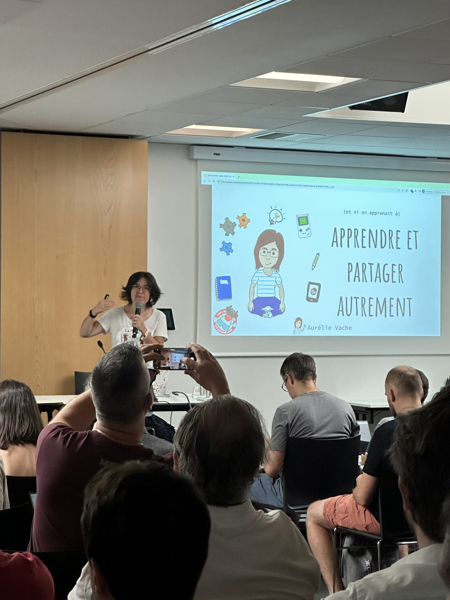
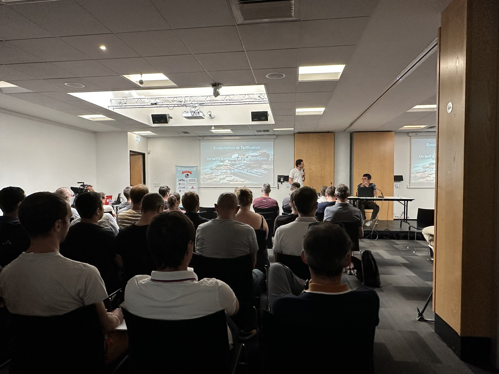
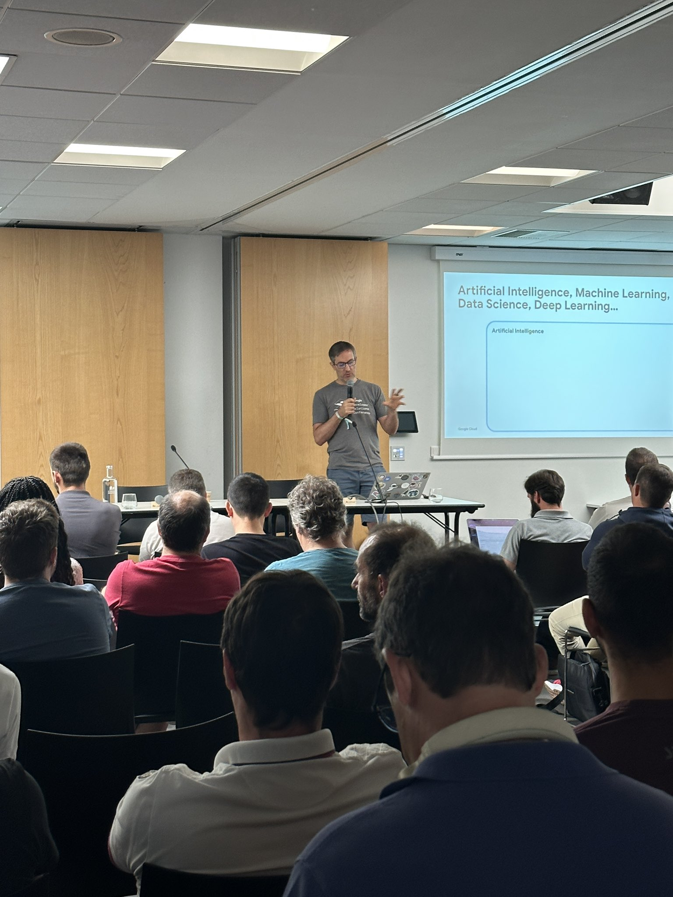
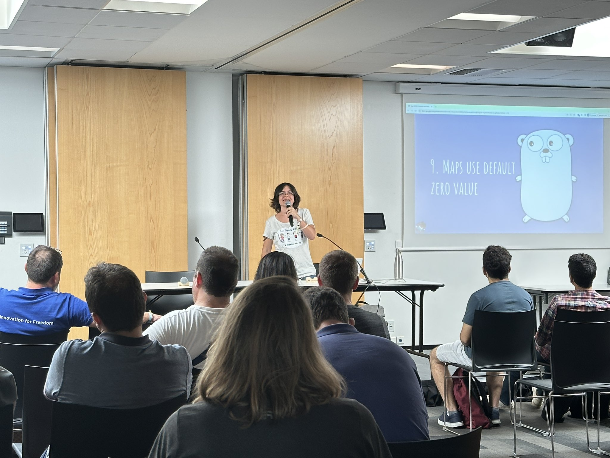

On y est, comme tous les ans le [JUG Summer Camp](https://www.jugsummercamp.org) est là et c'est le signal que la rentrée aussi 😉.  
Heureusement, d'ailleurs qu'il est là, cela nous permet de faire une rentrée en douceur avec encore un petit parfum de vacances qui flotte dans l'air.  
La faute, certainement, au fait que l'on est encore nombreuses et nombreux à arborer nos tenues estivales 🩴 et que le soleil et le thermomètre nous font vraiment penser à un mois d'août 🌡️.  
La Rochelle avec son océan et son port n'y est pas pour rien, pour entretenir cet "esprit vacances".  
C'est aussi de revoir le ami•es et les anciens collègues : c'est toujours un moment sympa de revoir des têtes connues que l'on apprécie 😊.  
Cette année, c'est un peu spécial pour moi, je retrouve le plaisir de participer à une conférence sans tenir un stand ou donner un talk, cela m'a permis de retrouver ces moments de partages que nous donnent les speakers mais aussi les personnes du public.

Un mot sur les organisatrices et organisateurs.
C'est toujours aussi bien et géré sans accros.
Il faut rappeler que c'est une conférence gratuite avec un repas à table d'une qualité super.
Il reste peu de conférences qui peuvent proposer cela, c'est toujours bon de le rappeler 😉.

Je vous ai dit que j'ai eu la chance de voir pas mal de conférences cette année, alors allons-y.
Le niveau était-il à la hauteur (spoiler oui 😁) ?

### (Et si on apprenait à) Apprendre et partager autrement
🎙️ [Aurélie Vache](https://www.jugsummercamp.org/edition/14/speakers/MKkYzwlXx6dLM9cfE5vXYqJo5d43)  
📝 [Abstract](https://www.jugsummercamp.org/edition/14/presentations/RSFB4Oq1k0AafqRJeZ4z) / 
🏞️ [Slides](https://t.co/VflihmqJg0) / 
📽️ [Replay]()

Je connaissais déjà le talk d'Aurélie (en fait il y a peu de talks d'Aurélie que je n'ai pas vu plusieurs fois 🤣).
Je sais, sans trahir de secrets, que ce talk est particulier pour Aurélie.
Elle se livre sur tout ce qui l'a construite pour en arriver là où elle en est : une speaker reconnue à travers le monde.  
Le voyage n'a pas été de tout repos comme elle nous le partage, mais au final son abnégation et son plaisir du partage ont eu raison de toutes les embûches qui se sont dressées sur son chemin.  
Bravo, cet exercice de se livrer sur soi n'est jamais facile mais Aurélie l'a relevé avec brio 💪.  
Et quand je vois les nombreuses discussions, que cela a pu soulever par la suite, je me dis que plus d'une personne présente à ce talk repartira avec le plein de confiance et d'idées 😉.

### Sinistres 3.0 : L'IA au volant de l'assurance du futur
🎙️ [Gaëtan RUAULT](https://www.jugsummercamp.org/edition/14/speakers/Iu3KoaTOoQfiIdhMfxtmFbi6ntG3) et [Vincent FORET](https://www.jugsummercamp.org/edition/14/speakers/vincent-foret-darva)  
📝 [Abstract](https://www.jugsummercamp.org/edition/14/presentations/vaB4m0bSIUcKGVsn7im4) / 
🏞️ [Slides]() / 
📽️ [Replay]()

L'intelligence artificielle est devenue, depuis quelques mois, mon quotidien.
Etant totalement autodidacte sur le sujet j'aime aller voir ce qu'en disent les autres développeurs (et vérifier que je ne dis pas trop de bêtises 😅).  
Durant ce talk, Gaëtan et Vincent nous présentent une application sur laquelle leur laboratoire est en train de travailler.
Cette application, basée sur du machine learning, permet de faciliter les échanges entre assurés / assurance et spécialistes durant la déclaration d'un sinistre survenu à notre voiture.
On est dans ce que je croise en ce moment dans le monde de l'IA : une aide à l'humain et non pas un remplacement de l'humain.
C'est toujours intéressant de voir un cas concret d'utilisation de l'IA 😉.  
Ils finissent par une projection plus ou moins futuriste de ce que pourrait encore plus apporter l'IA dans ce domaine, comme souvent dans ce cas la frontière entre possible et science fiction est parfois faible.
Talk très intéressant et avec les notions de base de l'IA expliquées simplement et clairement à des développeuses et développeurs que nous sommes, bravo 👏.

### Generative AI par la pratique : cas concrets d’utilisation d’un LLM en Java, avec l’API PaLM
🎙️ [Guillaume Laforge](https://www.jugsummercamp.org/edition/14/speakers/T0c4tdkG6PTJTDajvQVpJRzFsU63)  
📝 [Abstract](https://www.jugsummercamp.org/edition/14/presentations/juptBx71BJ9CRj5RxhKK) / 
🏞️ [Slides]() / 
📽️ [Replay]()

Encore de l'IA me direz-vous ?
Eh oui, je pense qu'il est difficile de passer à côté du phénomène en 2023, alors autant se documenter !
Guillaume nous dresse un tour d'horizon de ce qui se fait chez Google au niveau du LLM (Large Language Model) et c'est passionnant 🤩.
De manière très simple, mais claire, il nous dresse un bilan d'où en est la firme dans le monde de l'IA et vers où l'on va suite aux récentes annonces de la Google I/O.  
Ensuite, mise en pratique avec des démos pour illustrer comment, nous, en tant que devs, on va utiliser cette IA dans nos applications.
Et cerise sur le gâteau, en Java (en Groovy plus précisément mais on lui pardonnera ce petit raccourci 😉) !

Super talk de Guillaume, ce n'est pas le premier, que je vois, de lui et je suis toujours aussi étonné de la simplicité avec laquelle il arrive à nous partager l'information.  
Simplicité qu'il conserve aussi lors des échanges que j'ai eu la chance d'avoir avec lui ensuite, merci Guillaume le monde de l'IT est meilleur avec des gens comme toi.

### Mister WIP in Factory Town©️
🎙️ [Fanny Klauk](https://www.jugsummercamp.org/edition/14/speakers/hDgeovtbpYUe248iONsiVDFsTn53)  
📝 [Abstract](https://www.jugsummercamp.org/edition/14/presentations/S33SsGdvuBSe79BRHX3L) / 
🏞️ [Slides](https://t.co/gJfpQ4JjpN) / 
📽️ [Replay]()

Pour celles et ceux qui me connaissent, je ne pense pas que vous soyez étonnés que j'ai été voir la conférence de Fanny 😉.
Je l'ai vu naître cette conférence, parfois dans la douleur, parfois dans le doute.  
Mais quel résultat !  

Une master class 🤩.

Arriver à expliquer un concept pas toujours connu et compris de manière ludique à travers l'utilisation d'un jeu vidéo.  
Et j'ai envie de dire que le pari est largement tenu 💪.  
15 mins cela passe vite, trop vite et j'ai vraiment hâte de voir ce que cela donne sur 30 minutes ou plus !
Avec tout ça je n'ai pas parlé du contenu, entre VSM (Value Stream Mapping), WIP Limit, Kanban, on est reparti avec tout un tas de trucs et astuces pour optimiser nos processes.
Encore bravo et je suis tellement fier de toi 🥰.

[© wildagsx](https://twitter.com/wildagsx)

### Dessiner c'est gagné !
🎙️ [Pierre Tibulle](https://www.jugsummercamp.org/edition/14/speakers/9LHSTmgvjXcyMPyfifAgXjtP6Z02)  
📝 [Abstract](https://www.jugsummercamp.org/edition/14/presentations/qhCu2rz08y2zVbVQRRzB) / 
🏞️ [Slides]() / 
📽️ [Replay]()

Je connaissais déjà une version de ce talk de Pierre, mais je suis toujours autant bluffé de comment cela paraît simple le sketch noting avec lui 😊.
Il a beau nous dire qu'il suffit d'avoir le niveau d'un enfant de 5 ans, je m'y suis déjà essayé suite à un autre talk de Pierre et j'avoue que je suis loin de ce qu'il propose 😅.  
Pierre, en 15 mins, nous distille ses trucs et astuces pour se lancer dans l'aventure.
Super moment, merci Pierre ! ✏️

[© @dadoonet](https://twitter.com/dadoonet)

### Apprends à dompter la Data sans douter de toi !

🎙️ [Johanna Vauchel](https://www.jugsummercamp.org/edition/14/speakers/OIyMDbt3huNADbTuqVQeCVr9Xg53)  
📝 [Abstract](https://www.jugsummercamp.org/edition/14/presentations/Om1q9xm6NNHtObNxLP5H) / 
🏞️ [Slides]() / 
📽️ [Replay]()

Pour une première c'est une réussite !
Johanna donnait sa première conférence et, tant sur la forme que sur le fond, c'est une très belle conférence à laquelle j'ai assisté 👏.  
Son parcours, d'abord dans le monde de la 3D, des mathématiques et du C++, pour ensuite se reconvertir dans la data est passionnant.
Elle nous partage ses doutes, ses échecs et ses réussites 😊.
Son témoignage nous prouve que lorsque l'on a une motivation sans faille, tout est possible, bravo car à titre personnel je crois que je n'aurais pas le courage de le faire.  
Et cerise sur le gâteau, nous allons avoir la chance d'avoir Johanna à [TADx](https://www.tadx.fr) !

[© @JugSummerCamp](https://www.jugsummercamp.org)

### La recherche à l'ère de l'IA

🎙️ [David Pilato](https://www.jugsummercamp.org/edition/14/speakers/eMFPF8fp2UTnePLtRCc0XgQddy12)  
📝 [Abstract](https://www.jugsummercamp.org/edition/14/presentations/oVFqGQVuSwZBRIfpXwVd) / 
🏞️ [Slides](https://speaker.pilato.fr/cPvYtw) / 
📽️ [Replay]()

Cela faisait longtemps que je n'avais pas vu David en conférence.
Je le croise souvent derrière son stand c'est sûr, mais je ne l'avais pas vu sur scène depuis un moment 😉.  
Eh bien c'est toujours aussi intéressant et juste.
J'ai découvert qu'Elastic pouvais indexer et faire des recherches sur les données représentées en vecteurs.
Et même plus, que l'on pouvait avoir le beurre et l'argent du beurre : conserver son indexation / recherche classique en la couplant aux vecteurs dans un mode hybride.  
Pleins d'idées viennent de germer dans ma tête, il me tarde de tester ça !

Merci aussi à David pour ces bons moments passés ensemble, les conversations ont été passionnantes 🤩.

[© @JugSummerCamp](https://www.jugsummercamp.org)

### "Common tips & mistakes" en Go - et comment les résoudre

🎙️ [Aurélie Vache](https://www.jugsummercamp.org/edition/14/speakers/MKkYzwlXx6dLM9cfE5vXYqJo5d43)  
📝 [Abstract](https://www.jugsummercamp.org/edition/14/presentations/78e6toMYfZSkadq0dT62) / 
🏞️ [Slides]() / 
📽️ [Replay]()

Deuxième talk de la journée pour Aurélie.
Ce talk, je le connais bien et il est toujours aussi efficace.
Je ne suis pas un développeur Go, mais il est clair que la liste des astuces que nous donne Aurélie est à garder précieusement dans un coin pour s'éviter de longues heures de recherches de bugs 😅.
Merci Aurélie pour ce partage toujours aussi instructif.

[© @JugSummerCamp](https://www.jugsummercamp.org)

### 📝 ✅ La checklist ultime pour rendre vos applications cloud native !

🎙️ [Katia HIMEUR](https://www.jugsummercamp.org/edition/14/speakers/SOMb4rd126UADiDIRvkUCJt9yO12)  
📝 [Abstract](https://www.jugsummercamp.org/edition/14/presentations/qrcPurz54OuOV0664DVC) / 
🏞️ [Slides]() / 
📽️ [Replay]()

Katia nous livre une liste (certainement non exhaustive mais déjà bien complète 😉) de ce qu'il faut faire ou penser avant de se lancer dans une migration cloud native.
Et il faut dire qu'il y a des choses à penser !
Merci à elle de ce partage, d'autant que l'on sent que cela vient du vécu, de son expérience.
Ses conseils n'ont donc que plus d'intérêt 😊.
Et, spoiler alert, prenez le temps de bien préparer et de bien vous entourer avant de vous lancer !

[© @JugSummerCamp](https://www.jugsummercamp.org)

## En conclusion

Voilà, par la suite je suis parti tranquillement pour digérer toutes ces merveilleuses conférences, que j'ai eu la chance de suivre ainsi que les personnes que j'y ai croisées.

Merci à vous toutes et tous pour ces moments c'était vraiment sympa 🤩.

Merci à toute l'équipe d'organisation au personnel de l'Espace Encan : vous avez toujours su garder le sourire et faire que la conférence soit une réussite.

Et encore bravo à ma chérie, quelle conférence tu as donnée !!

[© @glaforge](https://twitter.com/glaforge)

[© @dadoonet](https://twitter.com/dadoonet)

J'essaierai de rajouter les liens vers les replays et les slides manquants dès qu'ils seront disponibles. 

Si vous êtes arrivés jusque là merci de m'avoir lu et si il y a des coquilles n'hésitez pas à me faire une [issue ou PR](https://github.com/philippart-s/blog) 😊.