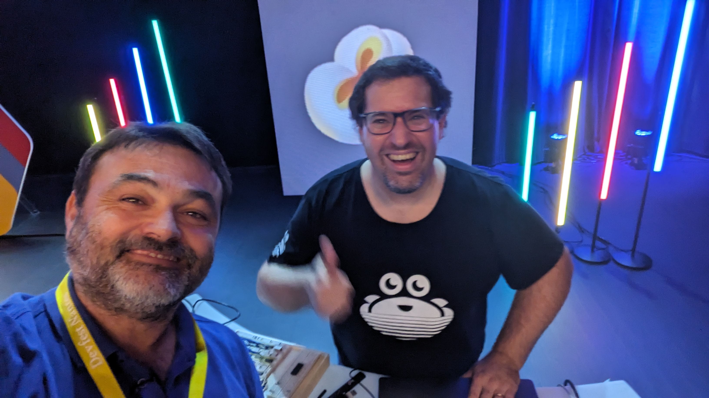
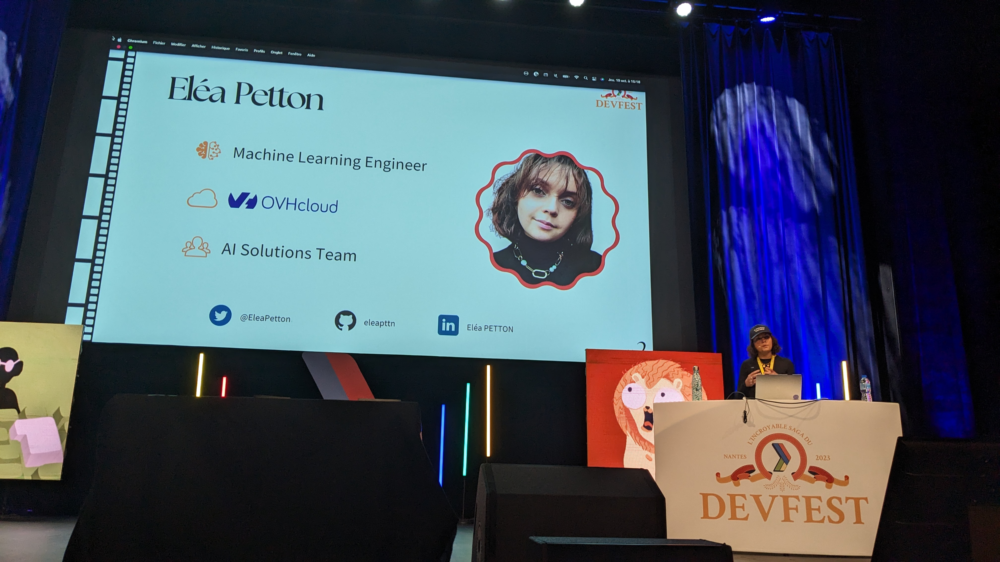

J'ai, de nouveau, eu la chance (et ce n'est pas un euphémisme quand on voit la vitesse à laquelle les places partent) de participer au [DevFest Nantes 2023](https://devfest.gdgnantes.com/).  
Il se déroulait à la [Citée des Congrès de Nantes](https://lacite-nantes.fr/).
J'aime beaucoup ce lieu car je trouve que, malgré le nombre de personnes qui passent durant les deux jours (+ 3500 il me semble), l'impression de foule reste supportable.

Pour celles et ceux qui ne connaissent pas le DevFest Nantes : c'est une conférence tech orientée développement (mais pas que, on y reviendra 😉) plutôt francophone (quelques conférences sont en anglais) et se passant ... à Nantes (oui le nom aurait été bizarre sinon 😅).
C'est clairement avec, [Devoxx France](https://www.devoxx.fr/), la conférence la plus importante de l'écosystème tech / numérique de France.

C'est donc, vous l'imaginez, avec joie et excitation que je suis parti (beaucoup trop tôt à mon goût 😅) le jeudi 19 octobre pour deux jours intensifs !

## 💰 Sponsor à DevFest Nantes

Être sponsor à DevFest Nantes, cela se mérite et cela commence par tenter de décrocher un précieux sésame !  
Car oui, si les places participant•es sont compliquées à avoir, les places sponsors je crois que c'est encore plus dur !
Mais nous avions réussi à décrocher le précieux sésame (à coup de F5 en masse le jour de la mise en vente 😉).

Cette année, le thème de la conférence était le cinéma.
Les DevFest Nantes à cette particularité d'avoir tous les ans un thème fort et différent.
Quand je dis fort c'est que tout est orienté vers ce thème en termes de décoration mais aussi d'ambiance, ...

Nous n'avons donc pas dérogé à la règle et avons joué le jeu avec un stand [OVHcloud](https://www.ovhcloud.com) basé sur le thème du cinéma et pour la grande majorité créé par [Horacio Gonzalez](https://twitter.com/LostInBrittany).

[© @wildagsx](https://twitter.com/wildagsx)

Être derrière un stand est toujours intense !
Et sur une conférence comme le DevFest Nantes c'est encore plus le cas 🤪.  
Heureusement on a la chance à OVHcloud d'avoir de supers collègues qui viennent de différents horizons et participent à la tenue du stand avec nous de main de maître 💪.

D'ailleurs j'en profite pour vous donner un conseil ou plutôt vous demander quelque chose à vous qui passez nous voir sur les stands 😉.
Je sais que la chasse au goodies est un sport, mais ne faites pas vos sauterelles en prenant tout ce qui est possible sur le stand et en repartant aussi tôt.
Tout d'abord parce que si à la fin cela fini à la poubelle ce n'est pas très utile et très bon pour notre planète 🌍.  
Mais aussi un _bonjour_ et _merci, au revoir_ cela fait toujours plaisir 🤗.
Et truc de dingue, prenez le temps de discuter et vous intéresser à l'entreprise que vous venez voir, souvent on a mis de l'énergie et du temps pour préparer tout ça et, de plus, les conversations sont toujours très enrichissantes.

## 🎙️ Speaker à DevFest Nantes

J'ai eu, pour la première fois, l'occasion d'être aussi speaker à DevFest Nantes.
Enfin, surtout j'ai eu la chance que [Fanny Klauk](https://twitter.com/klf37) me demande de l'accompagner lors de son atelier Lego Flow Game, rebaptisé, pour l'occasion [Game of Lego Flow](https://devfest.gdgnantes.com/sessions/legoflowgame___le_waterfall__le_scrum_et_le_kanban_tu_differencieras__/) ⚔️.  
Un atelier, lors de conférences comme le DevFest Nantes, permet aux participant•es de réellement manipuler et agir durant deux heures (ou trois dans certaines conférences).

Durant cet atelier, l'objectif est de faire découvrir aux personnes les différences entre le Waterfall, le Scrum et le Kanban.
Fanny a découvert le Lego Flow Game lors de l'[agile tour Rennes](https://agiletour.agilerennes.org/) avec une conférence donnée par [Nicolas Arhan](https://www.linkedin.com/in/arhannicolas/) et se l'est appropriée (avec sa bénédiction bien sûr 😉) pour un faire un super atelier !
Je ne vous en dit pas plus, il faut le vivre !
Mais vu les retours et les échanges d'après atelier je ne vous conseillerai que vivement d'y participer si Fanny le propose à une conférence où vous vous trouvez.

[© @wildagsx](https://twitter.com/wildagsx)

Vous trouverez les [slides et autres ressources](https://noti.st/klaukf/fuxr8g/lego-flow-game-le-waterfall-le-scrum-et-le-kanban-tu-differencieras) de cet atelier sur la [page noti.st](https://noti.st/klaukf) de Fanny.

Et si vous voulez en savoir plus sur l'atelier en lui-même et comment il est construit, je vous laisse allez lire le [billet de blog](https://klaukf.github.io/blog/Lego-Flow-Game/) de Fanny à ce sujet.

## 🗣️ Les conférences

Vous l'aurez certainement compris.
Entre le stand et l'atelier de deux heures, aller voir des conférences n'a pas été évident 😅.
Cependant il y avait des conférences que je ne voulais louper pour rien au monde et je vous propose de vous les faire découvrir.
Je vous le dis tout suite : il faudra vous jeter sur les replays lorsqu'ils seront disponibles sur la [chaîne YouTube](https://www.youtube.com/playlist?list=PLuZ_sYdawLiUHU4E1i5RrFsRN_lQcgPwT) du DevFest Nantes.

### 📺 [Après l'ordi 8 bit voici la carte VGA sur breadboard](https://devfest.gdgnantes.com/sessions/apres_l_ordi_8_bit_voici_la_carte_vga_sur_breadboard/)

🙎‍♂️ [Olivier Huber](https://twitter.com/olivierhuber), [Aiven](https://aiven.io/)  

Olivier, j'ai eu la chance de le voir à [Devoxx Maroc 2022](https://devoxx.ma/) et de le croiser sur d'autres conférences pour discuter avec lui.
Que ce soit en conférence ou lorsque vous discutez avec Olivier vos zygomatiques sont soumis à rude épreuve 😃.
Il fait aussi parti de ces personnes qui ont l'impression d'avoir toujours un bout de soleil avec elles et qui arrivent à vous transporter dans leur univers.  
L'univers d'Olivier, justement, est un univers où l'on ne peut s'acheter un composant électronique qu'une fois que l'on a réussi à le faire sois-même et de manière assez simple pour l'expliquer à des néophytes comme vous et moi.

[© @wildagsx](https://twitter.com/wildagsx)

Après avoir brillamment réussi l'exploit de le faire avec un processeur il s'attaque à la carte graphique VGA (SVGA devrais-je dire 😉).
Et une fois de plus il y arrive, on sourit, on rigole mais surtout on apprends !  

Et comme cela serait trop simple de s’arrêter après ces deux exploits il nous prépare pleins d'autres choses, mais pour ça il faudra attendre les prochaines conférences 😉.

Bien sûr vous pouvez aller voir les replays une fois disponibles, mais essayez de voir Olivier en conférence c'est tellement mieux !

### 🧠 Et si l'IA était la solution pour comprendre la langue des signes ?

👩🏻 [Eléa Petton](https://twitter.com/EleaPetton), OVHcloud  
🏞️ [les slides](https://noti.st/eleapttn/YBxNLQ/et-si-lia-etait-la-solution-pour-comprendre-la-langue-des-signes) de la conférence

Oui j'ai de nouveau été voir Eléa en conférence.
Et en plus sur un talk que j'ai déjà vu 😉.
Pourquoi me direz-vous ?
Tous simplement parce que, même en travaillant avec Eléa, en ayant le privilège de voir ses talks se construire je suis toujours bluffé une fois qu'elle monte sur scène.
Et devinez quoi ? 
Une fois de plus je n'ai pas été déçu.

Eléa avait eu le droit à une grande salle et tout a commencé du plus mal possible avec des ennuis techniques qui la font commencer en retard dans un état de stress bien important.
Je la connais un peu, à l'intérieur cela devait être pas simple à gérer 😖.  
Mais voilà, comme d'habitude, la lumière s'allume et Eléa lance la machine pour nous donner une prestation digne d'une master class.
La qualité des slides, la qualité de son élocution, de ses démos et de sa façon de vulgariser les concepts.
Bref, rien à redire si ce n'est qu'elle me bluff toujours.

[© @wildagsx](https://twitter.com/wildagsx)

Continue comme ça Eléa, je ne sais pas où tu va t’arrêter mais ce sera très loin ! 

Jetez-vous sur le replay dès qu'il est disponible.

### 🚀 L'AGC : retour sur l'ordinateur qui a amené l'humanité sur la Lune

🙎‍♂️ [Olivier Poncet](https://twitter.com/ponceto91), [Hawkswell](https://www.hawkswellstudios.com/)  
🙎‍♂️ [Romain Berthon](https://twitter.com/RomainTrm), Dotware Consulting

Merci les orgas pour avoir déplacé l'heure de notre atelier avec Fanny, cela nous a permis de suivre cette conférence 😜.
Nous étions tellement tristes de la louper !  
Et nous n'avons pas été déçus, en amoureux de l'espace et des histoires de conquêtes spatiales (mais aussi en grands fans d'Apollo 13 !).

Olivier et Romain nous emmènent dans les méandre de l'AGC, en gros l'ordinateur qui a fait voler les missions Apollo 🤩.
La force de leur talk : arriver à parler de choses très complexes en les rendant simples et compréhensibles.
Ils nous ont permis de se rendre compte à quelle point cette folle aventure de l'espace a pu faire bouger les lignes dans notre quotidien de développeuses et développeurs.

[© @wildagsx](https://twitter.com/wildagsx)

Et pour ma part j'ai dégusté ce talk du début à la fin avec des yeux d'enfant la tête dans les étoiles !
Je vais m'empresser de le montrer à mon fils une fois le replay disponible car lui aussi souvent il marche le visage tourné vers la voûte celeste 💫.

Un grand merci messieurs pour ce merveilleux moment passé.

## 🎁 Scène(s) post-générique

C'est la tradition, maintenant dans les films il y a une ou des scènes post-générique.
Pour moi cela a été la Keynote de clôture et la soirée de cloture au [melting potes](https://meltingpotesnantes.com/).

Commençons par la Keynote !
Ma chérie a eu la chance de faire partie de cette Keynote 🥰.
La Keynote en elle-même était un jeu créé de toute pièce se faisant affronter deux équipes sur le thème du cinéma.
L'autre équipe ayant comme speaker [Hubert Sablonnière](https://twitter.com/hsablonniere).
Une super idée, une super ambiance et des supers participantes et participants pour fermer le DevFest Nantes !
Bravo l'équipe d'ogas vous vous êtes surpassés !

[© @wildagsx](https://twitter.com/wildagsx)

La soirée a permis de ne pas tout de suite sauter dans un train et se confronter au spleen d'après conférence ☺️.
Je voulais juste remercier Olivier et Hubert pour cette soirée et les échanges que j'ai pu avoir avec vous.
Merci d'être aussi simples et accessibles, cela fait un bien fou 🤗.

[After party](https://twitter.com/devfestnantes/status/1715464242441191534) 🎉.

## ✨ Bonus audio

[Jean-Philippe Baconnais](https://twitter.com/JPhi_Baconnais) a improvisé un petit live Twitter pour retranscrire l'ambiance de ce DevFest Nantes.  
🎙️ [Replay](https://twitter.com/i/spaces/1YpJkwXpXNmJj)

Merci à lui de m'avoir demandé de participer c'est toujours un moment sympa ☺️.

## En conclusion

Quelle belle conférence, merci à toutes les personnes qui font parties de l'organisation : vous avez abattu un travail de titans 💪.
Cette conférence est d'une top qualité !
Un grand merci aussi aux bénévoles vous avez été tops et adorables.
Et un énorme merci au personnel de la cité qui permettent que tout se passe pour le mieux et que l'on mange pendant les pauses 😉.

J'ai hâte et j'espère vous revoir toutes et tous l'an prochain 👋.

Et encore bravo à ma chérie, tu es une super speaker !!

Si vous êtes arrivés jusque là merci de m'avoir lu et si il y a des coquilles n'hésitez pas à me faire une [issue ou PR](https://github.com/philippart-s/blog) 😊.