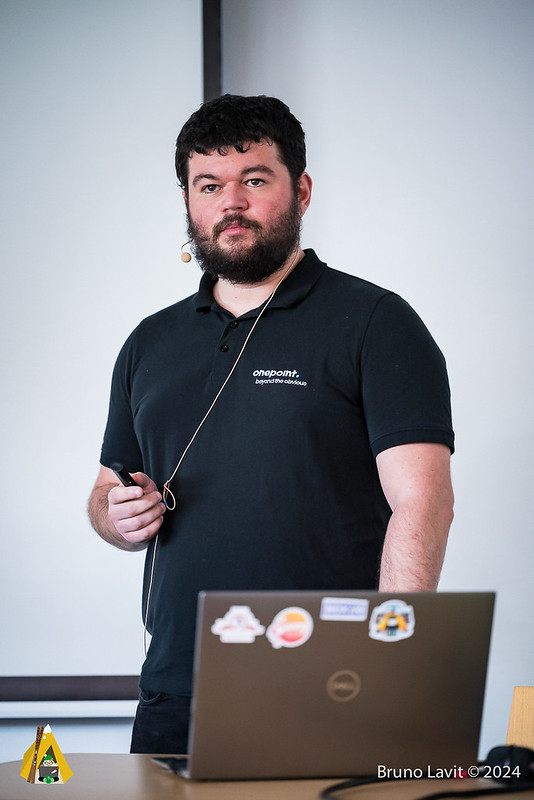
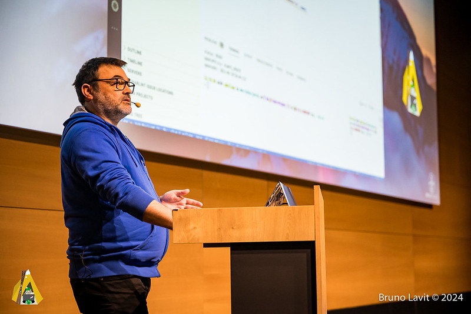
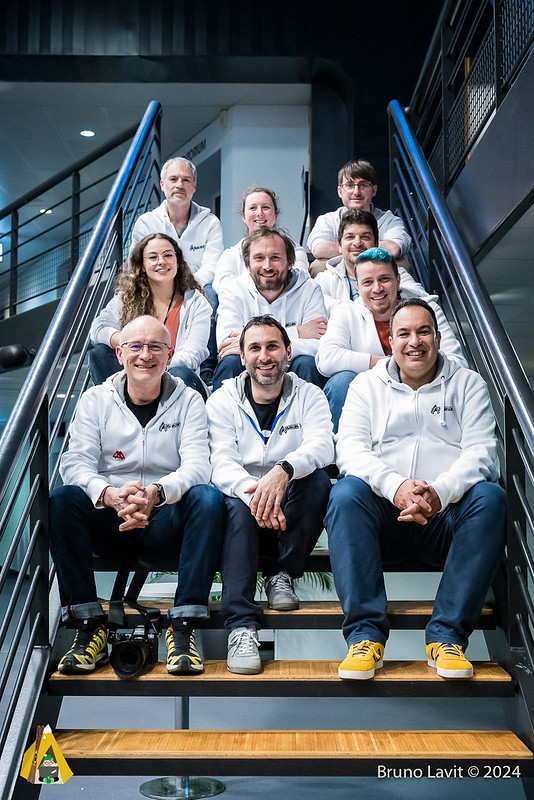

C'est avec plaisir que je suis, de nouveau, allé au [Snowcamp](https://snowcamp.io/) pour la troisième année de suite.
C'est un peu la conférence qui lance l'année. 
C'est en effet, depuis trois ans, ma première conférence de l'année que ce soit en tant que speaker ou sponsor.
Ca a été aussi, le début de mon aventure dans mon nouveau métier, Developer Advocate, chez [OVHcloud](https://www.ovhcloud.com/).

Le lieu, toujours aussi beau, entouré de ces belles montagnes.

# 🎙️ Les conférences

N'ayant pas de stand à gérer, j'ai pu profiter de quelques conférences.
Comme toujours, on aimerait avoir le don de se cloner pour aller en voir plus, mais voici un petit résumé de celles auxquelles j'ai pu assister.

## La compression Web : comment (re)prendre le contrôle ?
  - 🙍‍♂️ [Hubert Sablonnière](https://www.hsablonniere.com/) et [Antoine Caron](https://blog.slashgear.dev/)
  - 📝 [abstract](https://snowcamp2024.sched.com/event/1Vb21/la-compression-web-comment-reprendre-le-controle)

Il est très rare que, lorsque je suis à une conférence où Hubert donne un talk, je le rate.
Et c'est donc avec plaisir que j'ai été voir Hubert, en compagnie d'Antoine, animer cette Keynote d'ouverture de Snowcamp le jeudi.
Exercice toujours périlleux, puisqu'ils avaient la lourde responsabilité de lancer ce Snowcamp.  
D'autant, que de prime abord, le sujet pouvait paraître pas des plus engageants : la compression Web !
C'était mal connaître nos deux compères 😉.
Ils nous ont offert une master class, tout d'abord au niveau de la présentation : les slides sont juste magnifiques 🤩.
Mais peut on encore parler de slides ?
Tant ils apportent à la présentation par l'interactivité qu'ils permettent, bravo c'est bluffant !  
Mais il n'y avait pas que l'habillage qui était bien, le contenu aussi ! 
Riche en découvertes sur les différentes origines de la compression telle que l'on utilise, en passant par des chiffres nous permettant de nous rendre compte que l'on peut faire encore pas mal d'efforts pour améliorer nos propres développements.
Le rythme est soutenu, mais les deux speakers nous embarquent dans leur histoire qui conte l'histoire de la compression.  
Bravo messieurs, votre pari de lancer sur les bons rails ce Snowcamp est réussi ! 👏

[© Bruno Lavit](https://twitter.com/BrunoLavit)

## Quarkus : Greener, Better, Faster, stronger.

  - 🙍‍♂️ [Jérôme Tama](https://www.linkedin.com/in/j%C3%A9r%C3%B4me-tama-591699)
  - 📝 [abstract](https://snowcamp2024.sched.com/event/1Vb29/quarkus-greener-better-faster-stronger)

Vous ne serez pas étonnés de voir, dans ce résumé, un talk qui parle de [Quarkus](https://quarkus.io/) 😉.
Jérôme, au travers du développement d'extensions Quarkus, nous fais découvrir comment optimiser nos applications pour consommer moins mais aussi rendre nos applications plus maintenables et efficaces.  
C'est aussi, l'occasion de découvrir comment développer une extension Quarkus.
Cela pique un peu parfois car certains concepts sont ardus, mais Jérôme arrive à nous garder à bord avec lui en prenant le temps d'expliquer tout cela calmement.
Bravo à toi !  
Et merci pour le teasing de mon talk sur [Picocli](https://picocli.info/) durant ta conf, agréable surprise 🤗.

[© Bruno Lavit](https://twitter.com/BrunoLavit)

## 2 ans de migrations en environnement "cloud native" quand on n'est ni une startup, ni dans le CAC40

  - 🙍‍♂️ [Rémi Verchère](https://twitter.com/rverchere)
  - 📝 [abstract](https://snowcamp2024.sched.com/event/1Vb2D/2-ans-de-migrations-en-environnement-cloud-native-quand-on-nest-ni-une-startup-ni-dans-le-cac40)

J'ai, enfin, pu voir le talk de Rémi que j'avais loupé lors d'une autre conférence 😊.
Si vous vous posez des questions à aller ou non dans le cloud, ce REX est une vraie mine d'or.
Rémi y aborde ce qui a fonctionné, mais aussi les problèmes qu'il a pu rencontrer.
Et toujours avec sa vision d'expert qui vous permet de repartir avec beaucoup d'éléments pour votre propre projet.
Ce talk est aussi une vraie ode au DevOps (le vrai pas le poste 😉), où l'on comprend bien l'importance du dialogue inter équipes, afin d'accélérer la mise en place de solutions mais aussi de résolutions de problèmes.
Et puis, tout cela se déroule sur des infrastructures OVHcloud 😉.

[© Bruno Lavit](https://twitter.com/BrunoLavit)

## 📝 ✅ La checklist ultime pour rendre vos applications cloud native !

  - 👩🏻 [Katia HIMEUR](https://twitter.com/katia_tal)
  - 📝 [abstract](https://snowcamp2024.sched.com/event/1Vb2V/la-checklist-ultime-pour-rendre-vos-applications-cloud-native)

J'avais déjà vu le talk de Katia au [JUG Summer Camp](https://www.jugsummercamp.org) (voir l'article [Back from JUG Summer Camp 2023 🏖️]({{ site.baseurl }}).)
Et je dois dire qu'il est toujours aussi efficace !
On sent tout de suite son expertise et son vécu dans ses explications.
Cela rends d'autant plus précieux ses conseils et cette checklist : conservez-la à vos côté avant d'entamer votre propre migration.
Ou mieux, entourez vous d'expert•es comme Katia 😉.

[© Bruno Lavit](https://twitter.com/BrunoLavit)

## Le duo gagnant : Antora et AsciiDoc pour une documentation sans frustrations

  - 🙍‍♂️ [Thomas Bouffard](https://twitter.com/redfish4ktc) et [Benjamin Parisel](https://twitter.com/beparisel)
  - 📝 [abstract](https://snowcamp2024.sched.com/event/1Vb2p/le-duo-gagnant-antora-et-asciidoc-pour-une-documentation-sans-frustrations)

J'aime tout ce qui touche à la documentation, je ne dois pas être normal 🤪.
Je connaissais [AsciiDoc](https://asciidoc.org/) pour l'utiliser régulièrement mais pas [Antora](https://antora.org/).
Le talk de Thomas et Benjamin m'a permis de me rendre compte que l'on pouvait passer à un niveau supplémentaire dans l'industrialisation de la documentation et de l'approche _as code_.
Leur approche est vraiment comme un projet de dev pour gérer la doc, allant jusqu'à développer des éléments customs en utilisant un mécanisme de templating.  
A suivre et à essayer d'urgence lors de ma prochaine génération de documentation 😉.

[© Bruno Lavit](https://twitter.com/BrunoLavit)

## Mieux cultiver et mieux manger grâce au logiciel : la tech au service de l'agriculture

  - 🙍‍♂️ [Mathieu Passenaud](https://twitter.com/mathieupassenau) et [Bertrand Péchou](https://twitter.com/BertPech)
  - 📝 [abstract](https://snowcamp2024.sched.com/event/1Vb31/mieux-cultiver-et-mieux-manger-grace-au-logiciel-la-tech-au-service-de-lagriculture)

De nouveau, un très bon choix de la part de l'équipe d'organisation pour cette keynote 🤩.
Mathieu et Bertrand nous délivrent un très beau message sur l’agriculture Française, sans tomber dans le mélodrame mais en étant factuels sur les enjeux, les galères et le quotidien de notre agriculture.
J'ai longtemps vécu dans des villages, entouré d'agricultrices et d'agriculteurs et je sais oh combien ce métier est dur et souvent fait par passion.
Bravo à vous toutes et tous qui êtes le grenier de notre pays 🤗.  
Mathieu et Bertrand nous montrent, aussi, que l'agriculture a considérablement changé avec l’émergence de la data et du GPS pour, non seulement, augmenter le rendement, mais aussi limiter les pertes et simplifier, un peu, la vie de nos agricultrices et agriculteurs.  
Encore bravo cette keynote était superbe !

[© Bruno Lavit](https://twitter.com/BrunoLavit)

## Le développement augmenté à l'IA: tout ce qui va changer

  - 🙍‍♂️ [Yohan Lasorsa](https://twitter.com/sinedied)
  - 📝 [abstract](https://snowcamp2024.sched.com/event/1Vb32/le-developpement-augmente-a-lia-tout-ce-qui-va-changer)

Un talk IA, je me devais d'y aller 😉.
Je fais une parenthèse d'ailleurs.
Je ne sais pas combien de soumissions de talks IA a reçu le commité du CFP de Snowcamp, mais le programme était très bien équilibré, bravo à iels.  
Revenons au talk, après un très bon résumé théorique de Yohan sur les LLM nous plongeons dans le vif du sujet avec des démos nous permettant d'aller plus en avant dans le fonctionnement de [Copilot](https://github.com/features/copilot).
Au cours des différentes démos, on peut se rendre compte comment fonctionne la version _assistant_ sous forme de chat comme on le ferait avec [ChatGPT](https://chat.openai.com/), mais aussi de la version qui est directement dans l'éditeur de code.
J'avoue ne pas avoir sauté le pas, peut être que je suis trop vieux pour ça 😅.
Yohan m'a donné envie de tester un de ces jours, et je suis totalement d'accord avec lui sur sa conclusion : ne voyons pas l'IA comme quelque chose de dangereux mais comme un outil nous permettant d'être meilleurs.

## SELECT 'amazing_features' FROM "posgresql"

  - 🙍‍♂️ [Kevin Davin](https://twitter.com/davinkevin)
  - 📝 [abstract](https://snowcamp2024.sched.com/event/1Vb3D/select-amazingfeatures-from-posgresql)

Kevin est passé dans pas mal de conférences avec ce talk et je l'ai toujours loupé, la faute peut être au fait que le SQL et moi ce n'a pas toujours été une grande histoire d'amour 😉.
Trop de personnes que je connais me l'on conseillé pour que cette fois-ci je le loupe !
Et j'ai bien fait, le talk de Kevin est parfait tant dans la forme (ses slides sont superbes), que dans le fond.
Ce talk est une mine de savoir pour qui veut vraiment faire du SQL et utiliser pleinement [PostgreSQL](https://www.postgresql.org/).
Parfois ça pique un peu, mais jamais au point de décrocher, Kevin maîtrise son sujet et cela se sent.
Bravo ça m'a, presque, donnée envie de m'y remettre 😉.

[© Bruno Lavit](https://twitter.com/BrunoLavit)

## Automatisez l'installation de votre poste de travail !

  - 🙍‍♂️ [Sylvain METAYER](https://twitter.com/sylvain_metayer)
  - 📝 [abstract](https://snowcamp2024.sched.com/event/1Vb3Q/automatisez-linstallation-de-votre-poste-de-travail)

Un autre truc que j'adore en plus de la doc, ce sont les outils utilisés au jour le jour et l'automatisation des tâches (oui je sais je suis un peu étrange 😉).
Je connaissais une version replay de ce talk pour l'avoir croisé lors d'un CFP et j'avoue ne pas avoir été déçu.
Sylvain nous montre une utilisation d'[Ansible](https://www.ansible.com/) qui n'est pas forcément celle à laquelle on pense lorsque l'on utilise Ansible : l'utiliser pour maintenir la configuration de nos ordinateurs (perso et pro).
Cela donne pas mal de billes pour industrialiser notre environnement de travail, et cela va rentrer dans ma liste de tests à faire en plus des CDE et dev containers que je souhaite utiliser pour industrialiser un peu plus mon poste de travail 😉.

[© Bruno Lavit](https://twitter.com/BrunoLavit)

# 🎙️ Mes propres talks

Cette année j'avais deux sessions : un workshop de 3h autour de l'intelligence artificielle et un talk de 20 mins sur [Picocli](https://picocli.info/).  

## Viens dompter ta première IA en Python

  - 🙍‍♂️ [Thierry Chantier](https://twitter.com/titimoby) & [Stéphane Philippart](https://twitter.com/wildagsx)
  - 📝 [abstract](https://snowcamp2024.sched.com/event/1Vb1u/viens-dompter-ta-premiere-ia-en-python)

Le workshop était donné en binôme avec [Thierry Chantier](https://twitter.com/titimoby) mon collègue 🐼 d'[OVHcloud](https://www.ovhcloud.com).
J'avoue y avoir pris énormément de plaisir, c'est la troisième fois que l'on donne ce workshop et je trouve qu'il arrive à maturité, même si, bien sûr, il reste des axes d'améliorations 😉.
C'est toujours un certain plaisir de voir les participants prendre eux-mêmes du plaisir à suivre un workshop de 3h aussi dense 😊.  
Pour les participants et celles et ceux qui souhaiteraient le refaire voici les ressources : 
 - 🖼️ les [slides](https://docs.google.com/presentation/d/1EmR7ZG8R79PWrdbpNyRVZE8dlxznoSF4_ElXqDz1TYE/edit?usp=drive_link)
 - 👩‍💻 le code [source](https://github.com/devrel-workshop/101-AI-and-py)
N'hésitez pas à nous faire des retours via PR ou issues si vous voyez des choses à améliorer ou à ajouter.

[© Ludovic Poitou](https://twitter.com/LudoMP)

## Picocli, mets du Java dans ton terminal !

  - 🙍‍♂️ [Stéphane Philippart](https://twitter.com/wildagsx)
  - 📝 [abstract](https://snowcamp2024.sched.com/event/1Vb2I/picocli-mets-du-java-dans-ton-terminal)

Le talk était un format _shuss_ de 20 mins qui avait pour but de présenter le framework [Picocli](https://picocli.info/) qui permet d'écrire des CLI pour le terminal en Java.
J'en profite pour aborder [Quarkus](https://quarkus.io/) pour simplifier l'écriture du code et [GraalVM](https://www.graalvm.org/) pour la génération du binaire.
C'est un nouveau talk, et même si je dois améliorer pas mal de choses je suis assez content du rendu.
C'est à l’origine un [article]({{ site.baseurl }}) que j'avais écrit cet été.  
Et cerise sur gâteau, j'ai utilisé le projet [SliDesk](https://github.com/slidesk/slidesk) de [Sylvain Gougouzian](https://twitter.com/GouZ) pour faire mes slides, si vous ne connaissez pas, allez y jeter un oeil 😉.

[© Ludovic Poitou](https://twitter.com/LudoMP)

# En conclusion

La reprise de l'année avec Snowcamp, c'est l'occasion de revoir toutes les personnes qui nous ont manquées 😊.
Et j'ai été servi !
Quel plaisir de vous revoir toutes et tous, de discuter, refaire le monde, ...

[© Ludovic Poitou](https://twitter.com/LudoMP)

Avant de conclure une mention toute particulière à l'équipe d'organisation qui fait un super boulot 💪.

[© Ludovic Poitou](https://twitter.com/LudoMP)

J'espère être présent l'an prochain, pour de nouveau, passer un super moment 🤩.

Si vous êtes arrivés jusque là merci de m'avoir lu et si il y a des coquilles n'hésitez pas à me faire une [issue ou PR](https://github.com/philippart-s/blog) 😊.