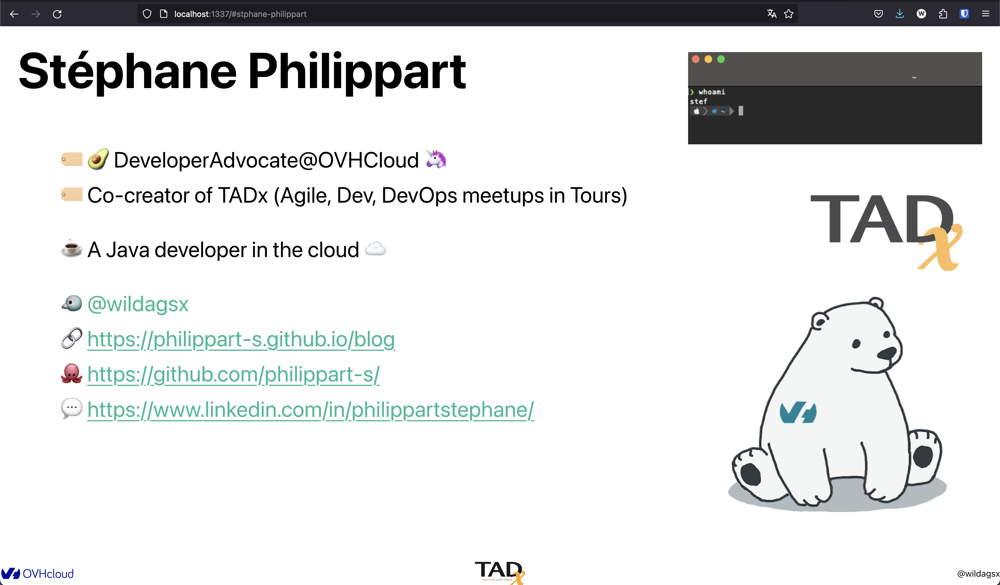
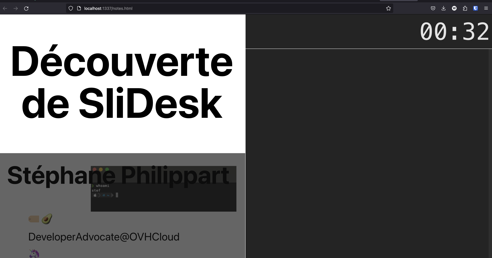

---
>**📜 TL;DR**
>
>Projet de slides as code simple, léger et personnalisable.
>
> - 🔗 [https://slidesk.github.io/slidesk-doc/](https://slidesk.github.io/slidesk-doc/)
> - 🔗 [https://github.com/slidesk/slidesk](https://github.com/slidesk/slidesk)
> - 🔗 [https://slidesk.github.io/slidesk/](https://slidesk.github.io/slidesk/)
> - 🔗 le [code source](https://github.com/philippart-s/slidesk-discovery) de cet article

--- 

Il y a quelques temps, je me suis [déjà essayé](/2020-05-11-Revealjs), avec peu de succès, à coder mes slides.
A cette époque, j'ai testé [Reveal.js](https://revealjs.com/) et je n'ai pas réussi à aller au bout de mon test pour plusieurs raisons.
Les principales : un niveau trop faible en CSS, la complexité de Reveal.js, un niveau trop faible en CSS 😅.  
Mais alors, pourquoi réessayer ?  
Tout simplement parce que, depuis, l'envie de coder mes slides plutôt que de les _dessiner_ ne m'a pas quitté.
Voyez-y de la geekerie (que j'assume) mais aussi ces autres raisons : 
 - je ne peux pas forcément utiliser les outils classiques que sont Office ou Google Slides,
 - je trouve le suivi de version de ces outils pas assez abouti,
 - le travail collaboratif par PR me semble plus approprié lorsque l'on travaille à plusieurs,
 - la gestion multilingue où il faut tout refaire ne me convient pas,
 - j'aime coder 😉

Il n'empêche que lorsque j'ai, de nouveau, franchi le pas en début d'année dernière, je me suis confronté aux mêmes problèmes que la dernière fois en réessayant Reveal.js et consorts.
Autre élément qui m'a aussi ennuyé, le côté monolithe du dev alors que mon envie était la possibilité de traiter mes slides comme un développement : factorisables, génériques et composables.

# 🤔 Pourquoi SliDesk ?

> Je ne suis pas aussi calé qu'Hubert Sablonnière qui code carrément tout un site pour les slides des ses talks 🤩.
> Allez jeter un coup d'oeil à son [site](https://www.hsablonniere.com/talks/).

Comme souvent, tout part d'une discussion 😉.
Dans ce cas, avec [Sylvain](https://twitter.com/GouZ), l'auteur de SliDesk.
Je lui indiquais, que je galérais avec Reveal.js et qu'en plus, nativement, le multilingue n'était pas super bien géré (et toujours le côté monolithe qui ne me plaisait pas).

De fil en aiguille, Sylvain, qui bossait sur le sujet SliDesk me propose d'intégrer cette fonctionnalité dans ses devs 🤩.
L'idée devient alors une motivation supplémentaire : l'aider dans la mise au point de son projet, avec mes retours de débutant de CSS et JS. C'était l'occasion de participer avec lui à son aventure !

Enfin, Sylvain me l'avait indiqué : son objectif était de faire un slide as code simple et personnalisable !

# 🏁 Démarrer avec SliDesk

Les premières choses à faire : aller voir du côté du [repository](https://github.com/slidesk/slidesk) GitHub, de la [documentation](https://slidesk.github.io/slidesk-doc/) et de l'[exemple]([https://slidesk.github.io/slidesk/).

Ensuite, vient le temps _d'installer_ SliDesk.
Ou plus précisément, la [CLI](https://slidesk.github.io/slidesk-doc/docs/usage/intro) de SliDesk qui va être votre compagnon pour tirer pleinement parti de SliDesk.

J'en parlerai plus tard, mais la CLI vous permettra aussi de _servir_ vos pages pour afficher vos slides.

Pour installer SliDesk, suivez la [documentation](https://slidesk.github.io/slidesk-doc/docs/category/installation) qui explique les différentes façons de procéder.  
Pour ma part j'ai utilisé brew : `brew install gouz/tools/slidesk`.

## ✨ Initialisation d'un projet

Pour initialiser un projet, rien de plus simple : `slidesk create slidesk-discovery`.  
```bash
$ slidesk create slidesk-discovery
 ____(•)-
(SliDesk) v 2.4.3

Creation of your talk: slidesk-discovery
> What is the title of talk?
SliDesk discovery
> Do you want to customize the presentation? [yN]
y
```
> le fait d'indiquer que l'on souhaite personnaliser la présentation permet d'avoir un fichier _custom.css_ de créé.

Une fois la commande exécutée, l'arborescence suivante est créée : 
```bash
slidesk-discovery
├── custom.css
└── main.sdf
```

On y retrouve le fichier _custom.css_ dont je vous parlais et le fichier _main.sdf_ qui va être le fichier _point d'entrée_ de notre présentation.

> l'extension _.sdf_ est propre à SliDesk mais au final c'est un format texte où l'on va mélanger syntaxe SliDesk, Markdown et HTML.

Voyons le contenu du fichier _main.sdf_ : 
```markdown
/::
custom_css: custom.css
::/

# SliDesk discovery 

## My first Slide
```

> J'utilise ici le markdown pour la coloration syntaxique mais Sylvain a développé une [extension VSCode](https://marketplace.visualstudio.com/items?itemName=gouz.sdf) qui permet d'avoir la coloration des fichiers _sdf_

On voit ici la structure d'un slide SliDesk : 
 - `# SliDesk discovery` : titre principal d'une présentation, représente le premier slide
 - `## My first Slide` : un slide simple dans SliDesk.

Voyons ce que cela donne de manière visuelle.
Pour cela il faut _exécuter_ notre présentation : `slidesk`.
```bash
$ slidesk                         
 ____(•)-
(SliDesk) v 2.4.3

Take the control of your presentation direct from here. 
 
Press Enter to go to the next slide. 
Press P + Enter to go to the previous slide. 
Press Q to quit the program. 

Your presentation is available on: http://localhost:1337
```

Lorsque l'on exécute _slidesk_, si un fichier _main.sdf_ est présent cela lance automatiquement la présentation à partir de celui-ci.
On voit aussi qu'il est possible de naviguer via le terminal en utilisant le clavier et de se connecter à la présentation pour l'afficher sur le port `1337` (paramétrage par défaut facilement modifiable).

<table>
  <tr >
    <td style="border-bottom: 0px">
      
    </td>
    <td style="border-bottom: 0px">
      
    </td>
  </tr>
  <tr>
    <td colspan=2 style="border-bottom: 0px; text-align: center">
      <i>Rendu des slides lors de la génération d'un projet</i>
    </td>
  </tr>
</table>

## 🏗️ Organisation de ses sources

Je vous l'ai dit, une des choses que je n'aimais pas avec les autres Frameworks c'était l'obligation de tout mettre dans un seul fichier.
Je trouvais ça contre productif et contre intuitif (et accessoirement impossible de travailler efficacement à plusieurs).

SliDesk, au contraire, permet une totale liberté d'organisation de slides, d'images, de CSS, JS, ...
A noter, qu'il vous est aussi possible de tout mettre dans un seul fichier si vous préférez 😊.

Voici un exemple d'organisation de sources : 
```bash
.
├── assets
│  ├── css
│  │  └── custom.css
│  └── images
│     └── prez
│        ├── ours.png
│        ├── tadx.png
│        └── whoami.png
├── LICENSE
├── main.sdf
├── README.md
└── slides
   └── speaker.sdf
```
On retrouve le ficher _main.sdf_ à la racine.
Les ressources dans un répertoire _assets_ avec ses sous répertoires selon les ressources.
Et enfin, un répertoire _slides_ avec les différents fichiers _sdf_.
> A noter qu'il est possible de créer d'autres sous répertoires afin de classer comme bon vous semble les différents fichiers.

Mais, comment cela fonctionne au final l'assemblage ?
Grâce à la directive `include`.
Le fichier _main.sdf_ devient donc : 
```markdown
/::
custom_css: assets/css/custom.css
::/

# SliDesk discovery 

!include(slides/speaker.sdf)
```

On voit ici l'inclusion du slide _speaker.sdf_ mais aussi de la feuille de style _custom.css_ qui se trouvent tous les deux dans des sous-arborescences.

C'est cette liberté dans l'organisation et dans la syntaxe (on le verra plus tard) que j'aime dans SliDesk 😇.

## 🎨 Un peu de personnalisation

Comme je vous l'ai déjà indiqué, il est possible de personnaliser SliDesk avec sa propre feuille de style.
En effet, SliDesk se veut simple et vient avec un style épuré.
Nul doute que, quelque soit votre niveau de CSS (et croyez moi, je sais de quoi je parle 😅), vous aurez besoin de personnaliser le rendu de vos slides.
Il est possible de tout faire en HTML (oui j'ai essayé tellement je n'aime pas le CSS 😂).
Force est de constater qu'il est plus simple et plus dans l'esprit de SliDesk de le faire en CSS.
Je ne suis pas devenu un pro de CSS mais avec un peu d'habitude, beaucoup d'inspecteur de code et encore plus de demande d'aide de Sylvain (merci à toi) on y arrive !

Dans mon cas c'est assez simple, car mon template favori pour faire des slides : un fond blanc, une police noire et des listes à puces.
Quelques images et emojis et on a fait le tour !  
Là où j'ai le plus eu de difficultés c'est avec les images pour les positionner comme il faut.
SliDesk est responsive, l'idée est donc que les images suivent aussi lorsque la résolution ou la place changent 😉.

SliDesk vient à notre secours avec une directive `image` mais vous pourrez avoir besoin de gérer une ou deux images pour des besoins spécifiques.
Revenons à nos moutons et voyons un peu ce que donne la personnalisation.
```css
:root {
  --sd-heading1-size: 8.5vw;
  --sd-heading1-line-height: 1;
  --sd-heading2-size: 5vw;
  --sd-heading2-line-height: 1;
  --sd-text-size: 2.2vw;
  --sd-text-line-height: 1.2;

  --sd-background-color: #fff;
  --sd-heading-color: #000;
  --sd-text-color: #000;
  --sd-primary-color: rgb(37, 186, 146);

  /* SpeakerView */
  --sd-sv-timer-size: 80px;
  --sd-sv-text-size: 40px;
  --sd-sv-text-line-height: 1.2;
  --sd-sv-background-color: #242424;
  --sd-sv-text-color: rgba(255, 255, 255, 0.87);
}

.slide-text {
  display: block;
}
.slide-text h2 {
  text-align: left;
  margin-bottom: 5rem;
}

.slide-text ul {
  margin: 2rem;
  width: 62%;
}

.slide-text ul li {
  list-style: none;
  line-height: 1.6em;
}

.slide-text .twitter {
  color: var(--sd-primary-color);
}

.slide-text p {
  text-align: left;
  line-height: 1.6em;
}
```
Je reviendrai sur la _speaker view_ présente dans le CSS plus tard 😉

## 🖼️ Coder ses slides

Il est maintenant grand temps de coder son premier slide.
```markdown
## Stéphane Philippart .[slide-text]

!image(assets/images/prez/whoami.png,, 494, 155, float: right; margin-top: -16vh)

- 🏷️ 🥑 DeveloperAdvocate@OVHCloud 🦄
- 🏷️ Co-creator of TADx (Agile, Dev, DevOps meetups in Tours)

!image(assets/images/prez/tadx.png, tadx, 304, 165, float: right; margin-top: -9vh)

- ☕️ A Java developer in the cloud ☁️

!image(assets/images/prez/ours.png, ours, 437, 414, float: right;)

- 🐦 <span class="twitter">@wildagsx</span>
- 🔗 https://philippart-s.github.io/blog
- 🐙 https://github.com/philippart-s/
- 💬 https://www.linkedin.com/in/philippartstephane/
```

Ici on voit plusieurs choses.
Commençons par la syntaxe _markdown_ : on retrouve les titres de sections `##` et les listes à puces `-`.
On peut appliquer un style CSS à l'ensemble du slide `.[slide-text]`.
On découvre aussi la directive [image](https://slidesk.github.io/slidesk-doc/docs/syntax/Image/) en action.

Le CSS précédent avec le code ci-dessous nous donne maintenant un joli slide de présentation de speaker.


S'il permet de faire du pure HTML, CSS et JS, SliDesk vient avec sa syntaxe pour vous faciliter la vie.
Je vous laisse aller voir les différentes syntaxes possibles dans la [documentation](https://slidesk.github.io/slidesk-doc/docs/category/syntax).

## 🧩 Les plugins

SliDesk vient avec des [plugins](https://slidesk.github.io/slidesk-doc/docs/plugins/intro) pré-définis.
Vous en avez déjà pas mal et plutôt cools comme : piloter sa présentation avec un gamepad, avoir des listes à puces animées, une barre de progression, ...
Je vous laisse allez voir la vingtaine de plugins disponibles.

Et si vous ne trouvez pas votre bonheur vous pouvez en créer vous-mêmes.
C'est, avec mon petit niveau front, ce que j'ai fait.
J'avais besoin de rajouter un footer avec logo et autres informations, du coup j'ai créé un plugin.
Pour cela il faut créer un répertoire `plugins` à la racine de votre projet puis un sous répertoire contenant votre plugin.
Dans mon cas ce sera `footer`.
Ensuite il faut créer quelques fichiers.

### ⚙️ Plugin.json

C'est le fichier principal qui va contenir les paramètres du plugin.
```json
{
  "addHTMLFromFiles": ["./plugins/footer/footer.html"],
  "addStyles": ["./plugins/footer/footer.css"]
}
```
Il y a [plusieurs champs](https://slidesk.github.io/slidesk-doc/docs/plugins/intro) que vous pouvez renseigner.  
Dans mon cas j'ai utilisé deux champs :
 - le premier pour indiquer le code HTML de mon plugin
 - le deuxième pour indiquer le CSS propre à mon plugin

### 📜 footer.html

Fichier qui contient simplement le code HTML du plugin.
```html
<div class="footer">
  <div class="ovhcloud-footer">
    
  </div>
  <div class="author-footer">@wildagsx</div>
  <div class="footer">
    
  </div>
</div>
```

### 🎨 footer.css

Fichier qui contient la feuille de style du plugin.
```css
/****
 * CSS for center element
 ****/
.footer {
  position: fixed;
  left: 0;
  bottom: 0;
  width: 100%;
  color: rgb(0, 0, 0);
  text-align: center;
  transition: all var(--animationTimer) ease;
}

/****
  * CSS for OVHcloud logo
  ****/
.ovhcloud-footer {
  position: absolute;
  left: 0%;
  top: 50%;
  transform: translateY(-50%);
}

.ovhcloud-footer img {
  padding: 2px;
  transition: all var(--animationTimer) ease;
}

/****
  * CSS for logo
  ****/
.img-footer {
  margin: 0 auto;
  width: 100px;
  text-align: center;
}

/****
 * CSS for author element
 ****/
.author-footer {
  position: absolute;
  right: 0%;
  top: 50%;
  transform: translateY(-50%);
  font-size: 0.4em;
}
```

Au final, nos slides ont un beau footer !



## ✨ Les autres fonctionnalités de SliDesk

SliDesk propose de nombreuses fonctionnalités, je vous laisserai aller voir par vous-mêmes dans la [documentation](https://slidesk.github.io/slidesk-doc/docs/intro) mais pour finir cet article je vous en présente deux très utiles.

### 📜 Les speaker notes

Je ne me sers pas souvent des speakers notes mais je sais que c'est une fonctionnalité très utilisée par de nombreuses personnes.
SliDesk permet d'avoir ses [speakers notes](https://slidesk.github.io/slidesk-doc/docs/usage/options/notes) comme pour les autres outils de création de slides.

Pour avoir ces notes, rien de plus simple : ajouter des commentaires avec le format `/* mes notes */` et lancer SliDesk avec l'option `-n`.

Petite subtilité de SliDesk sur les speakers notes, il est possible d'ajouter des informations sur le temps :
 - checkpoint : `//@ < 2:00`, ce slide doit être affiché avant 2 minutes sinon l'horloge sera affichée en rouge,
 - duration : `//@ [] 01:00`, le temps à passer sur ce slide
Pour que cela s'affiche il faudra lancer SliDesk avec l'option [timer](https://slidesk.github.io/slidesk-doc/docs/usage/options/timers), `-t`.

Au final pour lancer SliDesk avec les speakers notes et les informations de temps il faut donc activer les options `-n` et `-t`.

```bash
$ slidesk -nt                      
 ____(•)<
(SliDesk) v 2.4.3

Take the control of your presentation direct from here. 
 
Press Enter to go to the next slide. 
Press P + Enter to go to the previous slide. 
Press Q to quit the program. 

Your speaker view is available on: http://localhost:1337/notes.html
Your presentation is available on: http://localhost:1337
```

Et ce n'est pas tout ! SliDesk vous permet aussi, avec l'option `-i` couplée avec `-d` d'avoir les speakers notes sur un device et les slides sur un autre.  
Quelques explications : 
 - `-i` permet d'activer le mode [interactif](https://slidesk.github.io/slidesk-doc/docs/usage/options/interactive), c'est-à-dire qu'il permet d'afficher la présentation sur d'autres devices en plus du vôtre (mais vous restez la / le seul•e maître pour passer les slides)
 - `-d` permet d'activer le mode [domaine](https://slidesk.github.io/slidesk-doc/docs/usage/options/domain), c'est-à-dire qu'il rend la présentation et les speaker notes accessibles sur une IP bien particulière

Donc si l'on cumule toutes ces options pour afficher les speakers notes, le mode interactif et le domaine cela donne `slidesk -nit --domain 192.168.0.12`

```bash
$ slidesk -nit --domain 192.168.0.12
 ____(•)<
(SliDesk) v 2.4.3

Take the control of your presentation direct from here. 
 
Press Enter to go to the next slide. 
Press P + Enter to go to the previous slide. 
Press Q to quit the program. 

Your speaker view is available on: http://192.168.0.12:1337/notes.html
Your presentation is available on: http://192.168.0.12:1337
```

```html
## Stéphane Philippart .[slide-text]

!image(assets/images/prez/whoami.png,, 494, 155, float: right; margin-top: -16vh)

- 🏷️ 🥑 DeveloperAdvocate@OVHCloud 🦄
- 🏷️ Co-creator of TADx (Agile, Dev, DevOps meetups in Tours)
- $$title$$

!image(assets/images/prez/tadx.png, tadx, 304, 165, float: right; margin-top: -9vh)

- ☕️ A Java developer in the cloud ☁️

!image(assets/images/prez/ours.png, ours, 437, 414, float: right;)

- 🐦 <span class="twitter">@wildagsx</span>
- 🔗 https://philippart-s.github.io/blog
- 🐙 https://github.com/philippart-s/
- 💬 https://www.linkedin.com/in/philippartstephane/

//@ < 2:00
//@ [] 01:00

/*

Slide de présentation.

*/
```

L'affichage des speakers notes est disponible sur une autre route terminant par `notes.html`



### 🏴󠁧󠁢󠁥󠁮󠁧󠁿 L'internationnalisation

L'une des choses, entre autres, qui m’intéressait dans le fait de coder mes slides était la possibilité d'avoir du code générique et de ne pas tout réécrire entre deux conférences.
SliDesk permet d'utiliser des variables dans des [configurations](https://slidesk.github.io/slidesk-doc/docs/usage/options/conf) pour, par exemple, changer le nom d'une conférence ou d'autres petits éléments de variation.

Dans mon cas, je voulais aussi pouvoir gérer le cas où j'avais exactement la même présentation mais dans des langues différentes. La notion de configuration aurait pu convenir mais Sylvain a gentiment développé un [module multilingue](https://slidesk.github.io/slidesk-doc/docs/category/internationalisation) encore plus simple à utiliser.  
Pour l'activer rien de plus simple : 
Créer un fichier JSON par langue, par exemple `fr.lang.json` et `en.lang.json`.
```json
{
  "default": true,
  "translations": {
    "title": "Découverte de SliDesk"
  }
}
```
```json
{
  "default": false,
  "translations": {
    "title": "SliDesk discovery"
  }
}
```

Le champ `default` permet de savoir quelle langue est utilisée par défaut et les variables (par exemple `title`) s'utilisent en les entourant de `$$`.
Par exemple, avec `title` cela donne `$$title$$`.
```html
/::
custom_css: assets/css/custom.css
::/

# $$title$$

!include(slides/speaker.sdf)
```

Ensuite, si vous ne spécifiez pas de langue au démarrage, cela utilise la langue par défaut. Sinon vous pouvez spécifier la langue voulue au démarrage : `slidesk -l fr`.


## 🌐 Distribution des slides

Pour mettre vos slides à disposition des participant•es, vous avez deux options : impression PDF ou accès via le web en HTTP.
On ne va pa se mentir, l'option impression PDF peut être récalcitrante (même si Sylvain fournit une feuille de style qui fait déjà bien le boulot), la faute au HTML / CSS qui ne réagit pas toujours comme on veut 😅.
Si vous êtes ceinture noire de CSS, je pense que le problème est surmontable ... mais ce n'est pas mon cas 😉.

Pour l'accès via HTTP vous avez deux options : 
 - créer un serveur avec slidesk qui tourne pour servir vos slides
 - utiliser une version statique full HTML / JS exportée

Pour des raisons de simplicité j'ai choisi la deuxième option, d'autant que SliDesk fait l'export prêt à l'emploi pour moi 😎.
Pour cela il suffit de rajouter l'option `-s` permettant d'activer la [sauvegarde](https://slidesk.github.io/slidesk-doc/docs/usage/options/save) de vos slides en version statique.
Une fois exécutée, vous avez dans votre répertoire (que vous positionnez au moment d'activer la commande) l'ensemble des fichiers à déposer dans un serveur HTTP.
```bash
$ slidesk -s ./build
 ____(•)-
(SliDesk) v 2.4.3

📃 ./build/LICENSE generated
📃 ./build/plugins/footer/footer.html generated
📃 ./build/plugins/footer/footer.css generated
📃 ./build/assets/css/custom.css generated
📃 ./build/assets/images/TADx_HD.jpg generated
📃 ./build/assets/images/prez/whoami.png generated
📃 ./build/assets/images/prez/tadx.png generated
📃 ./build/assets/images/prez/ours.png generated
📃 ./build/assets/images/OVHcloud_logo.png generated
📃 ./build/index.html generated
📃 ./build/slidesk.css generated
📃 ./build/slidesk.js generated
📃 ./build/favicon.svg generated
```

Dans mon cas, j'ai choisi d'utiliser [GitHub Pages](https://pages.github.com/) pour héberger et gérer la version distribuable de mes slides.
Voici un exemple de ce que cela donne : [https://philippart-s.github.io/talks-slides/jarvis/snowcamp-2024/](https://philippart-s.github.io/talks-slides/jarvis/snowcamp-2024/#) et le [repository](https://github.com/philippart-s/talks-slides/) permettant l'hébergement.


## 🔎 En conclusion

C'en est fini de la présentation de SliDesk, je pourrai continuer à vous détailler toutes les options mais l'article est déjà bien trop long et je vous laisse aller vous faire une idée par vous-mêmes en parcourant la documentation et le repository de SliDesk.
Encore merci Sylvain, d'avoir fait un outil qui me permet de faire mes slides as code !

Si vous êtes arrivés jusque là merci de m'avoir lu et si il y a des coquilles n'hésitez pas à me faire une [issue ou PR](https://github.com/philippart-s/blog) 😊.

Merci à ma relectrice, Fanny, qui vous permet de lire cet article sans avoir trop les yeux qui saignent 😘.

Vous trouverez l'ensemble du code source dans le repository [slidesk-discovery](https://github.com/philippart-s/slidesk-discovery).