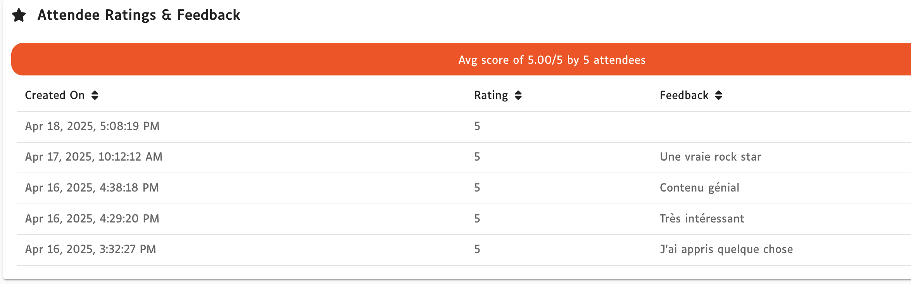

## 🪪 C'est quoi Devoxx France ? 

Je pense que bon nombre d'entre vous connaissent [Devoxx France](https://www.devoxx.fr/), mais pour celles et ceux qui ne connaissent pas, je vais prendre quelques minutes pour présenter cette conférence.

Devoxx France est une des plus grosse conférence d'Europe centrée sur le monde du développement. 
Elle dure 3 jours, accueille plus de 4500 participantes et participants avec plus de 280 conférences.
Elle fait partie de la galaxie Devoxx qui regroupe des conférences dans différents pays: la Belgique, la France, l'Angleterre, l'Ukraine, la Pologne et la Grèce.

Si son ADN est très centré développement, il est possible d'y suivre des conférences moins techniques ou sur d'autres domaines techniques comme les métiers de la production par exemple.

Mon lien avec Devoxx France est simple : je les ai toutes faites depuis la première dans un hôtel célèbre avec une moquette non moins célèbre 😂.

En tant qu'orateur j'ai eu la chance de donner mes premières conférences l'an dernier : un tools in action (format 30 mins avec des démos), un atelier de 3h avec un de mes collègues d'OVHcloud et un BOF de 45 minutes avec ma chérie 🥰.

## 🎙️ Une université à Devoxx c'est quoi ?

Une université à Devoxx France est une conférence de 3h où vous présentez un sujet. 
Le nom université est l'ancien nom, maintenant cela s'appelle _deep dive_.
La grosse différence avec un atelier est que les participantes et participants ne manipulent pas directement ce que vous présentez c'est une conférence où vous seul•e présentez le sujet.

C'est pourquoi, très souvent, les universités sont présentées par 2 ou 3 personnes (je reviendrai sur ce point).

L'autre élément à savoir est que ce format est assez rare et que Devoxx France le permet au vu du nombre assez impressionnant de conférences en parallèles.

## 📜 Commençons par le début, soumettre le sujet

Il y a une phrase que je répète très souvent aux personnes que j'accompagne dans leurs premières conférences : 
> "Le pire qui puisse t'arriver quand tu soumets à un CFP ... c'est d'être pris•e."

Dans mon cas c'est un peu différent : à peine le dernier Devoxx France terminé, j'ai tout de suite eu envie de soumettre un sujet qui me trottait dans la tête depuis un long moment mais que je n'osais pas conceptualiser : une ode à Java.

Mon idée principale était la suivante : cela fait plus de 20 ans que j'utilise Java et j'avais envie de prendre le temps de regarder dans le rétro de cette collaboration 😉.
J'ai vu les moments où il était à la mode, d'autres où on lui prédisait sa disparition.
Force est de constater est qu'il est toujours vivant et d'actualité.
Je voulais donc avoir assez de temps pour présenter tout ce que l'on peut faire avec ce language, mais aussi peut-être lui rendre tout l'amour qu'il m'a donné 😉.

J'ai donc passé mes premiers mois d'après Devoxx à faire des POCs pour me "rassurer".

> Il y a deux "écoles" pour les CFP : celles et ceux qui écrivent le CFP avec "seulement" l'idée mais qui attendent la réponse pour préparer la conférence.  
>J'ai essayé, cela m'a tellement mis en stress de devoir faire la conférence en moins d'un mois et demi que je me suis promis de ne plus le refaire 😅.  
>Vous l'avez compris, je suis de l'autre école : préparer ma conférence avant de soumettre le CFP.  
>Plus exactement : préparer l'ensemble des démos et un gros draft des slides.

J'avais donc besoin de me rassurer sur ce que je voulais présenter, j'ai principalement utilisé des éléments déjà connus mais que j'avais besoin de rafraîchir, et une ou deux choses que j'ai découvertes durant mes différentes phases de recherche.

Et ensuite je suis rentré dans une phase assez connue : la procrastination 😉.

Jusqu'au moment de l'ouverture du CFP ... et là un vieil ami est revenu me voir : le fameux syndrome de l'imposteur (je vous laisserai aller voir [une conférence d'Aurélie Vache](https://youtu.be/MGt-DpYf30g?si=Fx8Mm7ivrJrHFs_Q) à Devoxx France qui l'explique beaucoup mieux que moi).

> Devoxx France c'est quand même une grosse conférence  
> Il y a des oratrices et orateurs beaucoup plus confirmé•es que toi  
> Le publique en sait plus que toi  

### 🚀 Il faut bien se lancer à un moment donné 

Là, vous ête un peu seul•e : à un moment, seul•e vous allez pouvoir passer le cap entre l'envie de soumettre ou non à un CFP et le faire, quelque soit la taille de la conférence.

Dans mon cas, au vu du sujet, du format et de la conférence, je me suis réfugié dans le côté scolaire de l'exercice : faire un CFP le plus lisible possible pour un sujet de cette taille et le plus rassurant possible pour l'équipe d'organisation.

Ca a donc été un des CFP que j'ai le plus travaillé, je voulais vraiment que l'équipe d'organisation mais aussi les participantes et participants sachent pourquoi retenir mon sujet et pourquoi rentrer dans une salle pour passer 3h avec moi 😅.

Au final, ce conseil vaut pour tous vos types de talks : prenez le temps d'avoir un CFP qui s'adapte à la conférence et soit clair.
Ne donnez pas l'impression que vous soumettez les sujets en mode batch, ce sont des humains qui relisent vos CFP, il faut qu'iels aient l'impression que vous avez envie de venir à cette conférence (et que ce n'est pas une parmi tant d'autres).

### 👤 Une université tout seul, tu es sûr ?

Une petite remarque sur le fait que j'ai soumis ce format de conférence tout seul.  
Très souvent, les conférences avec des formats de 3h, n'aiment pas trop qu'il y ait qu'une seule oratrice ou un seul orateur.
Risque d'annulation si la seule personne qui donne la conférence est malade, risque de ne pas tenir le rythme pendant 3h, etc.  

Vous vous demandez peut-être pourquoi j'ai fait le choix d'être seul pour ce format ?  

Tout simplement parce que cela faisait trop longtemps que j'avais cette conférence en tête et embarquer une ou deux personnes supplémentaires m'aurait obligé à renoncer à certaines idées qui me tenaient à cœur.
Je trouve que, l'exercice de préparer une conférence, quelque soit son format, à plusieurs, est un exercice compliqué ou alors peut-être que je ne suis pas fait pour ce genre de chose.
Cela implique d'être raccords sur le sujet bien évidement mais surtout d'avoir le même mode de préparation.
Bref, vous l'avez compris je n'étais pas prêt pour préparer cette conférence comme ça 😉.

> Je suis conscient d'avoir eu la chance d'être pris par Devoxx France et je suis reconnaissant envers l'organisation pour cette opportunité 🤗.

### 🕰️ L'attente

C'est fait : j'ai soumis mon sujet.
Par habitude je soumets le plus tôt possible, au début de l'ouverture d'un CFP.
Pour être passé par la case relecteur de CFP (et dans des volumes beaucoup moins importants que ceux de Devoxx France) je sais que l'on est plus "frais", en tant que relectrice ou relecteur, sur les premiers sujets.

Donc il ne me reste plus qu'à attendre quelques semaines ... 
A ce stade je ne sais pas si j'ai envie d'avoir une réponse positive ou négative 😂.

En tout cas je reprends ma phase de POC et je commence à faire mes slides "au cas où" 🤞.  
Je me fait aussi une carte mentale pour commencer à bien délimiter les sujets que je veux aborder.
Car très vite je me rends compte d'une chose : le sujet choisi fait que je pourrais faire 5h et non 3h !

Mon objectif premier : me rassurer en résolvant les dernières inconnues ou problèmes que j'ai sur certains éléments techniques que j'ai prévu.  
Et comme tout bon geek que je suis, je profite de cette période pour me rajouter un élément supplémentaire : l'utilisation des [Dev Containers](https://containers.dev/).
Depuis longtemps je veux les utiliser et, un changement de machine, me permets de décider de ne plus rien installer directement sur ma machine mais de passer uniquement par les dev containers.  

En suit deux articles de blog, témoins de ma découverte des dev containers : [🧑‍💻 A la découverte des Dev Containers 🐳](/2025-01-12-discover-devcontainers) et [🧑‍💻 Aller plus loin avec les Dev Containers 🐳](2025-01-28-devcontainers-advanced).  
Au final ça a été une fausse bonne idée mais que je ne regrette pas : faute de pouvoir peaufiner ma configuration avec un problème au dernier moment et le fait que je donnais mon talk avec mon portable professionnel m'ont fait revenir sur une full installation sur celui-ci (je pense que cela alimentera un troisième article sur les dev containers 😉).

> 🤔 Retenez ce conseil : tenez-vous en au plan initial de votre talk, notez vos nouvelles idées pour en faire une V2 ou même un nouveau talk 😉.

Je profite de cette phase pour aussi peaufiner la partie slides, là-encore je décide de ne pas suivre la solution de facilité et je pars sur du _"slides as code"_.
Et pour cela je prends [SliDesk](https://slidesk.github.io/slidesk-doc/) (vous pouvez avoir plus de détails en consultant mon [article de présentation de SliDesk](/2024-03-09-slidesk-discovery)).
Je ne regrette en rien ce choix car cela fait un moment maintenant que je fais mes slides as code et cela me tenait à coeur (même si, vu mon niveau en développement front, cela reste un challenge 😅).

> 🙃 On verra plus tard que ce choix m'aura apporté une petite suée une heure avant le début, rien à voir avec SliDesk mais les conditions en conférences sont rarement celles de votre bureau douillet 😆.

### 🥳 La réponse 😱

Il est là, le mail tant attendu (ou redouté 😁).
Je le relis deux ou trois fois pour être sûr : _[devoxxfr2025] Proposition acceptée / Accepted proposal : ☕️ Full stack Java, du dev à la prod en passant par l'infra 🏗️_

Mon premier réflexe (mon cerveau est très étrange parfois) : est-ce que je suis vraiment content de cette acceptation ? 
Je vais répondre qu'en fait je ne peux pas ... 

Mais non, j'ai trop longtemps voulu donner ce genre de conférence (j'en ai fait mon métier après tout) sur ce genre de sujet pour abandonner maintenant.
Je ne m'imaginais pas dans quoi j'allais tomber.

**J-72** je vais bien.

> Pour pimenter le tout j'ai deux autres conférences qui sont acceptées : un lunch talk (mais qui utilise une partie de mon deep dive) et un BOF qui demande moins de travail et surtout qui va être géré à 100% par ma co-speaker 🥰.

## 🧑‍💻 Le temps de la préparation

J'ai la chance que la partie conférences soit une des tâches de mon travail, j'ai donc du temps pour préparer mon université durant mes journées de travail mais aussi de les répéter, on le verra plus tard c'est un vrai luxe.

Je commence tranquillement à préparer la trame de ma conférence : 65% de code et 35% de slides.
C'est un choix, je préfère des conférences avec du code, je n'aime pas trop donner une conférence 100% slides.

Je me rends vite compte que le format va faire voler en éclats quelques habitudes que j'ai.
Lors de mes conférences, habituellement, pas de notes speaker dans les slides ni pour mes démos.
Mais là on parle de 3h et je me rends compte que mon cerveau ne sera pas en capacité, en plus des autres choses professionnelles, d'absorber une telle masse d'informations pour les retenir et les restituer.
Une fois n'est pas coutume, je passe donc par la phase notes dans les slides.

> Spoiler ... au final je ne les aurai quasiment pas utilisées alors qu'elles m'auront causées quelques soucis 😉

### 🖼️ Organisation de mes slides

Je n'ai pas envie de noyer les personnes avec beaucoup de slides mais la partie slides doit me permettre de souffler un peu entre les démos, permettre aussi aux participantes et participants de souffler et introduire calmement les notions des démos qui suivent.

Je choisis d'alterner les slides avec quelques infos (toujours peu de lignes dans un seul slide) et les slides avec juste une image.
J'aime les slides épurés et notamment avec une seule image, cela demande juste de bien maîtriser le contenu (ou de rajouter quelque notes 😉).

Après avoir tâtonné entre faire les slides et faire les démos je choisis de construire tout ça en mode déroulé logique de la conférence : je construis les slides dans l'ordre et quand c'est le moment de la démo je construis la démo, etc.

En espérant avoir le temps de tout finir !

Au final, ma présentation aura 90 slides, c'est beaucoup mais je pense avoir trouvé le bon équilibre avec mes démos pour 3h de présentation.

### 🧑‍💻 Organisation des démos

Je vous l'ai dit, je suis adepte des conférences avec du code.
Du coup j'avais beaucoup de démos et de code prévus pour cette conférence.
Depuis maintenant quelques années je ne code plus au fil de l'eau mais j'utilise des [snippets VSCode](https://code.visualstudio.com/docs/editing/userdefinedsnippets) pour avoir du code bloc par bloc.
Cela évite les problèmes de syntaxe et rends le temps de démo plus déterministe je trouve.

> Pour me faciliter la vie sur la génération de code j'utilise le projet [snippets](https://github.com/bots-garden/snippets) de l'ami [Philippe Charrière](https://x.com/k33g_org)

Je me suis fixé comme objectif de pouvoir faire une première répétition un mois avant pour me laisser le temps de bien prendre en main l'ensemble et faire les correctifs nécessaires (je vous rappelle que nous sommes des faiseuses et des faiseurs de bugs 🐛).

Cela avance bien et je commence à avoir quelque chose qui prends forme.
Les 5 projets de mes démos sont initialisés, mes slides finis en version alfa.

**J-52** que peut il m'arriver de mal ?

### 💥 Les imprévus ... et la gestion du stress

La vie n'est pas un long fleuve tranquille et à compter du 24 février je rentre dans une période professionnelle chargée avec une conférence de l'autre côté de l'atlantique, une journée de tech labs en Angleterre (pour ma première à devoir parler en anglais durant une journée sur un atelier) ... et la loi de Murphy étant ce qu'elle est, une tonne de choses non prévues à gérer.

De plus, certaines démos techniques ne se passent pas forcément bien, le fait de bosser avec les dev containers non plus (je continue car cela me permet de switcher facilement de machine pro / perso ... et parce que je suis têtu 😉).

Et je commence à voir ma dead line imaginative (je dis imaginative car c'est moi qui ai décidé arbitrairement cette date) du 16 mars de plus en plus compliquée à tenir.

Le stress monte d'un cran (peut-être de trois ou quatre ...), tout le temps non passé à finaliser mes slides, mes démos, me semble du temps de perdu.
Le sommeille fait parti de ce _"temps perdu"_ que je supporte le moins, d'autant que cela devient compliqué de dormir sans penser pendant de longues minutes (heures ?) à ces sujets.

Je fais donc un choix drastique, à mon retour du Canada, j'ai 16 jours pour avoir une version finale ... exécutable en mode dry run.

Du coup je dédie le maximum de temps libre, principalement mes soirées et début de nuit à préparer ma conférence.
Je m'astreins à ne pas me coucher après 1h ou 2h du matin, il faut que je reste assez frais pour mes journées de travail.

### 🧑‍🧑‍🧒‍🧒 Et la vie personnelle dans tout ça ?

Je profite de cette période de ma préparation pour faire une parenthèse sur les implications que peut avoir la préparation d'une telle conférence.
Nous sommes nombreuses et nombreux à avoir des familles, ce qui implique forcément aussi de passer du temps avec elles mais aussi selon les âges des enfants, et du temps à passer à s'occuper des différentes tâches familiales.

Il faut le prendre en compte, j'ai la chance d'avoir une amoureuse très compréhensive, dans l'IT et connaissant le monde des conférences du côté oratrice et organisatrice.
Je pense avoir tenu durant cette période grâce à elle, sinon j'aurais peut-être abandonné à un moment ou un autre.

Et je sais que cela n'a pas été facile à ce moment là pour elle non plus, je m'en excuse de tout mon coeur et je ne la remercierai jamais assez d'avoir cru en moi et fait que j'y ai cru jusqu’au bout 🥰.

**J-24** je suis au fond du trou, c'est le moment de donner un coup de pied pour remonter

### 💬 Les répétitions

J'ai un truc, pas complètement stable, je le sais, mais on a dépassé ma dead line, et j'ai besoin de commencer à faire que la conférence devienne concrète en répétant des parties de celle-ci.

J'en profite pour faire une n-ième parenthèse : répéter ou ne pas répéter une conférence ?  
Certaines oratrices ou certains orateurs indiquent ne pas avoir besoin de répéter, j'ai, au contraire, besoin de répéter.
D'abord pour me rassurer, ensuite pour essayer de donner la meilleure expérience possible aux personnes assistant à ma conférence.
Je suis tellement fan lorsque je vois une personne donner une conférence qui est réglée comme du papier à musique que j'essaie, à mon humble niveau, de faire de même.

Pour autant, je suis dans un cas un peu particulier d'une conférence de 3h, tout comme un marathon, il est rare que l'on court 10 marathons pendant les séances d'entraînement.

Je commence donc par jouer des parties de la conférence, parfois cela me rassure, parfois je me mets un coup de stress car je tombe sur des bugs que je n'avais pas forcément prévus.

Très vite j'ai tout de même besoin de faire de "vrais" dry run.

Au final j'en ferai 7 😲.

Ajoutez à cela mes répétitions fractionnées, j'ai dû passer pas loin de 30 heures en répétitions.

> ⚠️ De nouveau j'insiste sur une chose : j'ai la chance de pouvoir prendre du temps professionnel pour faire une bonne partie de ces répétitions. 
> Si ce n'est pas votre cas, avant de vous lancer dans une aventure de la sorte calculez le temps qu'il vous reste sur votre journée : une fois enlevé le pro, le perso (à conserver absolument), dormir (il paraît que c'est obligatoire), demandez-vous si il reste du temps pour faire la conférence. ⚠️

Les répétitions me permettent d'affiner mon code et mes snippets, je crée des issues pour pouvoir gérer l'urgence et la nécessité des corrections à faire. 
Cela me permet de vider mon cerveau de potentielles améliorations qui me trottent dans la tête mais qui seraient clairement du temps de perdu dans la dernière ligne droite.

**J-15** les premiers bouts de ciel bleu

### 🔒 Ceinture et bretelles

Je commence à me dire que je vais y arriver, mes slides sont finis à 95%, juste quelques peaufinages à faire mais ça c'est bon.
Il me reste deux problèmes techniques à résoudre sur de l'instabilité avec deux sujets.
J'ai la chance d'être bien entouré, et ma collègue, Aurélie, me permet d'avancer sur la résolution ou du moins dans un cas sur les choix à faire pour ne pas avoir de soucis le jour J 😉.

Pour la première fois lors de la création de conférences, je décide d'enregistrer l'ensemble de mes dernières répétitions, cela sera mon plan de secours ultime le jour J si rien ne fonctionne.

J'imprime toute la partie notes, là encore je ne fais pas ça d’habitude mais j'ai envie de faire le maximum pour anticiper tous types de problèmes.

Et je me crée 4 ou 5 environnements de backup au cas ou (l'ensemble de mes démos se déroulent dans le cloud).

**J-4** je suis prêt !!

### 🚀 Compte à rebours final

Je m'offre un WE sans toucher à mes slides et mon code, un peu comme pour un marathon je décide de faire un peu de "jus" en m'aérant la tête avec la famille (j'arrive presque à ne pas culpabiliser de ne pas travailler 😉).

2 jours avant le jour J, ultime répétition, plus pour me rassurer techniquement que pour réellement réviser.
Impeccable, tout se passe bien.
Une dernière frayeur par rapport à un changement d'API que j'utilise mais avec une belle réactivité des équipes d'OVHcloud, cela revient à la normale.

**J-1** En route pour l'aventure !

## 🎙️ Il est grand temps de donner ce deep dive

On est la veille, jour de départ pour Devoxx France !

### 🤕 Tout se paye un jour

N'oubliez jamais ça, quelque soit votre énergie, votre force, vos convictions, si vous tirez trop sur la corde votre corps vous le rappellera.  
Et souvent jamais au bon moment.

Pour moi c'est le matin (la veille de ma conférence) au moment de partir, dos bloqué à ne presque pas pouvoir s'habiller.

Un court instant le pire scénario s'imagine, c'est fini je ne pourrai pas aller à Devoxx, ces mois de préparation pour rien, décevoir l'équipe organisatrice qui avait mis sa confiance en moi ...

Là-encore, l'importance d'être bien entouré, ma chérie qui me rassure et surtout m'aide pour le trajet (j'ai la chance qu'elle soit bénévole à Devoxx France et donc aille aussi à la conférence).
Mon objectif : arriver à Paris et on verra bien.
La suite : du paracétamol, un ostéo en urgence entre midi et deux, du baume du tigre et du croisage de doigts 😉.

**J-0** je ne sais pas si je vais être en capacité de tenir 3h

### ✨ Le jour J

Le matin, le dos a l'air de tenir, je prends tout ce que je peux prendre pour m'en assurer et évite les faux mouvements.
Il faudrait un cataclysme pour m’empêcher d'aller donner ma conférence.
Tout le monde me souhaite bonne chance, ça aide les copines et les copains dans ces moments 🤗.

Comme à mon habitude, je m'isole avant la conférence pour un peu me concentrer et vérifier 2-3 points.
Dernière frayeur : les notes de mes slides ne s'affichent pas sur mon iPad.
Grâce à SliDesk on peut, via web socket, afficher les notes des slides sur un autre terminal, c'est très pratique quand vous partagez votre écran pour les démos 😉.
C'était sans compter sur le Wifi du Palais des congrès qui ne permet pas d'avoir une connexion web socket.
Je suis tellement préparé et avec des plans B que, si cela m'ennuie, cela ne me mets pas en panique.
J'en touche deux mots à Sylvain, le créateur de SliDesk, pour savoir si c'est moi qui fait mal quelque chose.
Il me confirme que c'est bien le Wifi qui est chelou mais me fait un fix maison pour que cela fonctionne et va jusqu'à me déployer mes slides sur une instance distante 🫶.

L'avantage est que cela m'aura permis de passer le temps sans stresser sur le moment qui arrive 😉.

Je rentre dans ma salle, elle est pleine c'est cool et au premier rang quelques visages connus, c'est toujours agréable et rassurant.
Le reste, se passe très bien, je suis un peu juste niveau timing mais je connais assez bien mon contenu pour accélérer là où il faut pour que cela tienne.

**H+3** ça c'est fait 🤘

## 🤔 J+11 ... alors au final bonne ou mauvaise expérience ?

Comme un marathon, le lendemain de ma conférence je me disais : je suis fier de l'avoir fait.
J'en ai bavé, j'ai eu des doutes mais je l'ai fait et les personnes qui ont suivi mon deep dive m'ont fait de beaux retours.
Je garde en mémoire un retour qui m'a particulièrement touché.
Une personne, en partant le vendredi, m'avait avoué être venue alors qu'elle n'était pas forcément dans sa zone d'expertise mais qu'elle avait passé un très bon moment.

 

Mais pour autant, est-ce que je suis prêt à recommencer ?
Est-ce que comme pour certaines et certains qui font un marathon, une fois accompli, ayant tellement soufferts iels ne veulent plus le refaire ?

C'est une bonne question.  

La semaine qui a suivi Devoxx France, je me disais "plus jamais".
Au jour où j'écris cet article, je me dis en fait "pourquoi pas" 😌.
Certainement que les semaines à venir cela se transformera en "mais carrément".
Cependant ce sera avec le recul de ce que j'ai vécu, il y a des erreurs que je ne referai plus.
Et peut-être même que je me lancerai dans l'aventure de le faire à plusieurs.

Si il y a un conseil que je peux donner à celles et ceux qui veulent se lancer dans cette aventure c'est que oui c'est énormément de travail mais la récompense des feedbacks des participantes et participants en vaut la peine.

Le sentiment d'avoir été utile.

Et, mais cela n'engage que moi, pour le vivre de la meilleure des manières : le préparer, le répéter et encore le répéter pour ne pas le subir le jour J (cette remarque peut être valable pour n'importe quelle conférence).

Alors on se dit : à l'année prochaine 👋 ?

>Epilogue : 
>Je voulais encore remercier et m'excuser auprès de ma douce et tendre.  
>Je sais que je lui ai parfois rendu la vie pas facile durant quelques semaines mais sans elle rien de tout ça n'aurait été possible ❤️  
>Promis, si je remets ça l'an prochain ce sera plus tranquille 😁

Si vous êtes arrivés jusque là merci de m'avoir lu et si il y a des coquilles n'hésitez pas à me faire une [issue ou PR](https://github.com/philippart-s/blog) 😊.