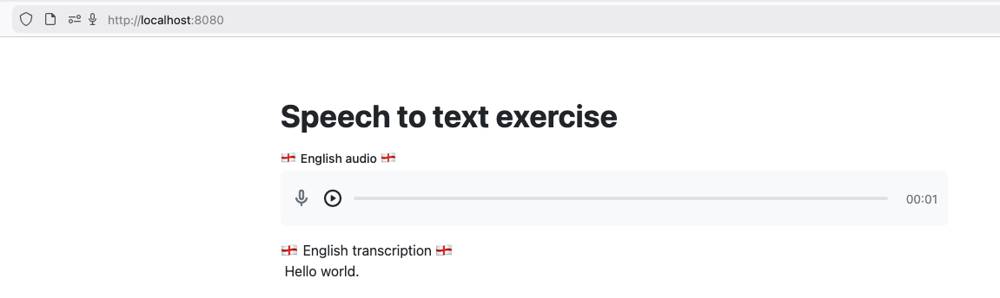

## 📖 TL;DR
>💡 [Javelit](https://javelit.io/) est un Framework Java pensé comme [Streamlit](https://streamlit.io/) pour faciliter la création d'interfaces Web orientées Data Science / IA.  
>👤 Son créateur est [Cyril de Catheu](https://www.linkedin.com/in/cyril-de-catheu/).     
>🐙 Son [repository](https://github.com/javelit/javelit) GitHub et la [documentation officielle](https://docs.javelit.io/).   
>📝 Un [exemple d'utilisation](https://github.com/devrel-workshop/ai-as-lib-workshop/tree/main/solutions/audio/java) dans l'un de mes workshops IA

## 🚡 Javelit en quelques mots

[Javelit](https://javelit.io/) a comme principal objectif de vous rendre la vie facile lorsque vous avez besoin de créer une interface web manipulant des données.  
On retrouve l’inspiration de [Gradio](https://www.gradio.app/) et [Streamlit](https://streamlit.io/) (son créateur ne s'en cache pas).  
Mais, et ce "mais" est important, ce Framework est à destination des développeuses et développeurs Java 🤩.

Avec [Javelit](https://javelit.io/), non seulement vous allez vous simplifier la vie pour la conception de votre interface mais cela va vous permettre aussi de servir la dite page avec un serveur [Undertow](https://undertow.io/).  
On retrouve un peu l'approche composant que l'on peut trouver avec HTMx par exemple mais sans avoir à faire de CSS ou du HTML 😉.  
Nous sommes clairement dans du "server side rendering", ce qui n'est pas pour me déplaire en tant que développeur back ☺️.

## ⚙️ Installation

L'installation est on ne peut plus simple grâce à [JBang](https://www.jbang.dev/) 🥳.  
Vous avez d'autres modes d'installation (voir la [documentation](https://docs.javelit.io/get-started/installation)) mais je vous conseille fortement l'utilisation de JBang.

L'installation se réduit donc à, une fois JBang installé, une ligne de commande:
```bash
jbang app install javelit@javelit
```

Ensuite vous pouvez utiliser la CLI `javelit` pour lancer le "hello world" qui testera votre installation : `javelit hello`.

> ℹ️ Il est nécessaire d'avoir une version Java 21+

> Si vous souhaitez en savoir plus sur [JBang](https://www.jbang.dev/), je vous laisse aller jeter un oeil aux replays de mes [différentes conférences](https://philippart-s.github.io/blog/talks/#jbang-un-fichier-java-pour-les-gouverner-tous-) sur JBang 🎤.

## 👩‍💻 Utilisation de Javelit

Comme indiqué en introduction, j'ai décidé d'utiliser [Javelit](https://javelit.io/) dans le cadre d'un workshop que je donne pour mon travail.  
Le but était de porter tout un code écrit en Python ayant pour but de faire découvrir l'utilisation de modèles d'intelligence artificielle dans le développement d'application.  
J'avais porté l'ensemble du code, notamment grâce à [LangChain4J](https://docs.langchain4j.dev/intro/) (vous pouvez aller voir mon article sur la découverte de LangChain4J: [⚡️ Quand Quarkus rencontre LangChain4j 🦜]({{ site.baseurl }})).

Étant donné que je veux rendre l'expérience simple, j'utilise de nouveau [JBang](https://www.jbang.dev/). Cela me permet de n'avoir qu'un script simple à faire manipuler par les participantes et participants au workshop 😉.

Je déclare donc la dépendance à [Javelit](https://javelit.io/) comme ceci:
```java
//DEPS com.openai:openai-java:3.6.1
//DEPS io.javelit:javelit:0.71.0
```

> ℹ️ La dépendance [Javelit](https://javelit.io/) ici ne sert qu'à assurer la completion dans l'IDE, ensuite au runtime c'est la version que vous avez installé qui prime.  
> Pensez-y sur vos montées de version 😉.

> ℹ️ Bien entendu vous pouvez utiliser une gestion de dépendance classique avec Maven ou Gradle.

Ensuite, pour mon exemple, j'ai quelques lignes de code propres à la partie IA :

```java
public class SpeechToText {

  static String speechToText(byte[] record) {
    OpenAIClient client = OpenAIOkHttpClient.builder()
                                            .apiKey(System.getenv("OVH_AI_ENDPOINTS_ACCESS_TOKEN"))
                                            .baseUrl(System.getenv("OVH_AI_ENDPOINTS_WHISPER_URL"))
                                            .build();

    TranscriptionCreateParams createParams = TranscriptionCreateParams.builder()
                                                                      .model(System.getenv("OVH_AI_ENDPOINTS_WHISPER_MODEL"))
                                                                      .responseFormat(AudioResponseFormat.TEXT)
                                                                      .language("en")
                                                                      .file(record)
                                                                      .build();

    Transcription transcription =
        client.audio().transcriptions().create(createParams).asTranscription();
    System.out.println("📝 Transcript generated! 📝");
    return transcription.text();
  }

  ...
```

> ℹ️ Je ne détaillerai pas ici cette portion de code mais si cela vous intéresse j'utilise le produit [AI Endpoints](https://www.ovhcloud.com/en/public-cloud/ai-endpoints/catalog/) d'OVHcloud et je vous laisse aller voir mes autres articles sur comment intégrer des appels aux LLM en Java.

Et enfin, la création de l'UX grâce à [Javelit](https://javelit.io/) :

```java
  ...
 
  public static void main(String [] args) {
    // Javelit recorder
    Jt.title("Speech to text exercise").use();

    var recording = Jt.audioInput("🏴󠁧󠁢󠁥󠁮󠁧󠁿󠁧󠁢 English audio 🏴󠁧󠁢󠁥󠁮󠁧󠁿").use();

    if (recording != null) {
      var transcription = speechToText(recording.content());
      Jt.text(String.format("""
            🏴󠁧󠁢󠁥󠁮󠁧󠁿 󠁧󠁢󠁥󠁮󠁧󠁿󠁧󠁢English transcription 🏴󠁧󠁢󠁥󠁮󠁧󠁿󠁧󠁢
            %s
            """, transcription))
        .use()
    }
  }
}
```

Quelques explications :
  - l5 : je déclare le titre de la page Web qui sera affiché en haut
  - l7 : je déclare un composant graphique de type enregistrement audio (il fait aussi player). 
  - l10 : j'appelle mon "code métier"
  - l11 : j'affiche le résultat de l'appel dans une zone de texte de ma page Web.

⚠️ Notez bien l'utilisation de `.use()` pour les composants graphiques de [Javelit](https://javelit.io/) : c'est ce qui déclenche leur affichage dans la page Web ⚠️

> ℹ️ [Javelit](https://javelit.io/) n'est pas encore compatible Java 25, c'est pour cela que je n'ai pas utilisé les "unamed class" et la "instance main method".

Il ne me reste plus qu'à lancer mon application avec la CLI : `javelit run SpeechToText.java`


[© wildagsx](https://www.linkedin.com/in/philippartstephane/)<br/>


### 🧐 Conclusion

[Javelit](https://javelit.io/) n'en est qu'à ses débuts mais c'est très prometteur et je suis très impressionné de la productivité du développeur (Cyril) qui est tout seul derrière ce projet 🤘.  
Il a, notamment, rajouté l'option `--base-path` afin de résoudre un problème que j'avais avec l’utilisation de [Javelit](https://javelit.io/) dans un Cloud Development Environment (CDE), [Coder](https://coder.com/).

Si vous souhaitez voir d'autres exemples d'utilisations de [Javelit](https://javelit.io/), n'hésitez pas à aller voir [les articles](https://glaforge.dev/tags/javelit/) de Guillaume LAFORGE 📚.

Je vais donc suivre avec attention ce projet et continuer à pouvoir faire mes démos IA en Java 🥰.