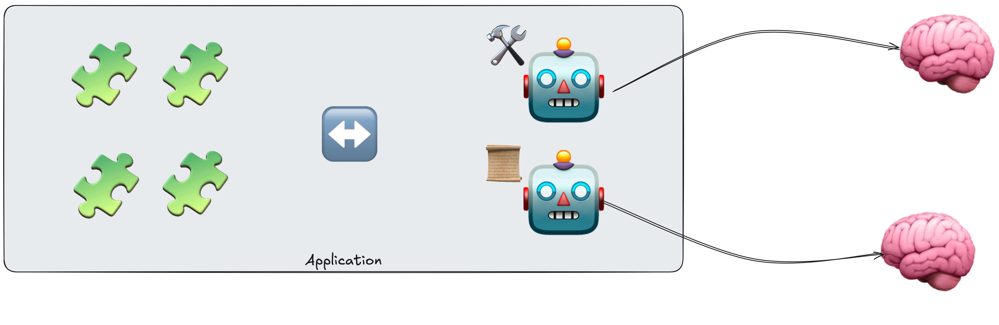
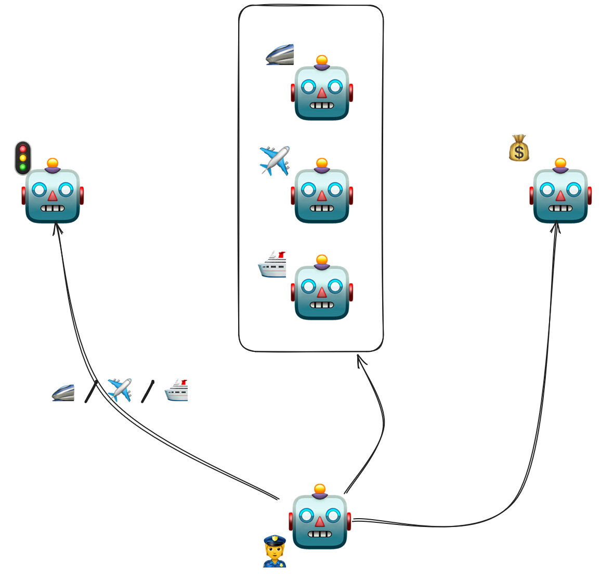

## 📖 TL;DR
> 🤖 Les agents sont une des dernières nouveautés dans le domaine de l'IA générative.  
> 🔀 Il existe plusieurs moyens de les orchestrer / chaîner  
> 🧑‍💻 Le code pour illustrer les concepts est en Java (Quarkus / LangChain4j)  
> 🐙 Le [code source](https://github.com/philippart-s/jarvis) de Jarvis   

<br/>

# 📜 Un peu de documentation

On a beaucoup de documentation disponible sur les agents, je vous propose de commencer par ces dernières :
 - 📜 l'article d'Anthropic [Building effective agents](https://www.anthropic.com/engineering/building-effective-agents)
 - 📚 la documentation de LangChain4j sur les [agents](https://docs.langchain4j.dev/tutorials/agents#agentic-systems)
 - 🎙️ l'excellent talk de Guillaume LAFORGE à TADX : [Agents intelligents, la nouvelle frontière des LLMs](https://youtu.be/0nqxN3fyg1E)
 - 📝 de manière plus générale, les [nombreux blog posts](https://glaforge.dev/) de Guillaume 🙂.

Et bien sûr, plein d'autres ressources comme les [replays de Devoxx France](https://www.youtube.com/@DevoxxFRvideos) par exemple.

# 🧑‍🏫 Oui mais toi Stéphane, c'est quoi ta définition d'un agent ?

Ah mais nous y voilà !
En toute honnêteté, j'ai mis pas mal de temps à comprendre ce qu'était un agent, et surtout en quoi c'était différent d'un simple appel à un LLM.
Ce qui n'aide pas non plus, comme souvent avec l'IA, c'est que chaque framework / librairie a sa propre définition d'un agent.
Et comme je n'aime pas ne pas comprendre un truc, je me suis documenté, testé, pris des murs, et j'ai fini par me faire ma propre définition.
C'est donc celle-ci que je vous propose, en toute humidité (comme dirait Perceval ⚔️).

> ⚠️ On est bien d'accord que c'est une définition personnelle, et que je ne prétends pas qu'elle soit universelle.
> À ce titre, n'hésitez pas à me faire des retours si vous n'êtes pas d'accord. ⚠️

Si j'étais taquin, je dirais, qu'une fois de plus, nos amis dans l'écosystème de l'IA ont réinventé une chose vieille comme le monde dans le développement logiciel 😈.
En effet, tout le monde s'émeut autour du fait que l'on a maintenant la capacité de faire de petits modules autonomes appelables, potentiellement, par des applications 🤪.
J'en conviens, je suis moqueur, mais après avoir réinventé les services distants (MCP), l'appel de fonctions utilitaires (function calling), on réinvente l'approche modulaire avec des agents 🙃.

## ☝️️ Ma définition d'un agent

C'est bien beau de se moquer, mais au final, c'est quoi un agent ?
Un agent va vous permettre de spécialiser l'utilisation d'un LLM pour une tâche précise.

Par exemple, si vous avez une application qui a besoin d'un LLM spécialisé dans la médecine et un autre dans le chinois.
Tout faire avec un seul modèle va vous forcer à utiliser un très gros modèle (donc cher).
Le modèle ne sera peut-être pas optimal dans les deux besoins (le fameux dilemme du combi DVD-magnétoscope 📼).

C'est là où l'approche agentique va vous permettre de créer des agents spécialisés.
Imaginez, que, chaque agent est une mini application (appelez ça un microservice si vous voulez 😆) qui va encapsuler un LLM avec des prompts, des outils, de la mémoire, etc. pour répondre à un besoin précis.

> ⚠️ Mon analogie avec les microservices peut être trompeuse, car la plupart des agents ne sont pas déployés en tant que services distants, mais exécutés localement dans votre application.
> Pour vraiment avoir le même paradigme, il faut utiliser [A2A](https://github.com/a2aproject/A2A) de Google. 
> N'ayant pas joué avec A2A, je n'aborderai pas ce sujet dans cet article. ⚠️

Vous le voyez, la grosse différence avec un simple appel à un LLM, c'est que l'agent va encapsuler toute la logique nécessaire pour répondre à un besoin précis.
Si nécessaire, il pourra s'aider d'outils locaux ou distants pour apporter plus de données dans le traitement de la demande utilisatrice ou utilisateur.

On peut donc, dans un premier temps, résumer l'agent comme ceci : 



Comment interpréter ce merveilleux schéma : 
 - 🧩 ce sont des briques applicatives qui vont appeler / consommer le retour des agents
 - 🤖 ce sont mes deux agents
 - 🛠️ ce sont les outils qu'un agent peut utiliser (dans mon exemple, ils sont locaux, mais ils pourraient être distants)
 - 📜 ce sont des données ajoutées par l'agent pour enrichir le contexte d'appel du LLM
 - 🧠 ce sont mes deux Large Language Models (LLM), cela peut être le même selon vos besoins

Je vous l'ai dit, plutôt simple.
Les agents ne sont qu'un module applicatif de plus de votre application.
La seule différence (et non des moindres 😉), c'est qu'ils se basent sur des LLM.

Ce serait beaucoup trop simple et pas assez waouh dans le monde de l'IA 😅.
Si vous lisez 2-3 autres blogs, vous tomberez certainement sur le pattern ReAct pour les agents.
ReAct pour Reasoning and Acting.
L'objectif va être d'introduire une boucle de feedback dans la relation entre votre agent et son LLM.
Ici on va vouloir maximiser la qualité de la réponse demandée par l'agent.

Si on zoome sur notre agent et son LLM, le pattern ReAct peut se résumer comme suit : 


> Si vous voulez en savoir plus (et que vous avez le courage) vous pouvez aller consulter la publication de recherche officielle [ici](https://arxiv.org/pdf/2210.03629).

- L'agent (🤖) envoie la liste des outils (🛠️) et documents potentiellement utilisables par le LLM (📜), en plus de la demande (prompt)  
- Le LLM commence à élaborer son analyse (💭) pour répondre au mieux au prompt
- Si besoin, le LLM déclenche une nouvelle boucle (🔁) d'échange avec l'agent pour affiner son analyse (demande d'exécutions d'outils ou de donnée supplémentaires)  
- Le LLM _estime_ avoir trouvé la réponse (✅), elle est renvoyée à l'utilisatrice / utilisateur (🥳)  
- alternative : Le LLM ne parvient pas à aller au bout de son raisonnement (nombre d'itérations max atteints ou erreur), une erreur est renvoyée (❌)  

## ⚠️ L'importance du prompt dans l'approche agentique

Quel que soit le type d'agent que vous allez créer, le prompt utilisé sera essentiel.
N'oubliez pas que vous n'êtes pas dans de l'algorithmique traditionnelle mais que vous déléguez à un LLM qui doit savoir quoi faire et pourquoi.
Pour le pattern ReAct c'est même une des composantes primordiales.
Voici un prompt simple pour un agent utilisant le pattern ReAct :
```text
Tu es un agent autonome suivant le pattern ReAct (Reason + Act).

Objectif :
Répondre correctement à la demande de l’utilisateur.

Tu peux raisonner étape par étape et utiliser des outils si nécessaire.

Outils disponibles :
- <tool_1>(description)
- <tool_2>(description)
- ...

Règles de fonctionnement :
1. À chaque étape, produis soit :
   - un raisonnement (Thought),
   - soit une action (Action),
   - soit une réponse finale (Final).

2. Si une action est nécessaire :
   - indique explicitement l’action à exécuter
   - n’invente pas le résultat de l’action

3. Après chaque action, une observation te sera fournie.
   - utilise cette observation pour poursuivre ton raisonnement

4. Lorsque tu estimes avoir suffisamment d’informations :
   - produis une réponse finale
   - n’appelle plus d’outil

Format STRICT à respecter :

Thought: <raisonnement>
Action: <nom_outil>(paramètres)

ou

Thought: <raisonnement>
Final: <réponse>
```

Ce prompt est très schématique et certaines actions (comme par exemple la liste d'outils) sont gérées par les Frameworks (comme [LangChain4J](https://docs.langchain4j.dev/intro/)) par exemple.

## 🔀 Orchestrer, si ... alors ... sinon

Une fois vos agents créés, vous allez certainement avoir besoin de les orchestrer.
Là, vous avez deux approches principales :
1. Faire un workflow classique : boucles, conditions, séquences, exécutions parallèles...
2. Déléguer tout ça à un agent de supervision

Si la première approche n'est pas très compliquée à comprendre (après tout on fait ça depuis des années dans nos applications).
Je pense qu'un petit éclaircissement de la deuxième n'est pas superflu.
Le but de l'agent superviseur ne va pas être de traiter le prompt mais d'orchestrer au mieux les appels d'agents pour traiter ce prompt.



- l'agent superviseur (👮) décide en fonction du prompt quel agent il doit appeler et dans quel ordre
- si tout se passe bien, il commencera par utiliser le bon agent de transport (🚄/✈️/🛳️) à appeler
- puis appeler l'agent de paiement (💰)

Bien sûr, dans cet exemple, vous auriez pu le développer via un workflow classique.
Mais cela vous permet de voir à quoi sert un superviseur.

Bon, on est déjà bien avancé dans ce post et toujours pas de code 🫣.

# 🧑‍💻 Du code !

Allez, c'est parti pour l'implémentation de tout ça.
Pour l'implémentation je vais utiliser Python, non je blague 🙃.
Bien entendu, on va partir avec du Java, [LangChain4J](https://docs.langchain4j.dev/intro/) et [Quarkus](https://quarkus.io/).

Le projet sera celui que j'utilise en conférence pour présenter [Picocli](https://picocli.info/) : [Jarvis](https://github.com/philippart-s/jarvis).

>Si vous voulez plus d'informations sur Picocli je vous laisse aller voir :
> - l'article que j'ai écrit : [À la découverte de Picocli]({site.url}2023-08-03-discover-picocli)
> - les différents [replays]({site.url}/talks) de ma conférence sur Picocli 
 
## 🤖 Création des agents

> ℹ️ À ce stade de mon avancée avec les agents je n'ai pas encore développé un agent suivant le pattern ReAct.
> Vous n'en trouverez donc pas dans le code qui vient. ℹ️

La première chose à faire va être de créer nos différents agents.
Pour Jarvis, je vais avoir : 
 - un agent qui doit détecter qu'il faut utiliser des documents externes : `RAGAgent` 
 - un agent qui me permet d'accéder à mon projet public cloud OVHcloud : `OVHcloudAgent`
 - un agent qui doit permettre de répondre à des questions usuelles : `ChatAgent`

### 📜 RagAgent

{|
```java
import dev.langchain4j.agentic.Agent;
import dev.langchain4j.service.SystemMessage;
import dev.langchain4j.service.UserMessage;
import fr.wilda.picocli.sdk.ai.tool.RagTool;
import io.quarkiverse.langchain4j.ToolBox;

public interface RagAgent {

    @SystemMessage("""
            Your are an agent specialized to determine which documents add to RAG.
            If you don't find any information in the user prompt about the path, use DEFAULT as tool parameter.
            Don't try to guess the path, send DEFAULT if you have any doubt.
            Otherwise take only the path and not the file name and return it.
            
            Call the tool that help you to load document in the RAG system.
            """)
    @UserMessage("{userInput}")
    @Agent(description = "This agent should be use when prompt is about to get some information thanks to documents.", outputKey = "agentResponse")
    @ToolBox({RagTool.class})
    String askAQuestionEvent(String userInput);
}
```
|}

On retrouve ici, de manière classique, les `SystemMessage` et `UserMessage`.
L'annotation `@Agent` permet de déclarer un agent et non pas juste un chatbot.
En réalité, c'est très similaire, c'est juste le mode d'appel qui va être différent.
Notre agent peut utiliser un outil, `RagTool`, via l'annotation `@ToolBox` 

Ce n'est donc pas cet agent qui répond avec les données augmentées par le RAG mais se charge d'aller charger les données et les mettre à disposition pour les autres agents.
Comme vous le constatez, grâce à LangChain4J et Quarkus (via l'extension [quarkus-langchain4j](https://docs.quarkiverse.io/quarkus-langchain4j/dev/index.html#)), nous sommes en mode déclaratif via une interface.
Le principal intérêt de cet agent : déterminer par rapport au prompt où aller chercher les documents nécessaires.

{|
```java
import dev.langchain4j.agent.tool.Tool;
import dev.langchain4j.service.V;
import io.quarkus.logging.Log;
import jakarta.enterprise.context.ApplicationScoped;
import jakarta.inject.Inject;

import java.nio.file.Path;

@ApplicationScoped
public class RagTool {

  @Inject
  DocumentLoader loader;

  @Tool("Load document from the given path into the RAG system")
  void loadDocument(@V("Path to document to load into the RAG system") String path) {
    Log.info(String.format("📜 Loading RAG document from %s%n", path));

    if ("DEFAULT".equals(path)) {
      loader.loadDocument(null);    }
    else {
      loader.loadDocument(Path.of(path));
    }
  }
}
```
|}

Rien de spécial, si ce n'est que pour rendre une méthode éligible à être un outil, il suffit de lui ajouter `@Tool` et de bien veiller à décrire ce que doit faire l'outil et les paramètres qu'il a en entrée. 

>Si vous voulez en savoir plus sur le RAG, je vous laisse aller voir mon blog post [🤖 Augmente les capacités de ton IA avec LangChain4j 🦜]({site.url}/2024-04-14-quarkus-langchain4j-streaming) où j'explique comment le mettre en place.

### 🛠️ OVHcloudAgent
{|
```java
import dev.langchain4j.agentic.Agent;
import dev.langchain4j.service.SystemMessage;
import dev.langchain4j.service.UserMessage;
import fr.wilda.picocli.sdk.ai.tool.TimeAndDateTool;
import io.quarkiverse.langchain4j.ToolBox;
import io.quarkiverse.langchain4j.mcp.runtime.McpToolBox;

public interface OVHcloudAgent {

  @SystemMessage("""
                 You are specialized in OVHcloud products and account access.
                 If a request about OVHcloud resources is asked, use the tools provided for answser.
                 
                 If you don't know how to answer, just reply “⁉️ No data found for {userInput} on OVHcloud project ⁉️”
                 """)
  @UserMessage("{userInput}")
  // ToolBox is, normally not needed, see https://github.com/quarkiverse/quarkus-langchain4j/issues/1581 and https://github.com/quarkiverse/quarkus-langchain4j/issues/1877
  @ToolBox(TimeAndDateTool.class)
  @McpToolBox
  @Agent(description = "Use this agent to have details about OVHcloud products.", outputKey = "agentResponse")
  String askAQuestion(String userInput);
}
```
|}

Cet agent, dans sa construction, ressemble beaucoup au précédent.
La seule différence est la présence de l'annotation `@McpToolBox` qui va permettre au modèle de demander l'utilisation d'outils distants (disponibles via un serveur MCP).
L'activation d'un client MCP avec Quarkus est très simple : 

```properties
## MCP parameters
quarkus.langchain4j.mcp.ovhcloud.transport-type=streamable-http
quarkus.langchain4j.mcp.ovhcloud.url=https://mcp.eu.ovhcloud.com/mcp
quarkus.langchain4j.mcp.ovhcloud.log-requests=false
quarkus.langchain4j.mcp.ovhcloud.log-responses=false
```

Si vous ne voyez pas ce qu'est un serveur MCP (pour Model Context Protocol), voyez ça comme un service distant que votre LLM peut demander à être appelé comme il le fait avec des outils.
Dans le cas d'un appel d'un outil externe dont vous ne maîtrisez pas le code, je vous conseille fortement de demander une validation humaine avant l'exécution de cet outil.
Dans mon cas je n'ai pas envie de supprimer tout mon compte public cloud sur une simple erreur de compréhension du LLM 😅.

Voici un exemple de comment implémenter cette validation humaine :
```java
import dev.langchain4j.agent.tool.ToolSpecification;
import dev.langchain4j.mcp.McpToolExecutor;
import dev.langchain4j.mcp.client.McpClient;
import dev.langchain4j.service.tool.ToolExecutor;
import dev.langchain4j.service.tool.ToolProvider;
import dev.langchain4j.service.tool.ToolProviderRequest;
import dev.langchain4j.service.tool.ToolProviderResult;
import io.quarkus.logging.Log;
import jakarta.enterprise.context.ApplicationScoped;
import jakarta.enterprise.inject.Any;
import jakarta.inject.Inject;

import java.util.HashMap;
import java.util.Map;
import java.util.Scanner;

@ApplicationScoped
public class ApprovalMcpToolProvider implements ToolProvider {

  @Inject
  @Any
  McpClient mcpClient;

  @Override
  public ToolProviderResult provideTools(ToolProviderRequest request) {
    Map<ToolSpecification, ToolExecutor> tools = new HashMap<>();
      for (ToolSpecification spec : mcpClient.listTools()) {
        tools.put(spec, (toolRequest, memoryId) -> {
          // Validation
          Log.info(String.format("⚠️ Please valid the tool usage: %s ⚠️%n", toolRequest.name()));
          Log.info("Please type 'ok' to confirm the use of the tool: ");
          Scanner scanner = new Scanner(System.in);
          if (scanner.next()
              .equals("ok")) {
            Log.info(String.format("🔧 Using tool: %s%n",toolRequest.name()));
          } else {
            Log.info(String.format("⛔️ User did not validate the use of the tool ⛔️!%n"));
            return "⛔️ User did not validate the use of the tool ⛔️!";
          }
          return new McpToolExecutor(mcpClient).execute(toolRequest, memoryId);
        });
      }


    return ToolProviderResult.builder().addAll(tools).build();
  }
}
```
C'est une implémentation très naïve, mais qui permet tout de même de se prémunir de fausses manipulations.

### 💬 JarvisAgent

Le dernier agent est très simple car c'est celui qui est utilisé pour simplement avoir un chat bot.
Il a juste la particularité de bénéficier de l'ajout de données par les agents précédents si nécessaire.
{|
```java
import dev.langchain4j.agentic.Agent;
import dev.langchain4j.service.SystemMessage;
import dev.langchain4j.service.UserMessage;
import io.smallrye.mutiny.Multi;

public interface JarvisAgent {
    @SystemMessage("""
             You are a virtual assistant.
             Your goal is to help as best as possible when you are asked a question.
             If you don’t know how to answer, just reply “I don’t know how to answer this question.”
             Answer in a concise and simple way.
            
             If you need more information, you can use information from agents: {agentResponse}
            """)
    @Agent(description = "Chatbot agent that uses data from other agent to have accuracy response.", outputKey = "WFresponse")
    @UserMessage("{userInput}")
    Multi<String> askAQuestion(String userInput, String agentResponse);
}
```
|}
### 🔀 ClassifierAgent
{|
```java
import dev.langchain4j.agentic.Agent;
import dev.langchain4j.service.SystemMessage;
import dev.langchain4j.service.UserMessage;

public interface ClassifierAgent {

    enum SubCommand {
        RAG,
        MCP,
        CHAT
    }

    @SystemMessage("""
                You are a classification system that selects which Jarvis sub-command to call.
                 Given a user question, return ONLY ONE of the following tokens:
                 RAG, MCP, or CHAT
            
                 Classification rules
                    - RAG → The question refers to documents, files, PDFs, or phrases like “in the document”, “according to the file”
                    - MCP → The question is about OVHcloud services, MCP usage, cloud projects, or cloud resources
                    - CHAT → Any question that does not match RAG or MCP
            
                 STRICT OUTPUT RULES
                    - Output ONLY the token: RAG, MCP, or CHAT
                    - No explanations
                    - No punctuation
                    - No additional text
                    - No markdown
            
                 Examples
                    - "Show me my OVHcloud information" → MCP
                    - "What does the document say about X?" → RAG
                    - "What's the weather like?" → CHAT
                    - "How do I create a cloud project?" → MCP
                    - "Summarize the PDF content" → RAG
                    - "Who is the President of France?" → CHAT
            """)
    @UserMessage("{userInput}")
    @Agent(description = "Agent to be used to classify / identify the user request.", outputKey = "subCommand")
    SubCommand classify(String userInput);
}
```
|}
Cet agent doit juste permettre ensuite à mon workflow de savoir, en fonction du prompt, quel agent va répondre au mieux à la demande.
Comme vous le constatez, avec LangChain4J, il est possible de typer le retour des LLM.

## 🔀 Orchestration des agents

À ce stade, je peux choisir plusieurs façons d'orchestrer mes agents.
De la plus manuelle à la plus automatique.

### 👩 Workflow humain

La manière la plus simple, donc, d'orchestrer tout ça, est de la faire à la main avec un bon vieux _si ... alors ... sinon_ 😇.

```java
    //...
    var agentResponse = "";
    var agentToCall = classifierAgent.classify(input);
    switch (agentToCall) {
      case MCP -> {
        Log.info("☁️ MCP Agent selected ☁️");
        agentResponse = ovhcloudAgent.askAQuestion(input);
      }
      case RAG -> {
        Log.info("📜 RAG Agent selected 📜");
        ragAgent.askAQuestionEvent(input);

      }
      case CHAT -> Log.info("Chat Agent selected");
      default -> {

      }
    }
    jarvisAgent.askAQuestion(input, agentResponse);
    //...
```
Cette façon a le mérite d'être simple et claire à comprendre.
Cela laisse assez peu de moyen de faire évoluer vos agents sans casser ce code.

### 🤖 Workflow géré par un agent

Je vous propose d'utiliser un agent pour gérer le workflow.
Comme vous allez le constater, cela reste un workflow prédéfini mais je vais déléguer la partie `switch` à un agent.

```java
import dev.langchain4j.agentic.declarative.ActivationCondition;
import dev.langchain4j.agentic.declarative.ConditionalAgent;
import fr.wilda.picocli.sdk.ai.agent.common.ClassifierAgent;
import fr.wilda.picocli.sdk.ai.agent.common.OVHcloudAgent;
import fr.wilda.picocli.sdk.ai.agent.common.RagAgent;
import io.quarkus.logging.Log;

public interface AvailableAgents {

  @ConditionalAgent(description = "Agent used to determine which type of agent is needed: CHAT, MCP, or RAG.",
      subAgents = {
          OVHcloudAgent.class,
          RagAgent.class,
          ChatAgent.class
      },
      outputKey = "agentResponse"
  )
  String executeAgent(String userInput, ClassifierAgent.SubCommand subCommand);

  @ActivationCondition(OVHcloudAgent.class)
  static boolean activateOVHcloudAgent(ClassifierAgent.SubCommand subCommand) {
    var isActivated = subCommand.equals(ClassifierAgent.SubCommand.MCP);
    if (isActivated) {
      Log.info(String.format("Agent to activate: %s%n",  subCommand));
    }
    return isActivated;
  }

  @ActivationCondition(RagAgent.class)
  static boolean activateRagAgent(ClassifierAgent.SubCommand subCommand) {
    var isActivated = subCommand.equals(ClassifierAgent.SubCommand.RAG);
    if (isActivated) {
      Log.info(String.format("Agent to activate: %s%n",  subCommand));
    }
    return isActivated;
  }

  @ActivationCondition(ChatAgent.class)
  static boolean activateJarvisAgent(ClassifierAgent.SubCommand subCommand) {
    var isActivated = subCommand.equals(ClassifierAgent.SubCommand.CHAT);
    if (isActivated) {
      Log.info(String.format("Agent to activate: %s%n",  subCommand));
    }
    return isActivated;
  }

}
```

C'est donc cet agent qui par le biais de l'annotation `@ConditionalAgent` et les méthodes d'activation `activateXXX` va permettre de choisir le bon agent à appeler. 
Ensuite, la gestion de l'appel des agents est déléguée à un autre agent.

>⚠️ En parlant d'agent, je fais, certainement, un abus de langage car cet agent n'utilise pas de LLM pour activer les agents.
> Il se contente de récupérer le résultat de l'agent classifier pour ensuite activer ou non un agent ⚠️

Ensuite, il vous reste à créer votre workflow en chaînant les appels des agents.

```java
package fr.wilda.picocli.sdk.ai.agent.workflow;

import dev.langchain4j.agentic.declarative.SequenceAgent;
import fr.wilda.picocli.sdk.ai.agent.common.ClassifierAgent;
import fr.wilda.picocli.sdk.ai.agent.common.JarvisAgent;
import io.smallrye.mutiny.Multi;

public interface JarvisWorkflow {

  @SequenceAgent(outputKey = "WFresponse", description = "Jarvis Workflow", subAgents =
      {
          ClassifierAgent.class,
          AvailableAgents.class,
          JarvisAgent.class
      })
  Multi<String> executeJarvisWorkflow(String userInput);

}
```

Dans ce cas le workflow est le suivant : 
1. classification de l'agent à appeler entre RAG, MCP et CHAT
2. appel de l'agent en fonction de la classification
3. appel de l'agent de chat

Au final l'exécution de tout ce workflow se résume par l'appel de ce dernier agent : `jarvisWorkflow.executeJarvisWorkflow(prompt)`

ℹ️ Vous avez peut-être noté que depuis le début dans les définitions des agents vous avez l'attribut `outputKey`.
Cet attribut est utilisé pour le mode workflow agentique (et le suivant) pour stocker la réponse d'un agent avant d'appeler un autre agent qui aurait besoin de récupérer ces informations.
On appelle ça le contexte agentique. ℹ️

### 🤖 Mode superviseur

Au final, vous vous dites peut-être que devoir expliquer l'ordre par algorithmique cela ne fait pas assez IA et agent.
Très bien, je vous propose une orchestration où tout est géré par un agent.
C'est ce que l'on appelle le mode superviseur.
{|
```java
import dev.langchain4j.agentic.declarative.SupervisorAgent;
import dev.langchain4j.agentic.declarative.SupervisorRequest;
import dev.langchain4j.agentic.supervisor.SupervisorResponseStrategy;
import dev.langchain4j.service.V;
import fr.wilda.picocli.sdk.ai.agent.common.OVHcloudAgent;
import fr.wilda.picocli.sdk.ai.agent.common.RagAgent;
import fr.wilda.picocli.sdk.ai.agent.workflow.ChatAgent;
import io.smallrye.mutiny.Multi;

public interface AutonomousAgent {
    @SupervisorAgent(subAgents = {ChatAgent.class, RagAgent.class, OVHcloudAgent.class}, outputKey = "response",
        maxAgentsInvocations = 3, responseStrategy = SupervisorResponseStrategy.LAST)
    String ask(@V("userInput") String userInput);

    @SupervisorRequest
    static String request(@V("userInput") String userInput) {
      return "Answer to the following question: " + userInput;
    }
}
```
|}
Le rôle de cet agent est de décider, tout seul quel agent appeler en fonction du prompt et du résultat d'autres agents.
On peut limiter le nombre d'appels grâce à `maxAgentsInvocations`.

L'appel au final se résume donc à `agentService.ask(question)`.

>ℹ️ C'est grâce au champ `description` présent dans tous les agents que l'agent de supervision va décider quel agent appeler. ℹ️
 
**⚠️ Attention à la consommation ⚠️**  
En effet, avec les autres types de workflows vous maîtrisez vos appels et vos consommations de tokens.
Avec ce mode, c'est le superviseur qui va décider le nombre d'appels à faire à vos agents... attention à la mauvaise surprise 😦.

# 🤗 En conclusion

J'ai surtout mis des extraits de code pour que l'article reste digeste.
Si vous voulez le code dans son ensemble, c'est ici que ça se passe : [Jarvis](https://github.com/philippart-s/jarvis).

Tout ça est très jeune et très mouvant, notamment du côté des frameworks.
C'est pour cela que, dans mes exemples, il y a des lourdeurs afin de contourner certaines limitations.
Il n'est pas à en douter que ce code va évoluer avec le temps grâce aux améliorations constantes de ces frameworks.

La dernière étape sera d'ajouter un agent utilisant le pattern ReAct dont on a parlé dans cet article.
LangChain4J permet de déclarer un agent de type `@loop`.
Je n'ai pas encore essayé mais cela semble une bonne base de départ pour implémenter le pattern ReAct.
Je m'y attellerai certainement dans un prochain article, celui-ci est déjà bien trop long 😅. 

Si vous êtes arrivé•es jusque-là merci de m'avoir lu et s'il y a des coquilles n'hésitez pas à me faire une [issue ou PR](https://github.com/philippart-s/blog) 😊.