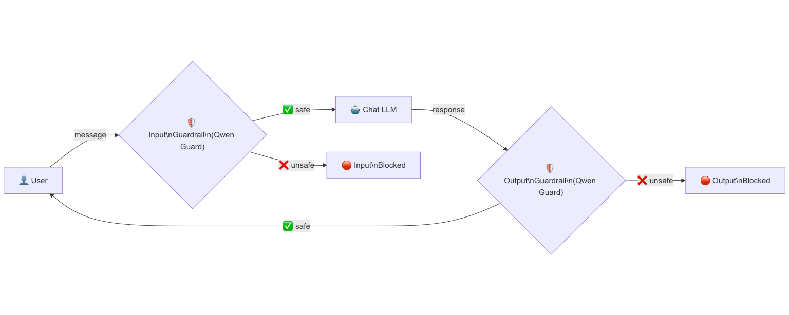

## 📖 TL;DR
> 🛡️ Les guardrails (garde-fous) permettent de protéger les entrées et sorties de vos LLM  
> 🚧 Les _input guardrails_ filtrent les prompts dangereux **avant** qu'ils n'atteignent le LLM  
> 🚧 Les _output guardrails_ filtrent les réponses inappropriées **avant** qu'elles ne soient renvoyées à l'utilisatrice ou l'utilisateur  
> 🤖 Utilisation de [Qwen Guard](https://www.ovhcloud.com/en/public-cloud/ai-endpoints/catalog/qwen-guard-gen-8b/) comme modèle de classification de sécurité  
> 🧑‍💻 Implémentation en Java avec [LangChain4J](https://docs.langchain4j.dev/intro/)  
> 🐙 Le [code source](https://gist.github.com/philippart-s/1fc7b7f18008aab83afce5efdece58da) complet  

<br/>

# 📜 Un peu de contexte

Dans mon [précédent article]({site.url}/2026-01-22-ai-agents), on a vu comment créer des agents, les orchestrer et les faire travailler ensemble.
C'est bien beau tout ça, mais on n'a pas du tout parlé d'un sujet plutôt important : la sécurité 🔐.

Parce que, soyons honnêtes, laisser une utilisatrice ou un utilisateur discuter librement avec un LLM sans aucun contrôle, c'est un peu comme laisser la porte de chez vous grande ouverte en plein centre-ville en espérant que personne n'entre 🏠.
Spoiler : quelqu'un va entrer 😅.

Et le problème n'est pas que du côté de l'utilisatrice ou l'utilisateur.
Votre LLM aussi peut avoir des réponses... disons... créatives 🙃.
Un prompt un peu tordu, un modèle un peu trop enthousiaste, et vous vous retrouvez avec une réponse que vous n'avez clairement pas envie de montrer à vos utilisatrices et utilisateurs.

C'est là qu'interviennent les **guardrails** (ou garde-fous si vous préférez le français 🇫🇷).

# 🛡️ C'est quoi un guardrail ?

Si on devait résumer le concept en une phrase : un guardrail, c'est un videur de boîte de nuit pour votre LLM 🕺.

Plus sérieusement, les guardrails sont des filtres de sécurité qui inspectent les messages **avant** et **après** qu'ils passent par le LLM.

On distingue deux types de guardrails :
 - 🚧 **Input guardrails** : ils vérifient le message de l'utilisatrice ou l'utilisateur **avant** qu'il ne soit envoyé au LLM. Si le message est jugé dangereux, toxique ou contraire à vos règles, il est bloqué net. Le LLM n'est même pas sollicité.
 - 🚧 **Output guardrails** : ils vérifient la réponse du LLM **avant** qu'elle ne soit renvoyée à l'utilisatrice ou l'utilisateur. Même si le prompt était légitime, le modèle peut parfois générer du contenu inapproprié. L'output guardrail est là pour rattraper ça.

> ℹ️ Dans l'exemple de cet article, on utilise **Qwen Guard**, un modèle spécialisé dans la classification de sécurité, comme moteur de guardrail.
> En gros, c'est un LLM dont le seul job est de dire si un texte est _safe_ ou _unsafe_. ℹ️

# 🏗️ L'architecture

Visuellement, voici comment se positionne le guardrail dans l'architecture :



Comment lire ce schéma :
 - 👤 l'utilisatrice ou l'utilisateur envoie un message
 - 🛡️ le message passe d'abord par l'**input guardrail** (Qwen Guard) qui le classifie
 - ✅ si le message est _safe_, il est transmis au LLM de chat
 - ❌ si le message est _unsafe_, il est bloqué et une notification est renvoyée. Le LLM n'est jamais appelé
 - 🤖 le LLM génère sa réponse
 - 🛡️ la réponse passe par l'**output guardrail** (Qwen Guard) qui la classifie à son tour
 - ✅ si la réponse est _safe_, elle est renvoyée à l'utilisatrice ou l'utilisateur
 - ❌ si la réponse est _unsafe_, elle est bloquée

Vous le voyez, on a **deux points de contrôle** : un en entrée, un en sortie.

# 🔄 Comment ça se passe concrètement ?

Voyons maintenant les deux scénarios possibles lors d'une interaction avec notre chatbot.

## ✅ Scénario safe

Le cas nominal, celui où tout se passe bien :


 1. L'utilisatrice ou l'utilisateur envoie un message normal : _"Quelle est la capitale de la France ?"_
 2. L'input guardrail (Qwen Guard) classifie le message comme **safe** ✅
 3. Le message est transmis au LLM de chat
 4. Le LLM répond : _"La capitale de la France est Paris."_
 5. L'output guardrail (Qwen Guard) classifie la réponse comme **safe** ✅
 6. La réponse est renvoyée à l'utilisatrice ou l'utilisateur

Rien de spectaculaire, et c'est tant mieux 😌.

## 🛑 Scénario unsafe

Maintenant, le cas où quelqu'un essaie de faire des bêtises :


 1. L'utilisatrice ou l'utilisateur envoie un message problématique
 2. L'input guardrail (Qwen Guard) classifie le message comme **unsafe** avec une catégorie (par exemple : _S1 - Violent Crimes_) 🛑
 3. Le message est **bloqué**. Le LLM n'est **jamais appelé** ❌
 4. Un message d'erreur est renvoyé à l'utilisatrice ou l'utilisateur

Le point important ici, c'est que le LLM n'a même pas connaissance du message dangereux.
On économise des tokens, et surtout, on évite que le modèle ne soit exposé à du contenu qu'il pourrait mal interpréter.

# 🧑‍💻 Du code !

Bon, on a assez parlé théorie.
Pour l'implémentation je vais utiliser Python, non je blague 🙃.
Bien entendu, on va partir avec du Java et [LangChain4J](https://docs.langchain4j.dev/intro/).

> ℹ️ Pour cet exemple, j'ai utilisé [JBang](https://www.jbang.dev/) pour pouvoir tout mettre dans un seul fichier et le rendre facilement exécutable.
> Pas de Quarkus cette fois, juste du Java pur avec LangChain4J. ℹ️

L'idée est d'avoir **deux AI Services** :

| Interface | Rôle | Modèle |
|-----------|------|--------|
| `ChatBot` | Le chatbot conversationnel | LLM de chat (ex: DeepSeek, Llama) |
| `GuardClassifier` | La classification de sécurité | Qwen Guard |

## 🛡️ Le classificateur de sécurité

Commençons par le plus simple : l'interface du classificateur de sécurité.

```java
interface GuardClassifier {
    String classify(String text);
}
```

Oui, c'est tout 😅.
Cette interface encapsule le modèle Qwen Guard via un AI Service LangChain4J.
On lui donne un texte, il nous dit si c'est _safe_ ou _unsafe_.

Le modèle Qwen Guard qui se cache derrière :

```java
ChatModel guardModel = OpenAiChatModel.builder()
        .apiKey(apiToken)
        .baseUrl(baseUrl)
        .modelName(guardModelName)
        .temperature(0.0)   // On veut des réponses déterministes pour la classification
        .logRequests(false)
        .logResponses(false)
        .build();

GuardClassifier guardClassifier = AiServices.builder(GuardClassifier.class)
        .chatModel(guardModel)
        .build();
```

> ℹ️ Notez la température à `0.0` : pour un classificateur de sécurité, on veut des réponses les plus déterministes possible.
> On ne veut pas que le modèle soit "créatif" dans sa classification 😬. ℹ️

## 🤖 Le chatbot

L'interface du chatbot est tout aussi simple :

```java
interface ChatBot {
    String chat(String userMessage);
}
```

C'est une interface classique d'AI Service.
La particularité, c'est que les guardrails ne sont pas définis dans l'interface elle-même, mais **injectés** via le builder `AiServices`.

## 🚦 L'activation des guardrails

C'est ici que la magie opère.
LangChain4J fournit deux interfaces : `InputGuardrail` et `OutputGuardrail`.
On les implémente en tant que classes anonymes directement dans le builder (juste par souci de simplicité, on pourrait aussi les implémenter dans des) classes séparées) :

```java
ChatBot chatBot = AiServices.builder(ChatBot.class)
        .chatModel(chatModel)
        .inputGuardrails(new InputGuardrail() {
            @Override
            public InputGuardrailResult validate(UserMessage userMessage) {
                String guardOutput = guardClassifier
                    .classify(userMessage.singleText())
                    .strip()
                    .toLowerCase();

                if (guardOutput.contains("unsafe")) {
                    String category = extractCategory(guardOutput);
                    return fatal("🛑️ Input blocked by Qwen Guard: " 
                        + "message classified as unsafe. 🛑\n" + category);
                }
                IO.println("✅ Input approved by Qwen Guard ✅");
                return success();
            }
        })
        .outputGuardrails(new OutputGuardrail() {
            @Override
            public OutputGuardrailResult validate(AiMessage responseFromLLM) {
                String guardOutput = guardClassifier
                    .classify(responseFromLLM.text())
                    .strip()
                    .toLowerCase();

                if (guardOutput.contains("unsafe")) {
                    String category = extractCategory(guardOutput);
                    return fatal("🛑 Output blocked by Qwen Guard: " 
                        + "response classified as unsafe. 🛑\n" + category);
                }
                IO.println("✅ Output approved by Qwen Guard ✅");
                return success();
            }
        })
        .build();
```

Décortiquons ce qui se passe :
 - Pour chaque guardrail, on appelle `guardClassifier.classify()` sur le texte à vérifier
 - Si la réponse du modèle Qwen Guard contient _"unsafe"_, on renvoie un résultat `fatal()` qui bloque la chaîne
 - Sinon, on renvoie `success()` et le traitement continu normalement
 - La méthode `extractCategory()` permet de récupérer la catégorie de danger (sur la deuxième ligne de la réponse de Qwen Guard)

```java
String extractCategory(String guardOutput) {
    String[] lines = guardOutput.strip().split("\n");
    if (lines.length > 1) {
        return lines[1].strip();
    }
    return "unknown";
}
```

## 🔄 La boucle interactive

Pour rendre tout ça utilisable, on met en place une boucle de conversation classique avec gestion des exceptions levées par les guardrails :

```java
while (true) {
    IO.print("💬>: ");
    String userInput = IO.readln();

    if (userInput == null || "exit".equalsIgnoreCase(userInput.strip())) {
        IO.println("👋 Goodbye! 👋");
        break;
    }

    try {
        String response = chatBot.chat(userInput);
        IO.println("🤖: " + response + "\n");
    } catch (InputGuardrailException e) {
        IO.println("🛑 [INPUT BLOCKED] 🛑 " + e.getMessage() + "\n");
    } catch (OutputGuardrailException e) {
        IO.println("🛑 [OUTPUT BLOCKED] 🛑 " + e.getMessage() + "\n");
    }
}
```

Le point clé ici : quand un guardrail bloque un message, LangChain4J lève une exception spécifique (`InputGuardrailException` ou `OutputGuardrailException`).
Il suffit de les attraper pour informer l'utilisatrice ou l'utilisateur que son message (ou la réponse) a été bloqué.

# 🤗 En conclusion

Les guardrails sont un mécanisme simple, mais essentiel dans toute application utilisant des LLM.
Grâce à LangChain4J, cela reste relativement simple.

Si vous voulez aller plus loin dans l'écosystème LangChain4J, je vous renvoie vers mes articles précédents :
 - 🤖 [Quand Quarkus rencontre LangChain4j]({site.url}/2024-04-01-quarkus-langchain4j) pour une première prise en main
 - 🦜 [Augmente les capacités de ton IA avec LangChain4j]({site.url}/2024-04-14-quarkus-langchain4j-streaming) pour le RAG et le streaming
 - 🔀 [L'IA et ses agents, comment ça marche ?]({site.url}/2026-01-22-ai-agents) pour les agents et leur orchestration

Le code complet est disponible dans ce [gist](https://gist.github.com/philippart-s/1fc7b7f18008aab83afce5efdece58da) 🐙.

Si vous êtes arrivé·es jusque-là merci de m'avoir lu et s'il y a des coquilles n'hésitez pas à me faire une [issue ou PR](https://github.com/philippart-s/blog) 😊.