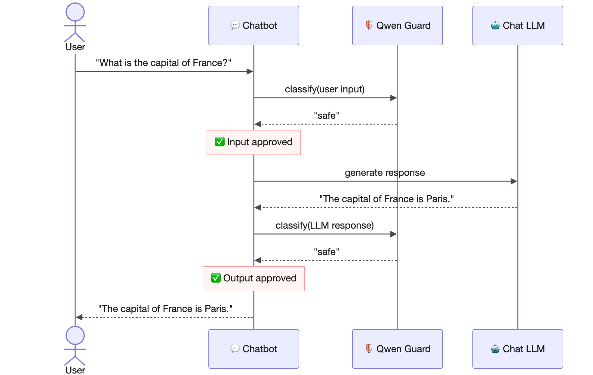
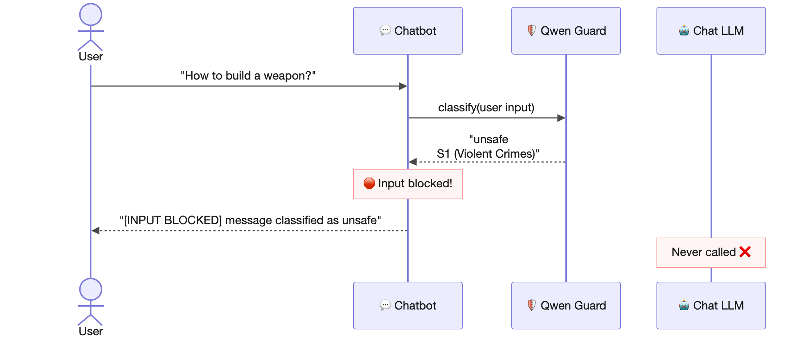

## 📖 TL;DR
> 🛡️ Guardrails protect the inputs and outputs of your LLMs  
> 🚧 _Input guardrails_ filter dangerous prompts **before** they reach the LLM  
> 🚧 _Output guardrails_ filter inappropriate responses **before** they are sent back to the user  
> 🤖 Using [Qwen Guard](https://www.ovhcloud.com/en/public-cloud/ai-endpoints/catalog/qwen-guard-gen-8b/) as a safety classification model  
> 🧑‍💻 Implementation in Java with [LangChain4J](https://docs.langchain4j.dev/intro/)  
> 🐙 The complete [source code](https://gist.github.com/philippart-s/1fc7b7f18008aab83afce5efdece58da)  

<br/>

# 📜 A bit of context

In my [previous article]({site.url}/2026-01-22-ai-agents), we saw how to create agents, orchestrate them and make them work together.
That's all well and good, but we didn't talk about a rather important topic at all: security 🔐.

Because, let's be honest, letting a user chat freely with an LLM without any control is a bit like leaving your front door wide open in the middle of the city hoping nobody walks in 🏠.
Spoiler: someone will walk in 😅.

And the problem isn't only on the user's side.
Your LLM can also have... let's say... creative responses 🙃.
A slightly twisted prompt, an overly enthusiastic model, and you end up with a response you clearly don't want to show to your users.

That's where **guardrails** come in.

# 🛡️ What is a guardrail?

If we had to sum up the concept in one sentence: a guardrail is a bouncer at a nightclub for your LLM 🕺.

More seriously, guardrails are safety filters that inspect messages **before** and **after** they pass through the LLM.

There are two types of guardrails:
 - 🚧 **Input guardrails**: they check the user's message **before** it is sent to the LLM. If the message is deemed dangerous, toxic or against your rules, it is blocked on the spot. The LLM is never even called.
 - 🚧 **Output guardrails**: they check the LLM's response **before** it is sent back to the user. Even if the prompt was legitimate, the model can sometimes generate inappropriate content. The output guardrail is there to catch that.

> ℹ️ In this article's example, we use **Qwen Guard**, a model specialized in safety classification, as the guardrail engine.
> Basically, it's an LLM whose only job is to tell whether a text is _safe_ or _unsafe_. ℹ️

# 🏗️ The architecture

Visually, here's how the guardrail fits into the architecture:


How to read this diagram:
 - 👤 the user sends a message
 - 🛡️ the message first goes through the **input guardrail** (Qwen Guard) which classifies it
 - ✅ if the message is _safe_, it is forwarded to the chat LLM
 - ❌ if the message is _unsafe_, it is blocked and a notification is sent back. The LLM is never called
 - 🤖 the LLM generates its response
 - 🛡️ the response goes through the **output guardrail** (Qwen Guard) which classifies it in turn
 - ✅ if the response is _safe_, it is sent back to the user
 - ❌ if the response is _unsafe_, it is blocked

As you can see, we have **two checkpoints**: one on input, one on output.

# 🔄 How does it work in practice?

Let's now look at the two possible scenarios during an interaction with our chatbot.

## ✅ Safe scenario

The nominal case, where everything goes well:



 1. The user sends a normal message: _"What is the capital of France?"_
 2. The input guardrail (Qwen Guard) classifies the message as **safe** ✅
 3. The message is forwarded to the chat LLM
 4. The LLM responds: _"The capital of France is Paris."_
 5. The output guardrail (Qwen Guard) classifies the response as **safe** ✅
 6. The response is sent back to the user

Nothing spectacular, and that's a good thing 😌.

## 🛑 Unsafe scenario

Now, the case where someone tries to cause trouble:



 1. The user sends a problematic message
 2. The input guardrail (Qwen Guard) classifies the message as **unsafe** with a category (for example: _S1 - Violent Crimes_) 🛑
 3. The message is **blocked**. The LLM is **never called** ❌
 4. An error message is sent back to the user

The important point here is that the LLM never even sees the dangerous message.
We save tokens, and more importantly, we prevent the model from being exposed to content it could misinterpret.

# 🧑‍💻 Show me the code!

Alright, enough theory.
For the implementation I'm going to use Python, just kidding 🙃.
Of course, we're going with Java and [LangChain4J](https://docs.langchain4j.dev/intro/).

> ℹ️ For this example, I used [JBang](https://www.jbang.dev/) to put everything in a single file and make it easily executable.
> No Quarkus this time, just plain Java with LangChain4J. ℹ️

The idea is to have **two AI Services**:
- `ChatBot`: The conversational chatbot(OSS-GPT, Llama, ...)
- `GuardClassifier`:Safety classification (Qwen Guard)

## 🛡️ The safety classifier

Let's start with the simplest part: the safety classifier interface.

```java
interface GuardClassifier {
    String classify(String text);
}
```

Yes, that's it 😅.
This interface wraps the Qwen Guard model via a LangChain4J AI Service.
You give it a text, it tells you whether it's _safe_ or _unsafe_.

The Qwen Guard model behind it:

```java
ChatModel guardModel = OpenAiChatModel.builder()
        .apiKey(apiToken)
        .baseUrl(baseUrl)
        .modelName(guardModelName)
        .temperature(0.0)   // We want deterministic responses for classification
        .logRequests(false)
        .logResponses(false)
        .build();

GuardClassifier guardClassifier = AiServices.builder(GuardClassifier.class)
        .chatModel(guardModel)
        .build();
```

> ℹ️ Note the temperature set to `0.0`: for a safety classifier, we want the most deterministic responses possible.
> We don't want the model to be "creative" in its classification 😬. ℹ️

## 🤖 The chatbot

The chatbot interface is just as simple:

```java
interface ChatBot {
    String chat(String userMessage);
}
```

It's a classic AI Service interface.
The twist is that the guardrails are not defined in the interface itself, but **injected** via the `AiServices` builder.

## 🚦 Activating the guardrails

This is where the magic happens.
LangChain4J provides two interfaces: `InputGuardrail` and `OutputGuardrail`.
We implement them as anonymous classes directly in the builder (just for simplicity's sake, we could also implement them in separate classes):

```java
ChatBot chatBot = AiServices.builder(ChatBot.class)
        .chatModel(chatModel)
        .inputGuardrails(new InputGuardrail() {
            @Override
            public InputGuardrailResult validate(UserMessage userMessage) {
                String guardOutput = guardClassifier
                    .classify(userMessage.singleText())
                    .strip()
                    .toLowerCase();

                if (guardOutput.contains("unsafe")) {
                    String category = extractCategory(guardOutput);
                    return fatal("🛑️ Input blocked by Qwen Guard: " 
                        + "message classified as unsafe. 🛑\n" + category);
                }
                IO.println("✅ Input approved by Qwen Guard ✅");
                return success();
            }
        })
        .outputGuardrails(new OutputGuardrail() {
            @Override
            public OutputGuardrailResult validate(AiMessage responseFromLLM) {
                String guardOutput = guardClassifier
                    .classify(responseFromLLM.text())
                    .strip()
                    .toLowerCase();

                if (guardOutput.contains("unsafe")) {
                    String category = extractCategory(guardOutput);
                    return fatal("🛑 Output blocked by Qwen Guard: " 
                        + "response classified as unsafe. 🛑\n" + category);
                }
                IO.println("✅ Output approved by Qwen Guard ✅");
                return success();
            }
        })
        .build();
```

Let's break down what's happening:
 - For each guardrail, we call `guardClassifier.classify()` on the text to check
 - If Qwen Guard's response contains _"unsafe"_, we return a `fatal()` result that blocks the chain
 - Otherwise, we return `success()` and processing continues normally
 - The `extractCategory()` method extracts the danger category (from the second line of Qwen Guard's response)

```java
String extractCategory(String guardOutput) {
    String[] lines = guardOutput.strip().split("\n");
    if (lines.length > 1) {
        return lines[1].strip();
    }
    return "unknown";
}
```

## 🔄 The interactive loop

To make all of this usable, we set up a classic conversation loop with exception handling for guardrail blocks:

```java
while (true) {
    IO.print("💬>: ");
    String userInput = IO.readln();

    if (userInput == null || "exit".equalsIgnoreCase(userInput.strip())) {
        IO.println("👋 Goodbye! 👋");
        break;
    }

    try {
        String response = chatBot.chat(userInput);
        IO.println("🤖: " + response + "\n");
    } catch (InputGuardrailException e) {
        IO.println("🛑 [INPUT BLOCKED] 🛑 " + e.getMessage() + "\n");
    } catch (OutputGuardrailException e) {
        IO.println("🛑 [OUTPUT BLOCKED] 🛑 " + e.getMessage() + "\n");
    }
}
```

The key point here: when a guardrail blocks a message, LangChain4J throws a specific exception (`InputGuardrailException` or `OutputGuardrailException`).
You just need to catch them to inform the user that their message (or the response) was blocked.

# 📽️ See it in action!

<div class="video-wrapper">
    <iframe width="560" height="315" src="https://www.youtube.com/embed/yt9l7XbizAk?si=cAxLTuOVuwJmxenf" title="YouTube video player" frameborder="0" allow="accelerometer; autoplay; clipboard-write; encrypted-media; gyroscope; picture-in-picture; web-share" referrerpolicy="strict-origin-when-cross-origin" allowfullscreen></iframe>
</div>

# 🤗 In conclusion

Guardrails are a simple yet essential mechanism in any application using LLMs.
Thanks to LangChain4J, it remains relatively straightforward.

If you want to go further in the LangChain4J ecosystem, here are my previous articles:
 - 🤖 [When Quarkus meets LangChain4j]({site.url}/2024-04-01-quarkus-langchain4j) for a first hands-on experience
 - 🦜 [Supercharge your AI with LangChain4j]({site.url}/2024-04-14-quarkus-langchain4j-streaming) for RAG and streaming
 - 🔀 [AI agents, how does it work?]({site.url}/2026-01-22-ai-agents) for agents and their orchestration

The complete code is available in this [gist](https://gist.github.com/philippart-s/1fc7b7f18008aab83afce5efdece58da) 🐙.

If you've made it this far, thank you for reading and if there are any typos don't hesitate to open an [issue or PR](https://github.com/philippart-s/blog) 😊.
